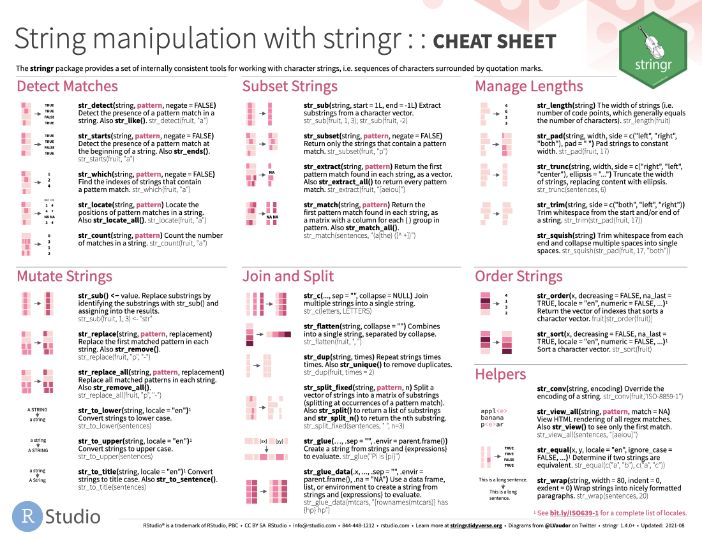

The following cheatsheets come from <https://www.rstudio.com/resources/cheatsheets>.
We haven't covered every function and functionality listed on them, but you might still find them useful as references.

::: columns
::: {.column width="50%"}
[{fig-alt="Data visualization with ggplot2 cheat sheet" fig-align="left" width="300"}](https://raw.githubusercontent.com/rstudio/cheatsheets/main/data-visualization.pdf)

 

[{fig-alt="Data tidying with tidyr cheat sheet" fig-align="left" width="300"}](https://raw.githubusercontent.com/rstudio/cheatsheets/main/tidyr.pdf)

 

[{fig-alt="String manipulation with stringr cheat sheet" fig-align="left" width="300"}](https://raw.githubusercontent.com/rstudio/cheatsheets/main/strings.pdf)

 

[{fig-alt="Dates and times with lubridate cheat sheet" fig-align="left" width="300"}](https://raw.githubusercontent.com/rstudio/cheatsheets/main/lubridate.pdf)
:::

::: {.column width="50%"}
[{fig-alt="Data transformation with dplyr cheat sheet" fig-align="right" width="300"}](https://raw.githubusercontent.com/rstudio/cheatsheets/main/data-transformation.pdf)

 

[{fig-alt="Data import with readr cheat sheet" fig-align="right" width="300"}](https://raw.githubusercontent.com/rstudio/cheatsheets/main/data-import.pdf)

 

[{fig-alt="Factors with forcats cheat sheet" fig-align="right" width="300"}](https://raw.githubusercontent.com/rstudio/cheatsheets/main/factors.pdf)

 

[{fig-alt="Positron IDE cheat sheet" fig-align="right" width="300"}](https://raw.githubusercontent.com/rstudio/cheatsheets/main/positron.pdf)
:::
:::
