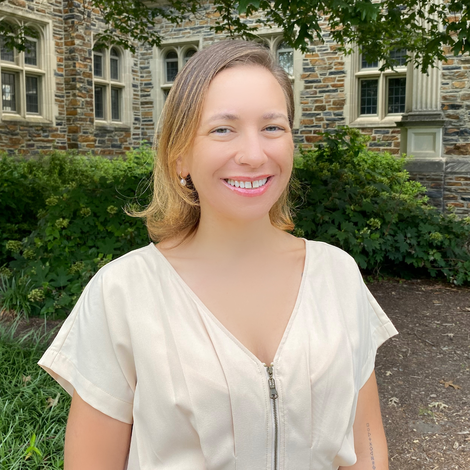
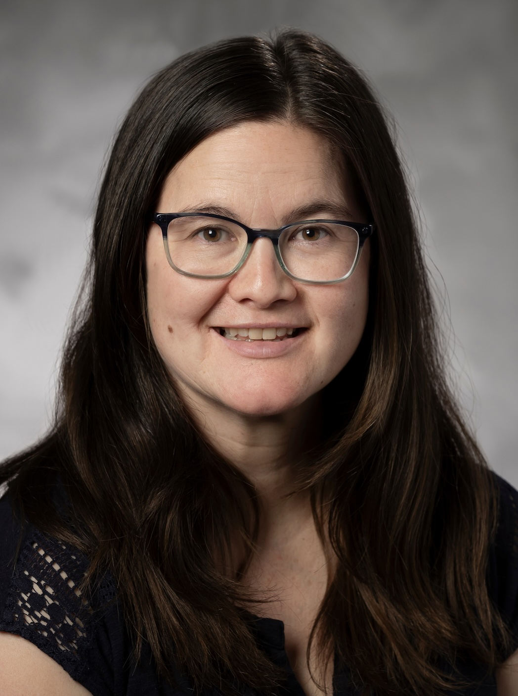

## Instructor

{.circular-portrait-mine style="float:right;padding: 0 0 0 10px;" fig-alt="Headshot of Dr. Mine Çetinkaya-Rundel"}

[**Dr. Mine Çetinkaya-Rundel**](http://mine-cr.com/) (she/her) is Professor of the Practice and Director of Undergraduate Studies at the Department of Statistical Science at Duke University. Mine's work focuses on innovation in statistics and data science pedagogy, with an emphasis on computing, reproducible research, student-centered learning, and open-source education, as well as pedagogical approaches for enhancing the retention of women and underrepresented minorities in STEM.

| Office hours                                   | Location     |
|------------------------------------------------|--------------|
| TBD | Bio Sci 111  |
| TBD                         | Old Chem 211C|

: {tbl-colwidths="\[70,30\]"}

## Teaching assistants {#teaching-assistants}

Each TA holds [office hours](https://docs.google.com/spreadsheets/d/1ecv7aJCSpDThmbBXkY3AkkpNKSyu4ISAlDXSjZx-WQA/edit?usp=sharing). Some TAs are also leaders or helpers for lab sections. Some TAs help out in lecture.

::: {#ta-listing}
:::

## Course coordinator

{.circular-portrait-mary style="float:right;" fig-alt="Headshot of Dr. Mary Knox"}

Dr. Mary Knox (she/her) is the course coordinator for this course. You can contact her (at [mary.knox\@duke.edu](mailto:mary.knox@duke.edu)) with any questions regarding registration, accommodations, missed work, extensions, etc. 
