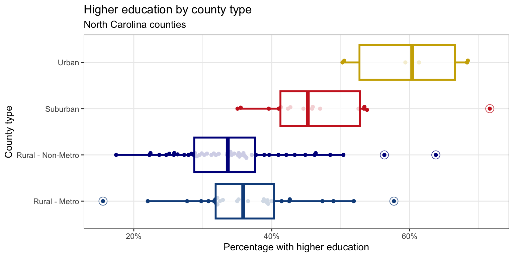

# Introduction

North Carolina is often described as one state, but its 100 counties differ in population, geography, access to resources, and economic and educational opportunities.
In this homework, you will use county-level data to get to know North Carolina through data visualization and data transformation.

The goal is not to rank counties or explain why one county is different from another.
Instead, you will practice asking descriptive questions such as: How are counties organized? Where are the most densely populated counties? How common is broadband access across different types of counties? How does educational attainment vary across the state?

As you work, remember that each row represents a county, not an individual person.
Your summaries will therefore describe counties in North Carolina, and your conclusions should use careful, non-causal language.

## Learning objectives

By the end of this homework, you will:

- use `dplyr` to count, filter, arrange, summarize, and create new variables;
- use `ggplot2` to visualize categorical and numerical variables;
- describe distributions using shape, center, spread, and unusual observations; and
- use data to develop a more detailed understanding of variation among North Carolina counties.

## Getting Started

## Guidelines

The guidelines should feel familiar, as they are the same ones from the lab! They are included below as a reminder.



## AI support and feedback



::: callout-note
If you have not yet enabled Duke's ChatGPT Edu access or installed the Codex extension for Positron, follow the instructions in [HW 1](hw-1.qmd).
:::

# Packages and data

## Packages

You will use:

- **tidyverse** package for data wrangling and visualization, 
- **scales** for better axis labels, 
- **ggthemes** for additional color palettes, and
- **ggbeeswarm** for additional geoms.

```{r}
#| label: load-packages
#| eval: true
#| message: false
library(tidyverse)
library(scales)
library(ggbeeswarm)
library(ggthemes)
```

## Data

In this homework you will work with a dataset that contains information on North Carolina counties. Some columns of the data come from the 2020 Census and others from the 2026 Attainment Profiles data distributed as part of the [myFutureNC Dashboard](https://dashboard.myfuturenc.org/county-data-and-resources/) maintained by Carolina Demography at the University of North Carolina at Chapel Hill. These data were retrieved on September 5, 2026 from these two resources.

This dataset is stored in a file called `nc-county.csv` in the `data` folder of your repository.

The variables in the dataset and their descriptions are as follows:

| No. | Variable | Description |
|---:|---|---|
| 1 | `county` | Name of county. |
| 2 | `land_area_m2` | Land area of county in meters-squared, based on the 2020 census. |
| 3 | `land_area_mi2` | Land area of county in miles-squared, based on the 2020 census. |
| 4 | `pop_2020` | Population of county, based on the 2020 Census. |
| 5 | `pop_dens_2020` | Population density calculated as population (`pop_2020`) divided by land area in miles-squared (people per mile-squared). |
| 6 | `county_type` | Peer county type classification based on population characteristics, socioeconomic status, and geographic features used for grouping counties with similar demographic, social, and economic characteristics, allowing them to be compared and benchmarked against one another. |
| 7 | `median_hh_income` | Median household income. |
| 8 | `p_foreign_born` | Percentage of population that is foreign-born. |
| 9 | `p_child_poverty` | Percentage of children living in poverty. |
| 10 | `p_single_parent_hh` | Percentage of households with children that are single-parent households. |
| 11 | `p_broadband` | Percentage of households with broadband internet access. |
| 12 | `p_home_ownership` | Percentage of homes that are owner-occupied. |
| 13 | `p_family_sustaining_wage` | Percentage of adults that earn a family-sustaining wage -- typically a wage that covers essential costs like housing, food, childcare, transportation, and healthcare for a family's basic needs within a specific geographic area. |
| 14 | `p_edu_lths` | Percentage of 25-44-year-olds with less than a high school diploma. |
| 15 | `p_edu_hsged` | Percentage of 25-44-year-olds with a high school diploma or equivalent. |
| 16 | `p_edu_scnd` | Percentage of 25-44-year-olds with some college. |
| 17 | `p_edu_ndc` | Percentage of 25-44-year-olds with non-degree credentials -- certifications, licenses, or other credentials that demonstrate specific skills or knowledge but do not confer a formal academic degree. |
| 18 | `p_edu_assoc` | Percentage of 25-44-year-olds with an associate degree. |
| 19 | `p_edu_ba` | Percentage of 25-44-year-olds with a bachelor's degree. |
| 20 | `p_edu_mapl` | Percentage of 25-44-year-olds with a master's, professional, or doctoral degree. |
| 21 | `p_edu_hs_grad_rate` | High school graduation rate. |
| 22 | `p_edu_chronic_absent_rate` | Chronic absenteeism rate. |

: {tbl-colwidths="[5,20,75]"}

Percentage variables, including variables whose names begin with `p_`, are stored as proportions from 0 to 1.
For example, a value of `0.75` represents 75%.
When reporting findings, convert these proportions to percentages when appropriate.

You can read this file into R with the following code:

```{r}
nc_county <- read_csv("data/nc-county.csv")
```

# Questions

## Question 1

We begin by getting an overview of how the counties in North Carolina are classified.
This gives us a first sense of the balance between rural, suburban, and urban parts of the state.

a. Calculate the number of rows and columns in `nc_county`. 

b. Calculate the number of counties in each `county_type` and display your results in descending order of the number of counties.

c. Based on your findings so far, write a short, introductory paragraph describing the dataset.

::: source-control
Preview, commit, and push your changes to GitHub with the commit message "Added answer for Question 1".

Make sure to commit and push all changed files so that your source control pane is empty afterward.
:::

## Question 2

North Carolina includes densely populated urban counties as well as counties with much more land and fewer residents.
Before focusing on particular counties, summarize the overall distribution of population density.

Your goal is to describe the distribution of population density (`pop_dens_2020`) of North Carolina counties using the following sentence as:

> The distribution of population density of North Carolina counties is ____. A typical North Carolina county has a population density of `_____` people per square mile. The middle 50% of North Carolina counties have population densities between `_____` and `_____` people per square mile.

Figure out the words and values that should go into the blanks using data visualization(s) and summary statistics.
Any summary statistics should be calculated in a single pipeline.

::: callout-tip
Think about which measures of center and spread are appropriate for a strongly right-skewed distribution.
:::

::: source-control
Preview, commit, and push your changes to GitHub with the commit message "Added answer for Question 2".

Make sure to commit and push all changed files so that your source control pane is empty afterward.
:::

## Question 3

Now use the population-density distribution to identify specific places at the densely populated end of the spectrum.
As you look at the results, consider which counties you recognize and what their population density might suggest about where people live in North Carolina.

Answer each part using a single data-wrangling pipeline.
Your response should be a data frame with the following five columns, in this order: `county`, `county_type`, `pop_dens_2020`, `pop_2020`, and `land_area_mi2`.
If your response has multiple rows, arrange the counties in descending order of population density.

a. Find out which county Duke University is located in and identify its population density.

b. Identify all counties with a population density greater than 500 people per square mile. Find a map of North Carolina counties from a reliable source online and use it to identify the locations of these counties (e.g., eastern, western, central, or coastal North Carolina). Your response should link to the map you found as well.

c. Identify the county with the highest population density. Your code must use `max()`.

::: source-control
Preview, commit, and push your changes to GitHub with the commit message "Added answer for Question 3".

Make sure to commit and push all changed files so that your source control pane is empty afterward.
:::

## Question 4

The number of people living in a county is one way to understand North Carolina, but economic opportunity is another.
The following question helps identify which county types include several counties where a relatively large share of adults earn a family-sustaining wage.

A classmate says:

> “Look at that, there is a county type containing at least ten counties where less than half of adults earn a family-sustaining wage!”

In a single pipeline, discover all county types that could fill in the blank.
Your response should be a data frame with only the county type and the number of counties in that county type where `p_family_sustaining_wage` is less than 0.50, and by 1-2 sentences identifying the county types that satisfy the statement and the county types that do not.

::: source-control
Preview, commit, and push your changes to GitHub with the commit message "Added answer for Question 4".

Make sure to commit and push all changed files so that your source control pane is empty afterward.
:::

## Question 5

Access to broadband internet is one part of the infrastructure that connects people to school, work, health information, and one another.
Use the county data to explore whether broadband access appears to vary across the county types used in this dataset.

Do some county types have a higher percentage of counties where at least 75% of households have broadband internet access?

a. To explore this question, first create a new variable called `broadband_level` in `nc_county`.
The variable should have the value `"At least 75%"` when `p_broadband` is greater than or equal to 0.75, and `"Below 75%"` otherwise.

b. Then, create a segmented bar plot with one bar per `county_type`, filled according to `broadband_level`.
The y-axis should range from 0 to 1 and represent the proportion of counties in each county type.

c. Finally, in a single pipeline, calculate the proportion of counties with at least 75% broadband access for each `county_type`.

d. Based on the visualization and the summary statistics, write a short paragraph comparing the percentage of counties with at least 75% broadband access across the county types based on your plot.

::: source-control
Preview, commit, and push your changes to GitHub with the commit message "Added answer for Question 5".

Make sure to commit and push all changed files so that your source control pane is empty afterward.
:::

## Question 6

We next turn to education, another important dimension of life.
Specifically, we will examine the distribution of higher educational attainment across counties in North Carolina.

The dataset records several education categories separately. 
First, create a new variable called `p_edu_he` (short for "percentage with higher education") that is the sum of the percentages of

    - 25-44-year-olds with an associate degree (`p_edu_assoc`), 
    - a bachelor's degree (`p_edu_ba`), and
    - a master's, professional, or doctoral degree (`p_edu_mapl`).

and store this variable in the `nc_county` data frame.

::: callout-warning
If you don't create the new variable `p_edu_he`, you will not be able to answer the remaining parts of this question or any of the remaining questions on the homework.

Therefore, here is a quick check to make sure you created the variable correctly -- after creating the variable, run the following code:

```{r}
#| eval: false
nc_county |>
  select(county, p_edu_he) |>
  slice_head(n = 3)
```

You should see the following output:

```
# A tibble: 3 × 2
  county    p_edu_he
  <chr>        <dbl>
1 Alamance     0.427
2 Alexander    0.308
3 Alleghany    0.342
```

These values are proportions: for example, `0.427` means that 42.7% of 25–44-year-olds in the county have an associate degree or higher.

If you do not see this output, please revisit the instructions above and make sure you created the variable correctly.
Ask for help on Ed or in office hours if you need assistance.

:::

a.  In a single pipeline, calculate the

    - minimum,
    - first quartile (25th percentile),
    - median (50th percentile),
    - mean,
    - third quartile (75th percentile), and
    - maximum

    of `p_edu_he`.

b.  In a single pipeline, calculate the same statistics as in the previous part, but for each `county_type`. Arrange the results in ascending order of median. Briefly comment on how these summary statistics vary across county types.

::: source-control
Preview, commit, and push your changes to GitHub with the commit message "Added answer for Question 6".

Make sure to commit and push all changed files so that your source control pane is empty afterward.
:::

## Question 7

The summary statistics in Question 6 describe higher education numerically.
This visualization lets you see how the full distributions differ across county types and which counties contribute to those distributions.

Using the variable you created in Question 6, re-create the following plot that shows the distribution of `p_edu_he` by `county_type`.



::: callout-tip
- x-axis: You learned how to format the x-axis as percentages in class and had a hint about it in your previous homework assignment. You can use the same approach here.

- Points: The points are drawn with the `geom_beeswarm()` function from the **ggbeeswarm** package.

- Outliers: The outliers in the box plots are drawn as _open circles_. You can specify this with the `outlier.shape` argument in `geom_boxplot()`. You can also adjust the size of the outliers with the `outlier.size` argument. The ggplot2 [aesthetic specifications documentation](https://ggplot2.tidyverse.org/articles/ggplot2-specs.html#point) has a list of shape names you can use for help.

- Color palette: The colors for the box plots are manually specified in a `scale_color_manual()` layer. You do not need to worry about the exact colors, but you should try to get close, e.g., use blue-ish colors for Rural counties, red-ish for Suburban, and brown-ish for Urban. You can use HEX codes for colors or look up named colors in R in the [R colors cheatsheet](https://www.nceas.ucsb.edu/sites/default/files/2020-04/colorPaletteCheatsheet.pdf)

- Transparancy: You should adjust the transparency of the box plots. You don't have to worry about the exact transparency value, but you should try to get close.

- Theme: This plot uses a non-default theme. See [theme options documentation](https://ggplot2.tidyverse.org/reference/ggtheme.html) for options.

- Aspect ratio and width: You can adjust the aspect ratio and width of your plot in your _rendered document_ by setting `fig-asp` and `fig-width` options in the code cell.
:::

::: source-control
Preview, commit, and push your changes to GitHub with the commit message "Added answer for Question 7".

Make sure to commit and push all changed files so that your source control pane is empty afterward.
:::

## Question 8

The points that fall beyond the typical range in the previous plot represent counties that may be especially useful for getting to know North Carolina.
Identify those counties from the plot so that you can connect the visual pattern to specific places.

In a single pipeline, identify the outliers in the plot you recreated in Question 7.
The cutoff you use should be based on the definition of an outlier in a box plot, not a visual estimate from the plot.
The output should be a data frame with the following three columns, in this order: `county`, `county_type`, and `p_edu_he`, and arranged in descending order of percentage with higher education.

::: callout-tip
First, calcalculate the interquartile range (IQR) of `p_edu_he` for each `county_type`.
:::

::: source-control
Preview, commit, and push your changes to GitHub with the commit message "Added answer for Question 8".

Make sure to commit and push all changed files so that your source control pane is empty afterward.
:::

## Question 9

Finally, examine the relationship between education and economic opportunity.

a. Create an appropriate visualization to explore the relationship between the percentage of 25-44-year-olds with higher education (`p_edu_he`) and the percentage of adults earning a family-sustaining wage (`p_family_sustaining_wage`). Decide which variables should be on which axes and state your reason for the decision in one sentence.
In your plot, make sure values are formatted as percentages on both axes (e.g., 30% not 0.3).

b. Based on your plot in Part a, describe the relationship between these two variables. In your description, make sure to comment on the direction, form, strength, and any unusual observations. For unusual observations, first describe in words the values for `p_edu_he` and `p_family_sustaining_wage` that make the observation unusual, then write code to identify these counties. Your code should output the county name, county type, and percentage with higher education, and percentage earning a family-sustaining wage for each unusual observation.

::: callout-tip
You will need to consider "and"s and "or"s when you write your code to identify unusual observations.
:::

::: source-control
Preview, commit, and push your changes to GitHub with an informative and concise commit message.
:::

## Question 10

In this last question, you get to be creative and work with a third variable of interest.
Your goal is to explore how the relationship between higher educational attainment and earning a family-sustaining wage varies with a third variable.

a. Select a third variable (other than `county_type`, we had enough of that...) of interest from the dataset. This could be any variable that you think might influence or interact with the relationship between higher educational attainment and earning a family-sustaining wage. State the variable, whether it's numerical or categorical, and why you think it might be interesting to explore in this context.

b. Add this third variable to your plot in Question 9 to explore whether the relationship between higher educational attainment and earning a family-sustaining wage differs across the distribution of that third variable. Before making the plot, describe how the variable will be added to the plot (as a new aesthetic mapping, for faceting, or some other approach) and why you chose that approach.

c. Describe how, if at all, the relationship between higher educational attainment and earning a family-sustaining wage varies across the distribution of your third variable.

::: source-control
Preview, commit, and push your changes to GitHub with an informative and concise commit message.
Make sure to commit and push all changed files so that your source control pane is empty afterward.
:::

# AI use disclosure



# Wrap-up

::: source-control
Before you wrap up the assignment, make sure that you preview, commit, and push one final time so that the final versions of both your `.qmd` file and the rendered PDF are pushed to GitHub and your source control pane is empty. We will be checking these to make sure you have been practicing how to commit and push changes.
:::

## Submission



## Grading and feedback

You can get immediate feedback on all of the questions with AI.

Submit your final version of `hw-2.pdf` to Gradescope. Be sure to select the pages associated with each question.

A subset of the questions will be carefully graded for correctness and quality of explanation by the course instructional team. You will receive that feedback in about a week.

There are also workflow points for:

- committing at least three times as you work through your homework,
- having your final version of `.qmd` and `.pdf` files in your GitHub repository, and
- overall organization.
