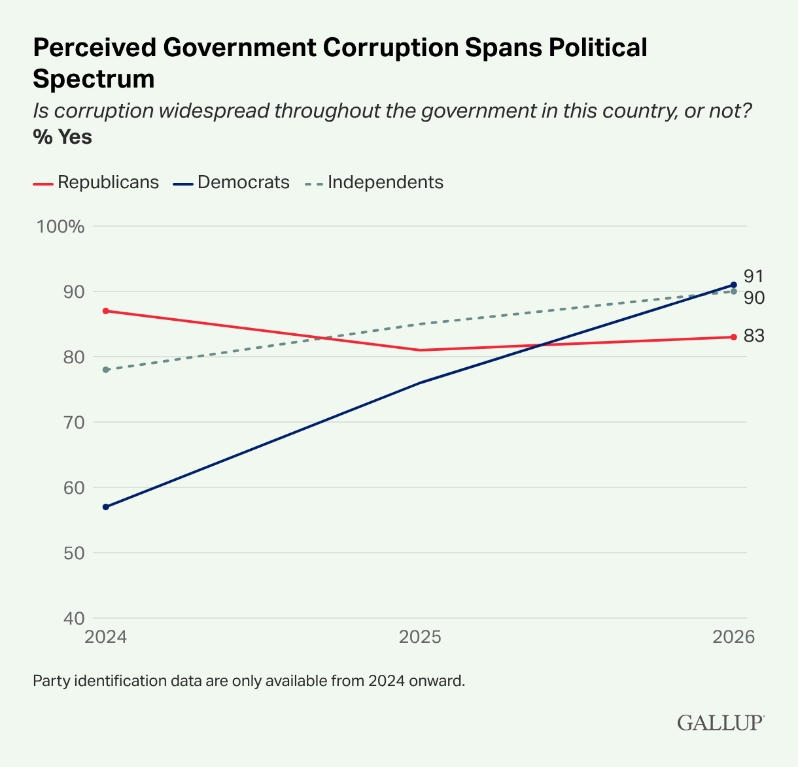

# Introduction

In this homework, you will explore two very different topics: basketball prospects and public perceptions of government corruption.
First, you will combine NBA Draft Combine measurements with draft picks to explore player characteristics and highlight players from Duke.
Then, you will examine Gallup survey results on perceived government corruption across political groups and over time.

Along the way, you will practice importing and cleaning data, identifying mismatches between datasets, joining and summarizing data, and creating and customizing visualizations with ggplot2.

## Learning objectives

By the end of this homework, you will:

- import data from Excel sheets and clean variable names and missing values;
- identify unmatched observations and join related datasets;
- summarize and visualize relationships between variables while accounting for missing values; and
- recreate and customize visualizations with ggplot2, including colors, labels, and annotations.

## Guidelines

By now you should be familiar with guidelines for homework assignments.
If not, please refer to an earlier homework assignment for details.

## AI support and feedback



# Packages

In addition to the [**tidyverse**](https://www.tidyverse.org/packages) package, you will also need the [**readxl**](https://readxl.tidyverse.org/) and the [**janitor**](https://sfirke.github.io/janitor/) packages.
Your analysis must use these packages.

```{r}
#| message: false
library(tidyverse)
library(readxl)
library(janitor)
```

# Part 1 - Slam dunks

The [NBA Draft Combine](https://en.wikipedia.org/wiki/NBA_draft_combine) is a multiple day event that takes place every May before the NBA draft in June.
At the combine, college basketball players take medical tests, are interviewed, perform various athletic tests and shooting drills, and play in five-on-five drills for an audience of National Basketball Association (NBA) coaches, general managers, and scouts.
How an athlete measures and performs during the combine can affect perception, draft status, salary, and the player's future career.
These stats are posted annually at <https://www.nba.com/stats/draft/combine-anthro>, which is where the data you'll be using comes from.

## Data

The data are stored in two sheets of a single Excel file called `nba-draft-combine-2627.xlsx`, which is in your `data` folder.
The two sheets and their contents are as follows:

**Sheet 1: `2026 Draft Player Stats`**

Player names, positions, and anthropometric measurements (i.e., measurements of the player's body dimensions and shape), and strength and agility statistics.

-   position: If you're curious, you can read more about basketball positions [on Wikipedia](https://en.wikipedia.org/wiki/Basketball_positions). However, you don't need to know anything about basketball to successfully complete the homework. Possible positions are:
    -   C: Center
    -   PF: Power Forward
    -   PG: Point Guard
    -   SF: Small Forward
    -   SG: Shooting Guard

-   hand length (in inches)
-   hand width (in inches)
-   height without shoes (in feet and inches, e.g., 6' 10.50'' = 6 feet 10.5 inches)
-   height with shoes (in feet and inches)
-   standing reach (in feet and inches)
-   weight (in pounds)
-   wingspan (in feet and inches)
-   lane agility time (in seconds, lower the better)
-   shuttle run (in seconds, lower the better)
-   three quarter sprint (in seconds, lower the better)
-   standing vertical leap (in inches, higher the better)
-   max vertical leap (in inches, higher the better)
-   max bench press (number of repetitions of 185 pounds)

**Sheet 2: `2026 Draft Picks`**

Player names and draft information for the first 50 picks:

-   team drafted to
-   prior affiliation (e.g. undergraduate institution)
-   draft year (all 2026 in this case)
-   round number - which round they were drafted in; 1 for first round pick, 2 for second round pick.
-   round pick - within a round, order in which a player was picked; 1 to 30
-   overall pick - overall order in which a player was drafted; 1 to 50 in the supplied data

## Question 1

**Import.** Using only the packages mentioned above, read each of the sheets in and save them as two separate data frames in R. Then, display the first ten rows and any columns that fit on the page.

::: callout-important
## Requirements

- Extraneous rows on top of the sheet(s) should be excluded.
- All variable names should use `snake_case` (lowercase, with underscores instead of spaces).
- All missing values should be coded as `NA`.
:::

## Question 2

**Inspect.** Find the mismatches between the two data frames:

a. Determine which, if any, players are in the stats data frame but not in the picks data frame. These are players present in the combine data but absent from the supplied draft-picks data; their absence does not necessarily mean they went undrafted. Display your output.

b. Determine which, if any, players are in the picks data frame but not in the stats data frame. These are the players who were picked in the draft but we do not have stats for. Display your output.

c. In a single sentence, briefly summarize the number of each type of mismatch.

## Question 3

**Explore.**

a. Using the stats data frame, create a single pipeline that summarizes the mean and median weight (in pounds) for players in each position.

   ::: callout-important
   ## Requirements
   
   - Players with missing position information should be excluded.
   - Exclude missing weights when calculating the mean and median. Count all players with a recorded position in `n`, including those with missing weights.
   - Resulting data frame should have four columns: `pos` (position), `n` (number of players), `mean_weight` (average weight in pounds), and `median_weight` (median weight in pounds).
   - Resulting data frame should have five rows.
   - Results should be displayed in descending order of mean weight.
   :::

b. Using the stats data frame and excluding players with missing positions or weights, first determine which type of plot would be appropriate and useful for exploring the relationship between player weights and positions and write a one-sentence justification for why you think this type of plot is appropriate and useful. Then, create the visualization you selected, making sure to employ good visualization practices.

c. Briefly, at most 3 sentences, describe your findings about the relationship between weights and positions of players in this combine dataset based on your results from parts (a) and (b).

## Question 4

**Recreate.** Recreate the following visualization of players in the supplied 2026 data, highlighting players whose prior affiliation was Duke University.
Then, improve it by giving it a title and better axis labels.

::: callout-important
## Requirements

- The plot should only include players that are in both data frames and have non-missing values for both weight and three-quarter sprint time.
- Players from Duke should be colored in Duke blue (the HEX code for this color is `#00539B`) and players not from Duke should be light gray (the name for this color is `gray70`).
- Players from Duke should be labeled with their names and the labels should not overlap with their points, though they can overlap with non-Duke players' points and they do not have to be in the exact same position as the labels shown in the plot below.
- Use `theme_minimal()` for the plot theme.
:::

```{r}
#| label: import-reference-data
#| include: false
nba_draft_stats <- read_excel(
  "../_data/nba-draft-combine-2627/nba-draft-combine-2627.xlsx",
  sheet = "2026 Draft Player Stats",
  skip = 3,
  na = c("", "-", "-%")
) |>
  clean_names()

nba_draft_picks <- read_excel(
  "../_data/nba-draft-combine-2627/nba-draft-combine-2627.xlsx",
  sheet = "2026 Draft Picks",
  na = c("", "-", "-%")
) |>
  clean_names()
```

```{r}
#| label: plot-to-recreate
#| fig-width: 8
#| fig-asp: 0.5
#| echo: false
draft_26 <- nba_draft_picks |>
  inner_join(nba_draft_stats, by = join_by(player)) |>
  mutate(duke = if_else(affiliation == "Duke", "Duke", "not Duke")) |>
  filter(!is.na(weight_lbs) & !is.na(three_quarter_sprint_sec))

ggplot(
  draft_26,
  aes(x = weight_lbs, y = three_quarter_sprint_sec, color = duke)
) +
  geom_point() +
  geom_label(
    data = draft_26 |> filter(duke == "Duke"),
    aes(label = player),
    vjust = -0.25,
    hjust = 0.5,
  ) +
  scale_color_manual(values = c("#00539B", "gray70")) +
  theme_minimal() +
  theme(legend.position = "none")
```

::: callout-tip
- First, make the scatterplot, without colors or text labels/annotations.
- Then, add the colors for the Duke players.
- Then, work on your improvements (title and axis labels).
- Finally, add the player names. Labels are required for full credit but are worth only a small portion of the points. If you are spending too much time on them, finish the rest of your homework first, then revisit this task.
:::

# Part 2 - Shaken trusts

On September 2, 2026, [Gallup](https://www.gallup.com/) reported "Record-High 89% in U.S. Say Government Corruption Widespread".

## Question 5

**Learn.** Read the article at <https://news.gallup.com/poll/713933/record-high-say-government-corruption-widespread.aspx> and, in 2–3 sentences, summarize the main finding and one comparison across political groups or over time. Explain whether the survey measures corruption itself or perceptions of corruption.

## Question 6

**Recreate.** The goal of this question is to recreate the following visualization from the article with ggplot2.

{alt="Perceived Government Corruption Spans Political Spectrum"}

a. In the linked Gallup article, find the interactive chart titled "Perceived Government Corruption Spans Political Spectrum" and download its data using the "Get the data" link. Save or upload the downloaded file to your `data` folder.

b. Read the data with the appropriate function and tidy and transform it as needed to recreate the plot.

c. Recreate the visualization with ggplot2. Match the data, group colors, lines and points, axis scales, and labels. Approximate fonts and spacing are acceptable.

   - For non-default features you match, briefly explain what you changed and how, e.g., "I matched the background color by using `theme(panel.background = element_rect(fill = "#F2F8F1"))`."
   - For any required features you cannot match, briefly explain what you tried and what did not work.

::: callout-note
The original plot is interactive -- if you hover on a point, it will show the exact percentage for that point. You do not need to make your plot interactive.
:::

# Part 3 - Stuck landings

For Part 3 of this homework, you'll work with two datasets -- the first one you'll recognize from lab, `gymnastics`, and the second one is `continents`.

The `gymnastics` dataset contains information about the routines performed by gymnasts in the women's artistic gymnastics competition at the 2024 Paris Olympics. 
Each row represents a single routine, so a gymnast who competed on all four apparatus in qualification appears in at least four rows.

The variables in the `gymnastics` dataset are as follows.

| Variable | Description |
|:---------------|:-------------------------------------------------------|
| `name` | Gymnast's name, in "Given Surname" order |
| `country` | Country name |
| `country_code` | 3-letter National Olympic Committee (NOC) code |
| `event` | Apparatus: Vault, Uneven Bars, Balance Beam, Floor Exercise |
| `competition` | Which round: Qualification, Team Final, All-Around Final, Event Final |
| `d_score` | Difficulty score (a number greater than zero, in increments of 0.1) |
| `e_score` | Execution score (a number between 0 and 10) |
| `penalty` | Neutral deduction |
| `score` | Routine total = `d_score` + `e_score` - `penalty` |
| `rank` | Placement for that row's competition |

The `continents` dataset contains countries and the continent each one is in.

The variables in the `continents` dataset are as follows.

| Variable | Description |
|:------------|:-----------------------------------------------------------|
| `entity` | Country name |
| `code` | Country code (3-letter ISO code for most countries) |
| `year` | Year the continent assignment was recorded |
| `continent` | Continent the country is in |

Both datasets can be found in the `data` folder, as `gymnastics.csv` and `continents.csv`, respectively.

## Question 7

To qualify for major competitions such as the Olympics, gymnasts must compete in their Continental Championship: the Pan American Games, European Championships, Asian Championships, African Championships, or Oceania Championships.
One question of interest, then, is whether gymnasts from different continents score differently.

::: callout-note
The Pan American Games features athletes from both North and South American countries.
For this analysis, you don't have to combine the two continents.
:::

a. First, read in the two datasets, save them as `gymnastics` and `continents`, respectively, and display the first ten rows of each.

b. Join the two data frames, and save the resulting data frame as a new data frame, giving it a short but evocative name. Display the first ten rows of the new data frame. Make sure that your joined data frame contains all countries in the `gymnastics` data frame.

c. In a single pipeline, produce a summary of the average vault score by continent.

d. How many rows does your summary have, and what does each row represent? Which continent has the highest average vault score, and which has the lowest?

e. Your summary has a row where `continent` is `NA`. Using `anti_join()`, write code to identify which countries in `gymnastics` have no match in `continents`. For each one, explain why it failed to match, and describe what you would need to do to fix it.
