::: callout-important
## Find your teammates
... and sit with them!
:::

*Mise en place* (French pronunciation: \[mi zɑ̃ ˈplas\]) is a French culinary phrase which means "putting in place" or "gather". It refers to the setup required before cooking, and is often used in professional kitchens to refer to organizing and arranging the ingredients (e.g., cuts of meat, relishes, sauces, par-cooked items, spices, freshly chopped vegetables, and other components) that a cook will require for the menu items that are expected to be prepared during a shift.[^1]

[^1]: Source: [Wikipedia](https://en.wikipedia.org/wiki/Mise_en_place).

{fig-align="center" fig-alt="A photo of a kitchen counter with various ingredients and tools arranged neatly, ready for cooking."}

This lab is all about setting up your computing environment for the course and putting in place all the bits and bobbles you'll need for the rest of the semester. It's about getting to know each other and the teaching team.

And just like the *mise an place* phase for cooking something that is new to you, it might not be entirely clear how everything will come together at the end. Hang in there, and it'll all start to make sense by the end of the week. And you'll be a pro at it all just in time for the first assignment!

# `Hello, World!`

## Computational toolkit

You may have heard/seen this phrase, `Hello, World!`, elsewhere before. It's usually the first thing you learn in programming -- to write a computer program to print this sentence to the screen. Things will be different in this course, as it's not a programming course, but a data science course. In this course, you'll learn to use a computing language (called R) to work with data.

But today, we need to set you up for success! Let's first briefly review the components of the computational toolkit for the course:

1.  R: The programming language you'll learn in this course.

2.  Positron: The piece of software (a.k.a. the integrated development environment, IDE) you'll use to write R code in.

    ::: callout-note
    R is the name of the programming language itself and Positron is a convenient interface.
    :::

3.  Quarto: The tool you'll use to create reproducible computational documents that contain both your narrative (i.e., words in English) and your code (i.e., code in R). Every assignment you hand in will be created using Quarto.

    ::: callout-note
    You might be familiar with word processors like MS Word or Google Docs. We will not be using these in this class. Instead, the words you would write in a word processor, as well as the code, will go into a Quarto document. When you *render* the document you will get a document out that has your words, your code, and the output of that code. Everything in one place, beautifully formatted!
    :::

4.  Git: A version control system.

5.  GitHub: A web hosting service for the Git version control system that also allows for transparent collaboration between team members.

    ::: callout-note
    Git is a version control system (like the "Track Changes" feature from Microsoft Word but more powerful) and GitHub is the home for your Git-based work on the internet (like DropBox but much better).
    :::

## Set up GitHub

### Sign in to your GitHub account

Go to [github.com](https://github.com/) and sign in to your GitHub account. Make sure to sign in with the GitHub username that you submitted in your Getting to know you survey.

::: {.callout-note collapse="true"}
## What if you don't have a GitHub account?

If you don't have a GitHub account, you'll need to create one. To do so, click on *Sign up* in the upper right corner of the GitHub page and follow the instructions. You do not have to use your Duke email address for your GitHub account, but I recommend doing so.\[\^3\] Similarly, you do not need to use your real name or your Duke NetID for your GitHub username, but I recommend reviewing the advice at <https://happygitwithr.com/github-acct#username-advice> before choosing a username.
:::

::: {.callout-important collapse="true"}
# Haven't filled out the Getting to know you survey? 
**STOP HERE AND TALK TO A TA!**
If you haven't yet filled out your *Getting to know you* survey yet or haven't submitted your GitHub username as part of it, let your TA know your GitHub username asap. This is essential for being able to complete the rest of your lab.
:::

### Update your GitHub profile

Once you have created your GitHub account, you should update your profile.

To do so, click on your profile icon in the upper right corner of the GitHub page and select *Settings*. Then, on the left side of the page, click on *Public profile* and fill out your profile information. You don't have to add a profile picture, but it is highly recommended. It will help us get to know you (and recognize you in class) and will also help you get to know your classmates.

Once done, click *Update profile* near the middle of the page.

## Set up Positron

You'll be doing all of your computing in Positron, which is hosted by Duke OIT in a container. A container is a self-contained instance of Positron for you, and you alone. You will do all of your computing in your container and you access it through a web browser.

- **Step 1.** Go to <https://cmgr.oit.duke.edu/containers> and login with your Duke NetID and Password.

- **Step 2.** Under *Reservations available*, click on *reserve STA199* to reserve a container for yourself.

- **Step 3.** Once you've reserved the container you'll see that it will show up under *My reservations*.

  {fig-alt="Container reservation" fig-align="center"}

- **Step 4.** To launch your container click on *STA199* under *My reservations*, then click *Login*.

  {fig-alt="Container login" fig-align="center"}

- **Step 5.** Then *Start*. You should now see the Positron environment.[^2]

  {fig-alt="Container start" fig-align="center"}

[^2]: Yes, it's too many steps. I don't know why! But it works, and you'll get used to it. Trust me, it beats downloading and installing everything you need on your computers!

You'll get acquainted with Positron throughout the semester, but here is the high level overview from yesterday's lecture to remind you of the terminology and the pieces of the Positron interface.

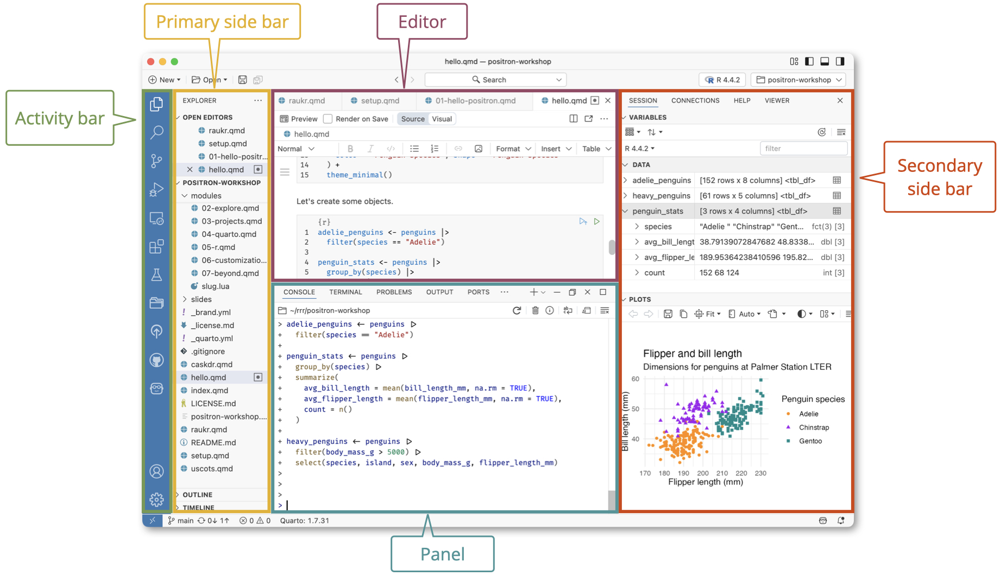{fig-alt="Positron overview" fig-align="center"}

## Connecting the pieces

### Sign in to GitHub from Positron

- **Step 1.** In Positron, click on the **Accounts** icon in the lower left of the **Activity bar** of your Positron window. It should have a red 1 in the lower right of the icon. It may take a minute for everything in your container to finish loading before the red 1 appears.

  {fig-alt="Accounts icon in Positron" fig-align="center"}

  You can also safely stash away the banner that says "By using Positron, you agree to the terms of the Positron license and the Education License Rider." by clicking on the `x` in the upper right corner of the banner.

- **Step 2.** In the **Accounts** panel, select **Sign in with GitHub to use GitHub Pull Requests (1)**.

  {fig-alt="Sign in with GitHub option in Positron" fig-align="center"}

- **Step 3.** A pop-up window with an authorization code will appear. Select **Copy & Continue to Browser**.

  {fig-alt="Authorization code pop-up in Positron" fig-align="center"}

  ::: {.callout-tip collapse="true"}
  ## Not seeing a pop-up window?

  Your browser may block pop-ups, in which case you may get a message to allow pop-ups for this website. If so, select **Retry** to allow pop-ups for your container website.
  :::

- **Step 4.** You should now be on a GitHub webpage to verify your credentials. Make sure that the account username you're seeing is the one you're using for this course, and then click **Continue**.

  {fig-alt="Verify session on GitHub" fig-align="center"}

- **Step 5.** Paste the code (e.g., control-v on PC; command-v on Mac; or select *Edit*, then *Paste*) into the GitHub screen, and click *Continue*.

  {fig-alt="Authorization code on GitHub" fig-align="center"}

- **Step 6.** Now authorize access between Positron and GitHub by clicking on the green **Authorize Visual-Studio-Code** button. You may need to sign in again to *Confirm access*.

  ::: {.callout-tip collapse="true"}
  ## Asked to log in again?

  Just follow the steps to do so!
  :::

- **Step 7.** You should now see a screen stating, "Congratulations, you're all set!"

  {fig-alt="All set on GitHub" fig-align="center"}

- **Step 8.** Navigate back to your container tab. If you click on **Accounts** icon again, you should now see that you are signed into your GitHub account within Positron and your GitHub username should appear there, followed by `(GitHub)`.

  {fig-alt="Signed into GitHub in Positron" fig-align="center"}

::: {.callout-tip collapse="true"}
## Getting an error in Positron?
We have identified two possible errors that you may encounter when signing into GitHub from Positron. 

- If you get an error in Positron that says something like "Having trouble logging in? Would you like to try a different way? (personal access token)" (or similar), you can ignore it. Click `x` on the corner of the error pop-up and click on Accounts again. If you still don't see your username in the Accounts menu, flag a TA for help!

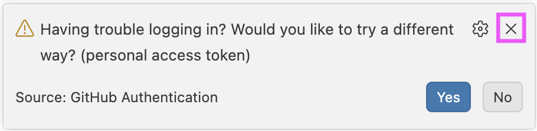{fig-alt="Potential error in Positron that says Having trouble logging in? Would you like to try a different way? (personal access token)" fig-align="center"}

- If you get an error in Positron that says an Extension needs to be updated or restarted, click on the Extensions icon in the Activity Bar, and then **Reload Window**. Then, start over in Step 1 and try again. If you still don't see your username in the Accounts menu, flag a TA for help!

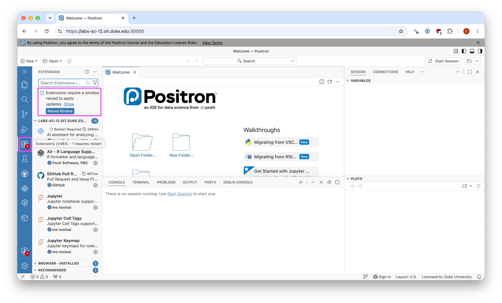{fig-alt="Reloading window to restarting Extensions in Positron." fig-align="center"}
:::

### Configure Git to introduce yourself

There is one more thing we need to do before getting started on the assignment. Specifically, we need to configure your Git so that Positron can communicate with GitHub. This requires two pieces of information: your (real, human first and last) name and email address (that you used when creating your GitHub account).

To do so, you will use the `use_git_config()` function from the `usethis` package.

::: callout-note
You've heard a bit about 📦 packages in the context of R, and you'll hear a lot more throughout the semester. As a reminder, they're how developers write functions and bundle them to distribute to the community (and more on this later too!).
:::

- **Step 1:** In the **Console** in Positron, select **Start Session**. Under **Start New Console Session**, click **R 4.6.1** to start an R session.

  {fig-alt="Start R session in Positron" fig-align="center"}

  The first time you do this, it may take a minute or so to install the `tinytex` package to set up your R environment for the course. Once it's done, you'll see a message in your console stating "Installation successful"

- **Step 2:** Then type the following lines of code in the **Console**, filling in your name and the address associated with your GitHub account, and hit enter/return. 

  ::: {.callout-tip collapse="true"}
  ## Getting an error about pasting from the clipboard?
  If you're copying and pasting, you might see a warning message about your container wanting to see text and images copied to the clipboard. Hit **Allow** to allow this.
  :::

  ```{r}
  usethis::use_git_config(
    user.name = "Your name",
    user.email = "Email associated with your GitHub account"
  )
  ```

  For example, mine would be

  ```{r}
  usethis::use_git_config(
    user.name = "Mine Çetinkaya-Rundel",
    user.email = "cetinkaya.mine@gmail.com"
  )
  ```

  {fig-alt="Typing Git configuration in the console" fig-align="center"}

  ::: callout-note
  I used my Gmail address because that is the email I used to create my GitHub account. You should also be using the email address you used to create your GitHub account, it's ok if it isn't your Duke email. If you don't do this, we won't be able to tell who you are and give you points for the work you do...[^3]
  :::

  [^3]: Well, a more accurate statement would be that we will be reaching out to you to get things right during the first few weeks of classes. But, it's best if you can get it right today!

You are now ready to interact with GitHub via Positron!

# Hello, STA 199 students!

Now that you have your computational toolkit setup, it's time to do some real data exploration. 
And what's more exciting to explore than your own selves.
In this section you'll be provided a real but anonymized portion of your own *Getting to know you* survey responses.
Each row in this dataset represents one of you, but we encourage you to not try to identify yourself or others in the data.
And it would be pretty difficult to do so anyway because we've only shared your responses to which section you're in, how much statistics and programming experience you have, some of the ways you learn best, and some types of data you're interested in.

## Clone your first repository

Now that you have your GitHub account set up, you can **clone** your first repository.
That is, you take a repository on GitHub that we have prepared for you and download it to your Positron container so that you can work with it.
And not just download the files, but do it in a way that allows you to keep your local copy of the repository in sync with the version on GitHub, by **staging** and then **committing** your changes and then **pushing** your work back to GitHub.

To do so, follow these steps.

- **Step 1:** Go to the repository for **lab-0** in the course GitHub organization: `https://github.com/sta199-f26/lab-0-YOUR-GITHUB-NAME`.

  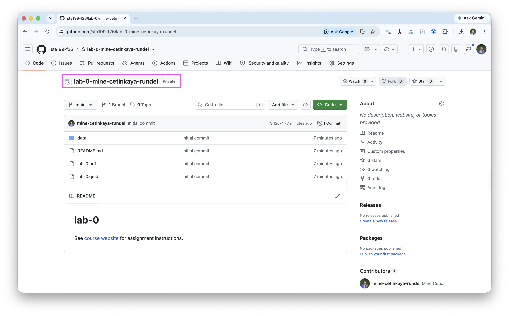{fig-alt="GitHub repository for lab-0" fig-align="center"}

- **Step 2:** Click on the green **CODE** button, select **HTTPS** under **Clone**. Click on the clipboard icon to copy the repo URL.

  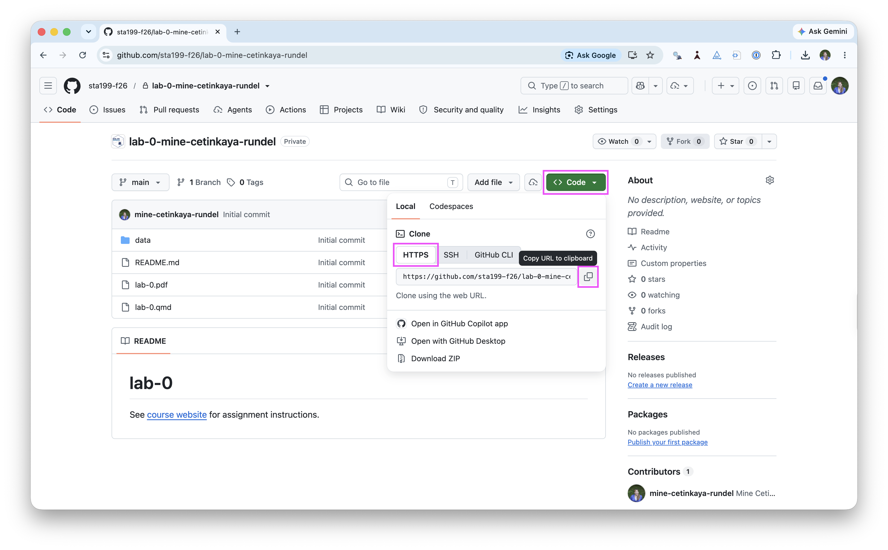{fig-alt="Code button for cloning the repository" fig-align="center"}

- **Step 3:** In Positron's Welcome window, click on *New Folder From Git...*.

  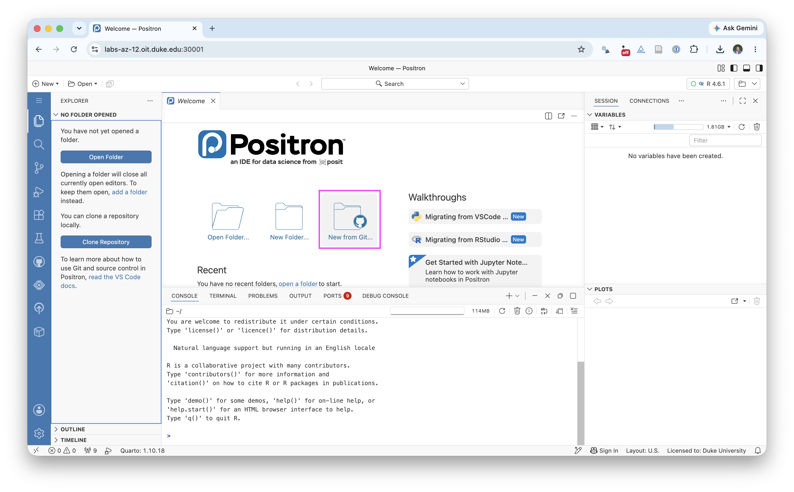{fig-alt="New Folder From Git option in Positron" fig-align="center"}

- **Step 4:** Paste the URL of the lab-0 repo into the dialog box labeled *Git repository URL*. Again, please make sure to have *HTTPS* highlighted under *Clone* when you copy the address. Then click *OK*.

  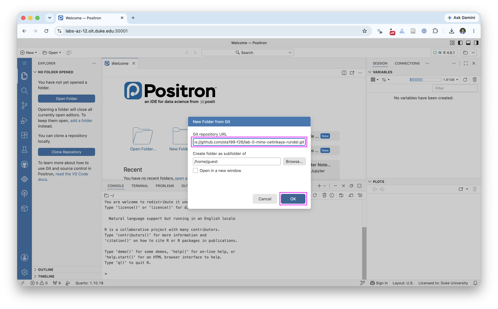{fig-alt="Pasting the GitHub repository URL into Positron" fig-align="center"}

These steps will clone the repository from GitHub to your Positron container and create a new Positron folder for you. This might take a few seconds. Once done, the files from your GitHub repo will appear in the *Explorer* panel in Positron. If you don't see it, click the Explorer icon (the page icon at the very top of the left-hand sidebar).

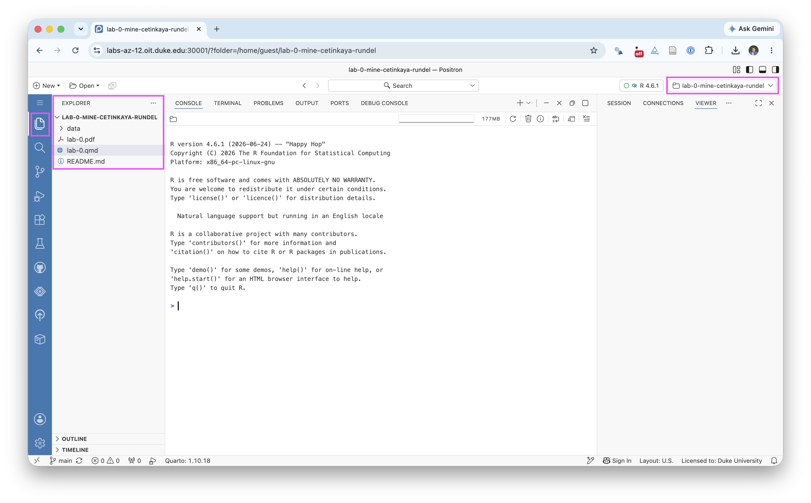{fig-alt="Your Lab 0 folder in Positron" fig-align="center"}

::: {.callout-tip collapse="true"}
## Seeing a dialog box asking if you trust the authors of this folder?
If you see a dialog box asking if you trust the authors of this folder, click **Yes**. This is a security feature of Positron to ensure that you are aware that you are downloading files from the internet. You can safely trust the authors of this repository, as it is part of your course materials.
:::

## Work on Lab 0

FINALLY!!!

The mise en place is finally done. And it's time to do a tiny bit of data exploration to close the loop.

First, open the Quarto file `lab-0.qmd`. You can do this by clicking on the file name. This will open the file name in the Explorer pane.
Before you start working on the lab, click *Preview* to see what the rendered document looks like.

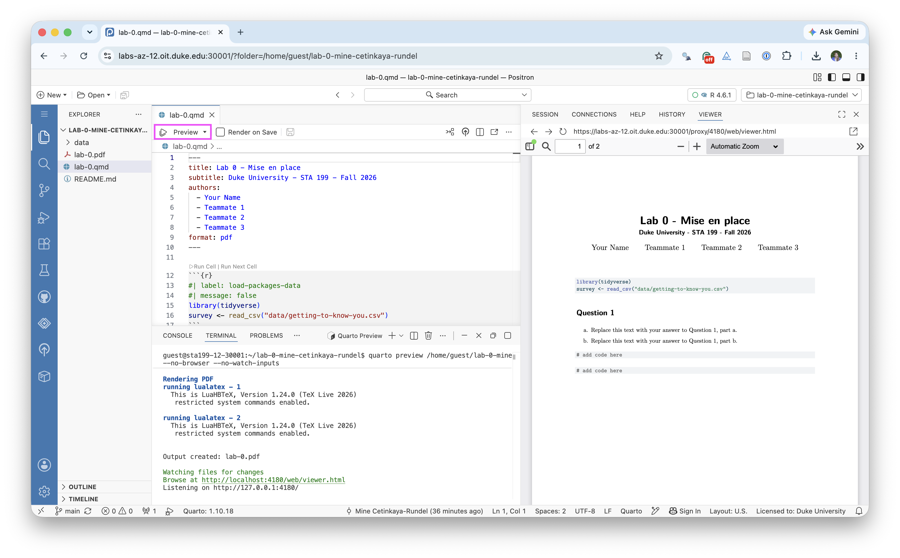{fig-alt="Preview lab-0.qmd in Positron" fig-align="center"}

### Update authors

In the YAML header at the top of the document, update the `author` field to include your name and your teammates' names. Preview the document again to make sure your names appear correctly.

You've made updates, previewed the document to confirm they look good, now it's time to take a record of this change.

Go to Source Control in the Activity bar (the icon that looks like a branch with a dot on it). You should see the files `lab-0.qmd` and `lab-0.pdf` listed under *Changes*. If you want to view what changed, click on `lab-0.qmd` to view the "diff" (i.e., the difference between the current version and the previous version) of the file. In this view red indicates lines that were removed and green indicates lines that were added. 

If all looks good, click on the `+` icon next to the file names to stage the changes. Then, in the *Message* box, type a message describing your change (e.g., "Updated authors") and click *Commit*.

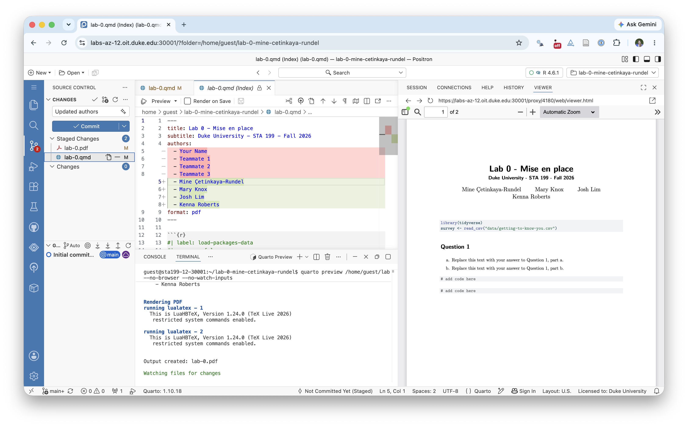{fig-alt="Source control in Positron" fig-align="center"}

At this point, you've taken a snapshot of your changes, but they are still only in your local Positron container. To get them to GitHub, you need to push them. To do so, click *Sync Changes*.

Now if you go back to your repository, you'll be able to see your changes there. Voila!

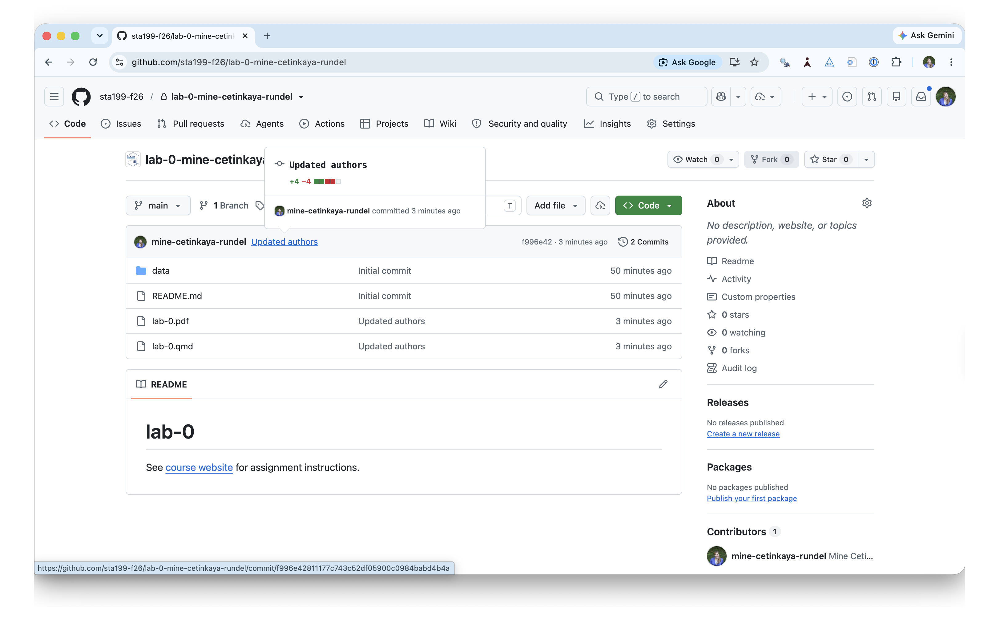{fig-alt="Changes on GitHub" fig-align="center"}

### Work with data

To finish up the lab, you'll work with data from the course *Getting to know you* survey and answer two quick questions.

#### Question 1

The data is in the data folder of your repository, in a file called `getting-to-know-you.csv`. You've already learned in lecture how to view a CSV file in Positron and how to read it in R. The code for doing so is already in the `lab-0.qmd` file, so you just need to run it.

a. What does each row in the dataset represent?
b. How many rows and how many columns does the dataset have?

#### Question 2

Take a look at the data in the data viewer to get to know the variables in the dataset. As a team, come up with a question you might want to answer with these data.

Once you're done, commit and push your changes to GitHub.

## Submit your work

As a last step, submit your PDF file to Gradescope. You can do so by going to the course Gradescope page, selecting the Lab 0 assignment, and uploading your `lab-0.pdf` file.

- **Step 1:** Right-click on `lab-0.pdf` in the Explorer pane and click Download.

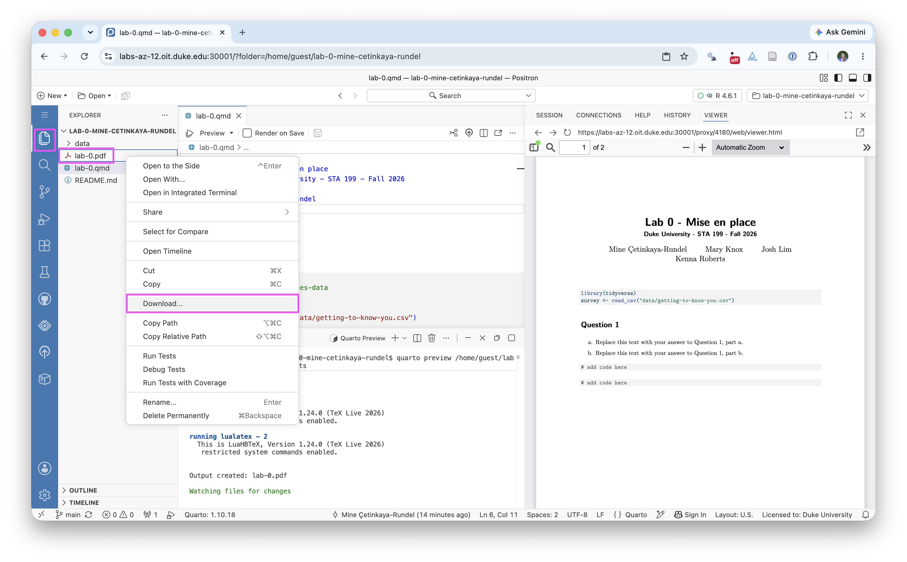{fig-alt="Download lab-0.pdf from Positron" fig-align="center"}

- **Step 2:** Find the downloaded file on your computer (likely in the Downloads folder) and upload it to Gradescope!

Fantastic job, now go take a well deserved break!

::: callout-note
## This lab is not graded
But do your best to complete it, and if you can't, submit what you have. This will allow us to give you feedback on your process and workflow before your first graded lab.
:::