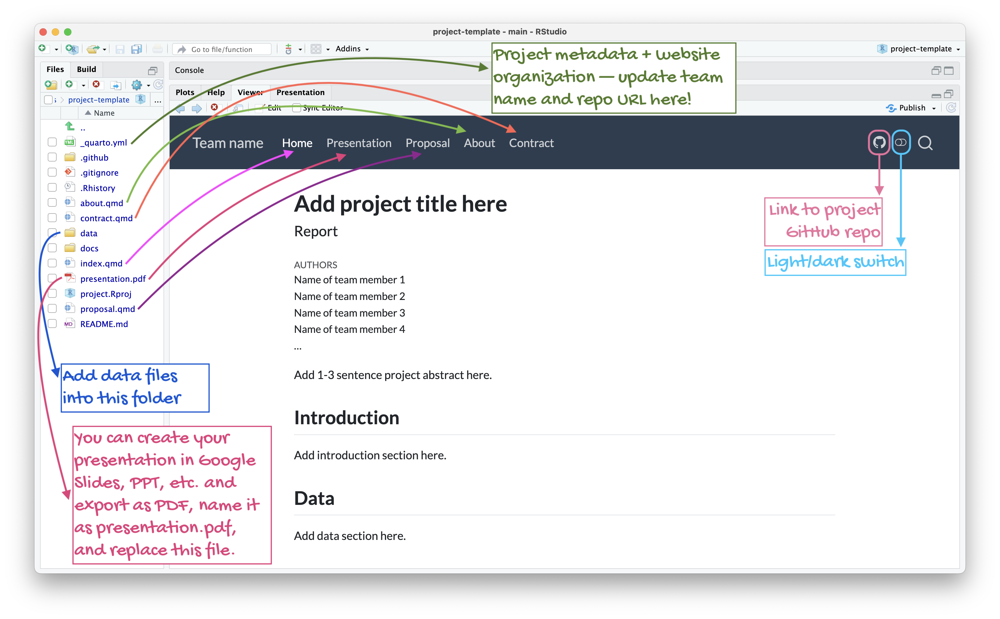

# Introduction

**TL;DR**: *Ask a question you're curious about and answer it with a dataset of your choice. This is your project in a nutshell.*

**May be too long, but please do read**

The project for this course will consist of an exploratory data analysis on a dataset of your own choosing.
The dataset may already exist, or you may collect your own data using a survey or by conducting an experiment.
You can choose the data based on your team's interests or based on work in other courses or research projects.
The goal of this project is for you to demonstrate proficiency in the exploratory data analysis techniques we have covered in this course and apply them to a novel dataset in a meaningful way.

The goal is not to do an exhaustive data analysis: you do not need to calculate every statistic or apply every procedure you have learned to every variable.
Instead, demonstrate that you can ask meaningful questions, answer them through exploratory data analysis in R, and interpret and present the results.
Focus on methods that help you begin to answer your research questions.
You do not have to apply every data science method we learned.
Also, critique your own methods and provide suggestions for improving your analysis.
Issues pertaining to the reliability and validity of your data and the appropriateness of the statistical analysis should be discussed here.

The project is very open ended.
You should create compelling visualization(s) and summary table(s) of the data in R.
Your analysis should be exploratory, building on the methods we learned in the first half of the course, up to and including Week 8, and excluding modeling and inference.
Your overall approach to data cleaning, transformation, and visualization should follow the tidyverse approach used in the course.
You may use additional R packages beyond those taught in the course to support your exploratory analysis.
You do not need to visualize or summarize all of the data at once.
A single high-quality visualization will receive a much higher grade than a large number of poor-quality visualizations.
Also pay attention to your presentation.
Neatness, coherence, and clarity will count.
All analyses must be done in Positron, using R, and all components of the project **must be reproducible** (with the exception of the slide deck).

You will work on the project with your lab teams.

# Structure

Your project is organized as a Quarto website, with a GitHub repository shared by all team members.

# Milestones

The seven milestones for the final project are:

1.  Milestone 1 - Working collaboratively
2.  Milestone 2 - Proposal
3.  Milestone 3 - Improvement and progress I: from proposal to project
4.  Milestone 4 - Peer review
5.  Milestone 5 - Improvement and progress II: polishing the project
6.  Milestone 6 - Presentation
7.  Milestone 7 - Write-up

You will not be submitting anything on Gradescope for the project.
Submission of these deliverables will happen on GitHub, and feedback will be provided as GitHub issues that you need to engage with and close.
The collection of the documents in your GitHub repo will create a webpage for your project.
To create the webpage, render the project website in Positron (e.g., by running `quarto render` in the Terminal).

## Milestone 1 - Working collaboratively

For the first milestone of your project, you'll practice a collaborative Git workflow with your team members.
Choose a team name, update the team information in `about.qmd`, complete your team contract in `contract.qmd`, and summarize your team's project interests in `proposal.qmd`.
Render, commit, and push your work to the shared repository.

Instructions are outlined in [Milestone 1: Working collaboratively](/project/1-working-collaboratively.html).
Each team member taking part in the collaborative working activity will get 5 points towards their project.

## Milestone 2 - Proposal {#project-proposal}

There are two main purposes of the project proposal:

-   To help you think about the project early, so you can get a head start on finding data, reading relevant literature, thinking about the questions you wish to answer, etc.
-   To ensure that the data you wish to analyze, methods you plan to use, and the scope of your analysis are feasible and will allow you to be successful for this project.

Write your proposal in `proposal.qmd`, introducing two candidate datasets and a motivated research question for each.
Describe each dataset's source, collection process, relevant variables, and any ethical concerns; store the data files in `data/` and import and inspect them in R using `glimpse()`.
Update `_quarto.yml` with your team's information and review your team contract.
Each team member must contribute commits, and the project website must build successfully.
You must use one of the proposed datasets for the final project unless instructed otherwise in feedback.

Instructions and grading criteria for this milestone are outlined in [Milestone 2: Proposal](/project/2-proposal.html).

## Milestone 3 - Improvement and progress I {#improvement-progress-I}

Create a data dictionary in `data/README.md`, address and close proposal feedback issues, and make further progress through commits to your repo since Milestone 2.
Focus your work on `index.qmd` and other project files; do not make further edits to the graded `proposal.qmd`.
For feedback about datasets you are no longer considering, close the issues with an explanatory comment.

This milestone is worth 10 points: 3 for the data dictionary, 2 for closing all feedback issues, and 5 for attending lab and participating in the teamwork in person.
Team members who do not attend and participate in person are not eligible for the 5 attendance points, regardless of their contributions throughout the rest of the project.

Instructions and grading criteria for this milestone are outlined in [Milestone 3: Improvement and progress I](/project/3-improvement-progress-I.html).

## Milestone 4 - Peer review {#peer-review}

Critically reviewing others' work is a crucial part of the scientific process, and STA 199 is no exception.
You will be assigned one team to review.
This feedback is intended to help you create a high-quality final project, as well as give you experience reading and constructively critiquing the work of others.

Read the assigned team's project draft and have one or two team members clone and render it to check reproducibility.
Discuss the review prompts together, then have one team member submit your team's constructive, actionable feedback as a GitHub issue in the reviewed team's repository using the peer review template.
Include the names of all participating team members and address statistical reasoning, reproducibility, and file and code organization.

Instructions and grading criteria for this milestone are outlined in [Milestone 4: Peer review](/project/4-peer-review.html).

## Milestone 5 - Improvement and progress II {#improvement-progress-II}

Incorporate peer feedback, close the peer feedback issues, and make further progress on your project through commits to your repo since Milestone 4.

This milestone is worth 10 points: 2 for one or more commits since Milestone 4, 3 for closing all feedback issues, and 5 for attending lab and participating in the teamwork in person.
Team members who do not attend and participate in person are not eligible for the 5 attendance points, regardless of their contributions throughout the rest of the project.

Instructions and grading criteria for this milestone are outlined in [Milestone 5: Improvement and progress II](/project/5-improvement-progress-II.html).

## Milestone 6 - Presentation

Create a slide deck of roughly six content slides plus a title slide, introducing your research question and data, highlighting your exploratory analysis, and discussing conclusions and limitations.
You may use presentation software such as Google Slides and upload the slides to your repo as `presentation.pdf`, or create your slides with Quarto.
Deliver a presentation of no more than five minutes in person in lab, with every team member participating.

Instructions and grading criteria for this milestone are outlined in [Milestone 6: Presentation](/project/6-presentation.html).

## Milestone 7 - Write-up

Complete your reproducible report in `index.qmd`, with Abstract, Introduction, Data, Results, Discussion, and Reflection sections.
The report, including visualizations, must be no longer than ten printed pages, excluding an optional appendix.
Hide code, warnings, and messages in the rendered report, and ensure all team members contribute regular, meaningful commits to the repository.

Instructions and grading criteria for this milestone are outlined in [Milestone 7: Write-up](/project/7-writeup.html).

# Computational quality {#computational-quality}

Computational quality is worth 10 points and measures your mastery of the computational aspects of the course across the project's source documents and GitHub repository.
It includes the following:

-   **Reproducibility:** All written work, except presentation slides, is reproducible. The project website renders successfully, and the code produces the reported results from the provided data.
-   **Organization:** The repository and code are logically organized, with clearly labeled code cells, appropriate cell options, an easily readable README, and no extraneous files.
-   **Code style:** Code follows a consistent tidyverse style, with informative object names, consistent spacing and indentation, and readable line lengths.
-   **Code smell:** Code avoids unnecessary repetition, unused or dead code, and other patterns that make it difficult to understand or maintain.
-   **Code complexity:** Code uses clear, appropriately simple solutions and avoids unnecessary steps or complicated logic. The overall approach follows the tidyverse methods used in the course.

# Teamwork

Teamwork is worth 10 points, based on peer evaluations.
You must complete the peer evaluation to be eligible to receive the teamwork points awarded to you by your teammates.

In the peer evaluation, you will also report each team member's contribution as a percentage of the team's total effort.
Each member's expected share is an equal share based on team size; for example, in a team of four, the expected share is 25%, and half of that share is 12.5%.
If you report that a team member contributed less than half their expected share, provide an explanation.
If a team member's contribution, averaged across the evaluations from all other team members, is less than half their expected share, penalties may apply to their overall project score beyond the teamwork component.

# Grading

The grade breakdown is as follows:

| Total                              | 100 pts |
|------------------------------------|---------|
| **M1: Working collaboratively**    | 5 pts   |
| **M2: Proposal**                   | 10 pts  |
| **M3: Improvement and progress I** | 10 pts  |
| **M4: Peer review**                | 5 pts   |
| **M5: Improvement and progress II**| 10 pts  |
| **M6: Presentation**               | 20 pts  |
| **M7: Write-up**                   | 20 pts  |
| **Computational quality**          | 10 pts  |
| **Teamwork**                       | 10 pts  |

## Grading summary

Grading of the project will take into account the following:

-   Content - What is the quality of the research and/or policy questions, and how relevant are the data to those questions?
-   Correctness - Are data science procedures carried out and explained correctly?
-   Writing and Presentation - What is the quality of the data science presentation, writing, and explanations?
-   Creativity and Critical Thought - Is the project carefully thought out? Are the limitations carefully considered? Does it appear that time and effort went into the planning and implementation of the project?

A general breakdown of scoring is as follows:

-   *90%-100%*: Outstanding effort. Student understands how to apply all data science and statistics concepts, can put the results into a cogent argument, can identify weaknesses in the argument, and can clearly communicate the results to others.
-   *80%-89%*: Good effort. Student understands most of the concepts, puts together an adequate argument, identifies some weaknesses of their argument, and communicates most results clearly to others.
-   *70%-79%*: Passing effort. Student misunderstands concepts in several areas, has some trouble putting results together in a cogent argument, and sometimes communicates results unclearly.
-   *60%-69%*: Struggling effort. Student is making some effort, but misunderstands many concepts and is unable to put together a cogent argument. Communication of results is unclear.
-   *Below 60%*: Student is not making a sufficient effort.

## Late work policy

**No late work will be accepted for this project.** Be sure to turn in your work early to avoid any technological mishaps.
