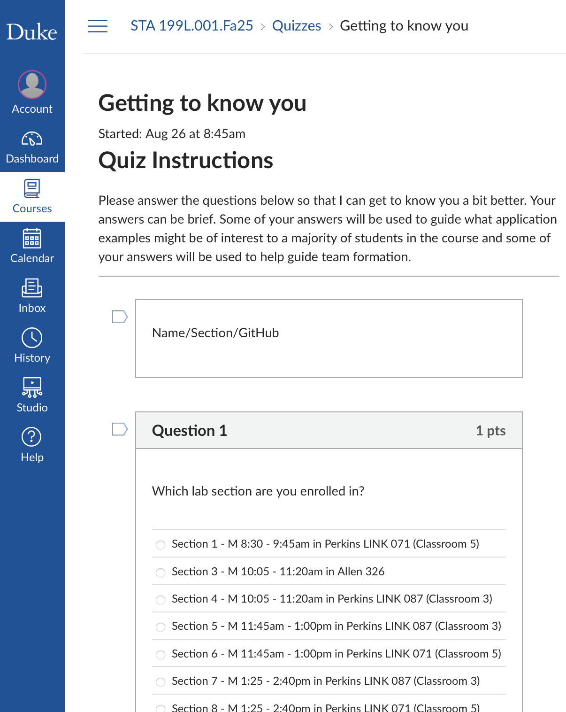

```{r}
#| label: setup
#| include: false
ggplot2::theme_set(ggplot2::theme_gray(base_size = 16))
```

# Hello world!

## Meet the prof {.smaller}

::: {.columns}
::: {.column width="50%"}
**Dr. Mine Çetinkaya-Rundel**

Professor of the Practice

Director of First-Year Experience in Trinity College of Arts & Sciences

Associate Director of Undergraduate Studies, Statistical Science

**Office:** Old Chem 211C
:::
::: {.column width="50%"}
**Office hours:**

- 3:30-5 pm on Wednesdays at my office
- Always available after class
- Also available by appointment
:::
::: 

## Meet the course team {.smaller}

::::: columns
::: {.column width="50%"}
- **Mary Knox (Course coordinator)**
- Josh Lim (PhD) (Head TA)
- Helen Chen (PhD)
- Cael Elmore	(PhD)
- **Robbie Hao (MS)**
- Carl Emerson (MS)
- Juan Pablo Lopez Escamilla (MS)
- Kenna Roberts (MS)
- Yasmine Abdel-Rahman (UG)
:::

::: {.column width="50%"}
- Tally Coulter (UG)
- Oliver Gao (UG)
- Hellen Han (UG)
- **Hyunjin Lee	(UG)**
- Anric Ngan (UG)
- Chelsea Nguyen (UG)
- **Max	Niu (UG)**
- Sophie Schwartz (UG)
- Allison Yang (UG)
:::
:::::

## Meet each other!

::: question
Please share with at least two classmates...

-   Your name
-   Your year
-   Where you're from
-   What you did this past summer
-   What you hope to get out of this course
:::

::: {.content-visible when-format="revealjs"}

:::

## Meet data science

::: incremental
-   **Data science** is an exciting discipline that allows you to turn raw data into understanding, insight, and knowledge.

-   We're going to learn to do this in a modern and `tidy` way -- more on that later!

-   This is a course on introduction to data science, with an emphasis on **statistical thinking**.
:::

## Let's do some data science! {.smaller}

::: {.columns}
::: {.column}
-   Yesterday we collected some data from you!

-   Today we're going to explore that data together, following the data science cycle.
:::
::: {.column}
{fig-alt="Data science cycle: Import, tidy, transform, visualize, model, communicate." fig-align="center"}
:::
:::

. . .

::: callout-warning
The data is anonymized and randomized and contains only a subset of the data collected. The rows have been shuffled for each column independently, meaning that no row belongs to a single student in the course. Additionally, any identifying information has been removed. Please do not try to de-anonymize or re-identify any individuals in the dataset.
:::


## Beginning the data science cycle {.smaller}

::: {.columns}
::: {.column width="50%" .fragment}
You took a survey:

{fig-alt="Screenshot of Getting to know you survey on Canvas." fig-align="center" fig-width="200"}
:::
::: {.column width="25%" .fragment}
Canvas stored your data in a CSV (comma-separated values) file:


:::
::: {.column width="25%" .fragment}
We want to explore the data that is in that file!
:::
::: 

## Import

{fig-alt="Data science cycle: Import, tidy, transform, visualize, model, communicate. Import is highlighted." fig-align="center"}

## Load some packages

More on what packages are on Thursday, but in a nutshell "get your tools out of the toolbox":

```{r}
#| message: false
library(tidyverse) # for data wrangling and visualization
library(scales) # for better axis labels
library(tidytext) # for handling text data
library(taylor) # for a surprise!
```

## Import the data

Import the data called `survey-anonymized.csv` in the folder called `data` using the `read_csv()` function:

```{r}
#| eval: false
survey <- read_csv("data/survey-anonymized.csv")
```

```{r}
#| include: false
survey <- read_csv(here::here("slides", "data/survey-anonymized.csv"))
```

## Take a peek at the data {.smaller}

```{r}
survey
```

## Participate 💻📱



## Take a peek + Participate 💻📱 {.xsmall}

::: {.columns}
::: {.column width="70%"}
```{r}
#| echo: false
survey
```
:::
::: {.column width="30%"}

:::
:::

## Statistics experience

We asked you the following multiple-choice question where you could only pick one option:

::: demo
Have you taken any statistics courses before?

- Yes, I have taken another college course on statistics
- Yes, I have taken a high school statistics course
- No, I have not taken any statistics courses
:::

## Visualize

One way to make sense of data collected via a question like this is to visualize it.

{fig-alt="Data science cycle: Import, tidy, transform, visualize, model, communicate. Visualize is highlighted." fig-align="center"}

## Visualize

```{r}
#| code-fold: true
#| fig-width: 10
#| fig-asp: 0.4
survey |>
  count(stats_experience) |>
  mutate(prop = n / sum(n)) |>
  ggplot(aes(y = stats_experience, x = prop)) +
  geom_col(show.legend = FALSE) +
  scale_y_discrete(labels = label_wrap(20)) +
  scale_x_continuous(
    labels = percent_format(accuracy = 1),
    breaks = c(0, 0.25, 0.5)
  ) +
  labs(
    title = "Prior statistics experience among STA 199 students",
    y = NULL,
    x = "Count"
  ) +
  labs(
    caption = "Data are self-reported, collected from STA 199 students on August 25, 2025."
  )
```


## Programming experience {.smaller}

We also asked you the following multiple-choice question where you could only pick one option:

::: demo
How much experience do you have with programming?

- None
- A little — I've written a few lines or done small exercises
- Some — I've worked on a few projects or used it occasionally
- A lot — I use programming regularly and feel confident writing code
:::

## Visualize

```{r}
#| code-fold: true
#| fig-width: 10
#| fig-asp: 0.5
survey |>
  count(programming_experience) |>
  mutate(prop = n / sum(n)) |>
  ggplot(aes(
    y = fct_reorder(programming_experience, prop),
    x = prop,
    fill = prop
  )) +
  geom_col(show.legend = FALSE) +
  scale_y_discrete(labels = label_wrap(25)) +
  scale_x_continuous(
    labels = percent_format(accuracy = 1),
    breaks = c(0, 0.1, 0.2, 0.3, 0.4)
  ) +
  scale_fill_viridis_c(option = "E") +
  labs(
    title = "Prior programming experience among STA 199 students",
    y = NULL,
    x = "Count"
  ) +
  labs(
    caption = "Data are self-reported, collected from STA 199 students on August 25, 2025."
  ) +
  theme_minimal(base_size = 16)
```

## Learn best {.xsmall}

We also asked you the following multiple-choice question where you could as many options as you liked:

::: demo
What types of data interest you?

- Crime
- Economics
- Education
- Entertainment (e.g., books, movies, music)
- Environment/Climate
- Health (e.g., social determinants of health, medical)
- Politics
- Sports
- Other
- No preference
:::

## Peek at the data {.smaller}

```{r}
#| code-fold: true
survey |>
  select(data_interests)
```

## Tidy  + Transform

Before we can visualize this variable, we need to tidy and transform it.

{fig-alt="Data science cycle: Import, tidy, transform, visualize, model, communicate. Tidy and transform are highlighted." fig-align="center"}

## Tidy + Transform {.smaller}

```{r}
#| code-fold: true
survey |>
  # remove text in parentheses
  mutate(data_interests = str_remove_all(data_interests, "\\s*\\(.*?\\)")) |>
  # separate into multiple rows for each interest, using comma as delimiter
  separate_longer_delim(data_interests, delim = ",") |>
  count(data_interests, sort = TRUE) |>
  mutate(prop = n / sum(n))
```

## Visualize

```{r}
#| code-fold: true
survey |>
  mutate(data_interests = str_remove_all(data_interests, "\\s*\\(.*?\\)")) |>
  separate_longer_delim(data_interests, delim = ",") |>
  count(data_interests, sort = TRUE) |>
  mutate(prop = n / sum(n)) |>
  filter(!is.na(data_interests)) |>
  ggplot(aes(y = fct_reorder(data_interests, prop), x = prop, fill = prop)) +
  geom_col(show.legend = FALSE) +
  scale_y_discrete(labels = label_wrap(20)) +
  scale_x_continuous(labels = percent_format(accuracy = 1)) +
  scale_fill_taylor_c(album = "Speak Now") +
  labs(
    title = "Data interests among STA 199 students",
    y = NULL,
    x = "Count",
    caption = "Data are self-reported, collected from STA 199 students on August 25, 2025."
  ) +
  theme_minimal(base_size = 16)
```

## Learn best

We also asked you the following open-ended question:

::: demo
How do you learn best?
:::

## Tidy + Transform + Summarize {.smaller}

We can use text mining techniques, like *tokenizing* to words to explore this open-ended question:

```{r}
#| code-fold: true
survey |>
  select(learn_best) |>
  unnest_tokens(word, learn_best) |>
  anti_join(stop_words, by = "word") |>
  count(word, sort = TRUE) |>
  filter(n > 15) |>
  print(n = Inf)
```

## Tidy + Transform + Summarize {.smaller}

We can also tokenize to *bigrams* (pairs of words):

```{r}
#| code-fold: true
survey |>
  select(learn_best) |>
  tidytext::unnest_tokens(bigrams, learn_best, token = "ngrams", n = 2) |>
  count(bigrams, sort = TRUE) |>
  filter(n > 10) |>
  print(n = Inf)
```

## Programming language comfort {.smaller}

We also asked you the following open-ended question:

::: demo
If you’ve programmed before, which languages have you used, and how comfortable do you feel with each? If you haven’t programmed before, please leave this question blank.
:::

## Take a peek + Participate 💻📱 {.smaller}

::: {.columns}
::: {.column width="60%"}
And the answers are non-trivial to tidy up, e.g.,

```
- Python - I've used it very little.
- I have not programmed before. 
- Java - very comfortable. Python - pretty comfortable. C/C++ - not super comfortable, haven't used since high school.
```

:::
::: {.column width="40%"}

:::
:::

## Can AI help? {.smaller}

```{r}
#| eval: false
#| code-fold: true
library(ellmer)

chat <- chat_openai()

prompts <- survey |>
  filter(!is.na(programming_languages)) |>
  pull(programming_languages) |>
  list()

type_language <- type_object(
  language = type_string(),
  experience = type_string()
)

language_experience <- parallel_chat_structured(
  chat,
  prompts,
  type = type_language
)
language_experience
```

```
language
1 Python, Java, R, C/C++, JavaScript, HTML/CSS, SQL, C#, VBA, MATLAB, Rust, Assembly, Swift, Stata, Bash, Typescript, Web3 Suite (HTML, CSS, JS), Nextflow, SAS, PsycoPy, Mathematica, React, Vue, Yaml, CourseKata, Flutter, Scratch

experience
1 Most students report a range of programming experience, from never having programmed before to being very comfortable in languages such as Python, Java, and R. Many took introductory courses (e.g., CS101, AP CS A) and are comfortable with basic programming constructs. Proficiency is generally highest in Python and Java, though some only have a little experience with languages like R, C/C++, and JavaScript. Quite a few have only used programming languages for specific classes or research projects and may not feel confident after a long break. Some students have experience with more niche or specialized tools such as MATLAB, SAS, and web technologies (HTML, CSS, JavaScript/JS frameworks). Many express a need for a refresher if not used recently. In summary, while a core group is comfortable with at least one language, especially Python or Java, many others have only basic to moderate experience and express the desire to gain more proficiency.
```

## Can it be trusted 100%? {.xsmall}

**Mathematica** is a software system used for mathematics.

```{r}
survey |>
  filter(str_detect(programming_languages, "Mathematica")) |>
  select(programming_languages)
```

. . .

**Nextflow** extends the Unix pipes model with a DSL.

```{r}
survey |>
  filter(str_detect(programming_languages, "Nextflow")) |>
  select(programming_languages)
```

. . .

**PsycoPy** is a desktop application for in-lab studies.

```{r}
survey |>
  filter(str_detect(programming_languages, "PsycoPy")) |>
  select(programming_languages)
```

<!-- ===========================================================================
     ALTERNATIVE VERSION OF THE DATA SCIENCE CYCLE DEMO
     Uses TidyTuesday country music lyrics instead of the student survey.
     Runs the same arc as the survey section above (import -> peek ->
     categorical bar chart -> multi-value tidying -> text mining -> AI), so
     keep ONE of the two sections and delete the other.
     Data object is called `country` (not `survey`) so both can coexist.
     Source: https://github.com/rfordatascience/tidytuesday/tree/main/data/2026/2026-08-25
     =========================================================================== -->

# Hello, country music! 🎸

## Let's do some data science! {.smaller}

::: {.columns}
::: {.column}
-   Today we're going to explore some data together, following the data science cycle.

-   Our question: **are the stereotypes about country music actually true?**
:::
::: {.column}
{fig-alt="Data science cycle: Import, tidy, transform, visualize, model, communicate." fig-align="center"}
:::
:::

. . .

::: demo
"Is it REALLY all about beer and trucks and girls and blue jeans? Are all the lyrics REALLY the same?"

--- [Grady Smith](https://www.youtube.com/watch?v=48ZxNFGJTo8), country music critic
:::

## Where the data comes from {.smaller}

::: {.columns}
::: {.column .fragment}
Grady Smith kept a spreadsheet of **every country song that reached the Top 30 of Billboard's Country Airplay chart**:


:::
::: {.column .fragment}
Someone tidied it up and put it in a CSV (comma-separated values) file:


:::
::: {.column .fragment}
We want to explore the data that is in that file!


:::
:::

## Import

{fig-alt="Data science cycle: Import, tidy, transform, visualize, model, communicate. Import is highlighted." fig-align="center"}

## Load some packages

More on what packages are on Thursday, but in a nutshell "get your tools out of the toolbox":

```{r}
#| label: cl-packages
#| message: false
library(tidyverse) # for data wrangling and visualization
library(scales) # for better axis labels
library(tidytext) # for handling text data
library(taylor) # for a surprise!
```

## Import the data

Import the data called `country-lyrics.csv` in the folder called `data` using the `read_csv()` function:

```{r}
#| label: cl-read-shown
#| eval: false
country <- read_csv("data/country-lyrics.csv")
```

```{r}
#| label: cl-read-real
#| include: false
country <- read_csv(here::here("slides", "data/country-lyrics.csv"))
```

## Take a peek at the data {.smaller}

```{r}
#| label: cl-peek
country
```

## Participate 💻📱



## Take a peek + Participate 💻📱 {.xsmall}

::: {.columns}
::: {.column width="70%"}
```{r}
#| label: cl-peek-2
#| echo: false
country
```
:::
::: {.column width="30%"}

:::
:::

## When did these songs chart?

Every song in this dataset broke into the Top 30 in some year. One way to make sense of a variable like this is to visualize it.

{fig-alt="Data science cycle: Import, tidy, transform, visualize, model, communicate. Visualize is highlighted." fig-align="center"}

## Visualize

```{r}
#| label: cl-year
#| code-fold: true
#| fig-width: 10
#| fig-asp: 0.4
country |>
  count(entered_top_30_in) |>
  mutate(prop = n / sum(n)) |>
  ggplot(aes(x = factor(entered_top_30_in), y = prop)) +
  geom_col(show.legend = FALSE) +
  scale_y_continuous(labels = percent_format(accuracy = 1)) +
  labs(
    title = "When did these songs break into the Top 30?",
    x = NULL,
    y = NULL,
    caption = "Country songs reaching the Top 30 of Billboard's Country Airplay chart."
  ) +
  theme_minimal(base_size = 16)
```

## Who is on country radio? {.smaller}

There are `r nrow(country)` songs in the data, but only 121 different artists. Let's look at the 15 with the most Top 30 hits.

```{r}
#| label: cl-artist
#| code-fold: true
#| fig-width: 10
#| fig-asp: 0.55
country |>
  count(artist, sort = TRUE) |>
  slice_head(n = 15) |>
  ggplot(aes(y = fct_reorder(artist, n), x = n, fill = n)) +
  geom_col(show.legend = FALSE) +
  scale_fill_viridis_c(option = "E") +
  labs(
    title = "Who had the most Top 30 country hits?",
    y = NULL,
    x = "Number of songs",
    caption = "Country songs reaching the Top 30 of Billboard's Country Airplay chart."
  ) +
  theme_minimal(base_size = 16)
```

## Who *writes* country songs? {.smaller}

Songs are usually written by more than one person, so the `writers` variable holds a whole list in a single cell:

```{r}
#| label: cl-writers-peek
#| code-fold: true
country |>
  select(song, writers)
```

## Tidy + Transform

Before we can visualize this variable, we need to tidy and transform it.

{fig-alt="Data science cycle: Import, tidy, transform, visualize, model, communicate. Tidy and transform are highlighted." fig-align="center"}

## Tidy + Transform {.smaller}

```{r}
#| label: cl-writers-tidy
#| code-fold: true
country |>
  # separate into multiple rows for each writer, using comma as delimiter
  separate_longer_delim(writers, delim = ", ") |>
  count(writers, sort = TRUE)
```

## Visualize {.smaller}

```{r}
#| label: cl-writers-plot
#| code-fold: true
#| fig-width: 10
#| fig-asp: 0.55
country |>
  separate_longer_delim(writers, delim = ", ") |>
  count(writers, sort = TRUE) |>
  slice_head(n = 15) |>
  ggplot(aes(y = fct_reorder(writers, n), x = n, fill = n)) +
  geom_col(show.legend = FALSE) +
  scale_fill_taylor_c(album = "Speak Now") +
  labs(
    title = "Is country radio run by a small circle of hitmakers?",
    y = NULL,
    x = "Number of songs written",
    caption = "Country songs reaching the Top 30 of Billboard's Country Airplay chart."
  ) +
  theme_minimal(base_size = 16)
```

## What do country songs sing about?

The `lyrics` variable contains the entire text of each song:

::: demo
"My friends call me up 'cause they know I'm down / Take me out to paint the town and help me get over it..."
:::

We can use text mining techniques, like *tokenizing* to words, to explore it.

## Tidy + Transform + Summarize {.smaller}

```{r}
#| label: cl-words
#| code-fold: true
country |>
  select(lyrics) |>
  unnest_tokens(word, lyrics) |>
  anti_join(stop_words, by = "word") |>
  count(word, sort = TRUE) |>
  slice_head(n = 15) |>
  print(n = Inf)
```

## Tokenize to bigrams {.smaller}

We can also tokenize to *bigrams* (pairs of words):

```{r}
#| label: cl-bigrams-raw
#| code-fold: true
country |>
  select(lyrics) |>
  unnest_tokens(bigram, lyrics, token = "ngrams", n = 2) |>
  count(bigram, sort = TRUE) |>
  slice_head(n = 8) |>
  print(n = Inf)
```

. . .

Hmm. Not very informative -- these are all common words!

## Drop the stop words {.smaller}

Let's split each bigram in two and throw away the pairs built from common words:

```{r}
#| label: cl-bigrams-clean
#| code-fold: true
country |>
  select(lyrics) |>
  unnest_tokens(bigram, lyrics, token = "ngrams", n = 2) |>
  separate_wider_delim(bigram, delim = " ", names = c("word1", "word2")) |>
  anti_join(stop_words, by = join_by(word1 == word)) |>
  anti_join(stop_words, by = join_by(word2 == word)) |>
  count(word1, word2, sort = TRUE) |>
  slice_head(n = 20) |>
  print(n = Inf)
```

## Can AI help? {.smaller}

We could also ask a large language model to read every song and tell us what it's about:

```{r}
#| label: cl-ellmer
#| eval: false
#| code-fold: true
library(ellmer)

chat <- chat_openai()

prompts <- country |>
  pull(lyrics) |>
  as.list()

type_song <- type_object(
  theme = type_string(),
  mentions_alcohol = type_boolean()
)

song_themes <- parallel_chat_structured(
  chat,
  prompts,
  type = type_song
)
song_themes
```

<!-- mtk: run the chunk above with your own API key and paste the real output
     into a plain code block here, the way the survey version of this slide
     does. Left unevaluated so the deck renders without an API key. -->

## Can it be trusted 100%? {.smaller}

Ask an AI (or a person!) what country songs are about and you'll hear: **beer, trucks, dirt roads, blue jeans, tractors**.

. . .

But we have the lyrics, so we can just *check*:

```{r}
#| label: cl-stereotypes
#| code-fold: true
country |>
  mutate(lyrics_lower = str_to_lower(lyrics)) |>
  summarize(
    truck = mean(str_detect(lyrics_lower, "truck")),
    whiskey = mean(str_detect(lyrics_lower, "whiskey")),
    beer = mean(str_detect(lyrics_lower, "beer")),
    `dirt road` = mean(str_detect(lyrics_lower, "dirt road")),
    `blue jeans` = mean(str_detect(lyrics_lower, "blue jeans")),
    tractor = mean(str_detect(lyrics_lower, "tractor"))
  ) |>
  pivot_longer(
    everything(),
    names_to = "stereotype",
    values_to = "prop"
  ) |>
  arrange(desc(prop))
```

## Communicate {.smaller}

::: incremental
-   Only about **12%** of these songs mention a truck, and **1%** mention a tractor.

-   The words that actually dominate are `girl`, `baby`, `love`, and `night`.

-   The stereotype is **memorable**, not **frequent** -- and that difference is only visible once you look at the data.
:::

. . .

::: callout-tip
This is what we mean by **statistical thinking**: a claim that "feels true" is a hypothesis, not a finding.
:::

# Course overview

## Homepage

[https://sta199-f26.github.io](https://sta199-f26.github.io/){.uri}

-   All course materials
-   Links to Canvas, GitHub, RStudio containers, etc.

## Course toolkit

All linked from the course website:

-   GitHub organization: [github.com/sta199-f26](https://github.com/sta199-f26)
-   RStudio containers: [cmgr.oit.duke.edu/containers](https://cmgr.oit.duke.edu/containers)
-   Communication: Ed Discussion
-   Assignment submission and feedback: Gradescope

## Activities {.smaller}

-   Introduce new content and prepare for lectures by watching the videos and completing the readings
-   Attend and actively participate in lectures (and answer questions for participation credit) and labs, office hours, team meetings
-   Practice applying statistical concepts and computing with application exercises during lecture
-   Put together what you've learned to analyze real-world data
    -   Lab assignments
    -   Homework assignments
    -   Exams
    -   Term project completed in teams

## Attendance and participation {.smaller}

-   Daily in lecture

-   Tracked for credit, but not based on correctness, only participation (and often they will be questions designed to make you think that might not have a single right answer!)

## Application exercises {.smaller}

-   Daily-ish in lecture

-   Not graded, but tracked for feedback on workflow

## Labs {.smaller}

-   Hands-on practice with data analysis

-   A sigle exercise per lab, graded based on being there and in something reasonable + correctness

-   Completed in-person, in lab, in teams

-   Teams randomized each week until project teams assigned

-   Developed collaboratively, but turned in individually by the end of the lab session

-   8 throughout semester, two lowest scores dropped

-   No late work accepted

## Homework {.smaller}

-   Hands-on practice with data analysis

-   Some questions for practice with instant feedback by AI

-   1-2 randomly sampled questions to be graded by humans for correctness

-   Can consult with course team and peers, but completed and turned in individually by the end of the week

-   7 throughout semester, lowest score dropped

-   Up to 3 days late (-5% per day), no late work accepted after that

-   One-time late penalty waiver: Can be used on any homework assignment, no questions asked, must be requested from Dr. Knox before the deadline

## Exams {.smaller}

-   Two exams + final

-   All exams comprised of two parts:

    -   Multiple choice questions

    -   Short answer questions, on homework specifics (read: difficult/impossible to answer correctly without having done the homework)

-   One sheet of notes for each exam, no larger than 8 1/2 x 11, both sides, **must be prepared by you**

- No extensions or make-ups

::: callout-caution
Exam dates cannot be changed and no make-up exams will be given. If you can’t take the exams on these dates, you should drop this class.
:::

## Project {.smaller}

-   Dataset of your choice, method of your choice

-   Teamwork

-   Seven milestones, interim deadlines throughout semester

-   Final milestone: Presentation in lab and write-up

-   Must be in lab, in-person to present

-   Peer review between teams for content, peer evaluation within teams for contribution

-   Some lab sessions allocated to project progress

::: callout-caution
Project presentation date cannot be changed. You must complete the project to pass this class.
:::

## Teams {.smaller}

-   Randomized at first for weekly labs

-   Then selected by you or assigned by me if you don't express a preference for project and remaining labs

-   Expectations and roles
    -   Everyone is expected to contribute equal *effort*
    -   Everyone is expected to understand *all* code turned in
    -   Individual contribution evaluated by peer evaluation, commits, etc.

-   For the project: Peer evaluation during teamwork and after completion

## Grading {.smaller}

| Category              | Percentage |
|-----------------------|------------|
| Lectures (attendance + participation) | 5%         |
| HW                    | 5%         |
| Labs                  | 10%        |
| Project               | 15%        |
| Exam 1                | 20%        |
| Exam 2                | 20%        |
| Final                 | 25%        |

See course syllabus for how the final letter grade will be determined.

## Participate 💻📱



# Wrap up

## Tasks due Wednesday

-   Complete the getting to know you survey, then accept your GitHub organization invitation
-   Read the syllabus
-   Complete readings and videos for Wednesday
