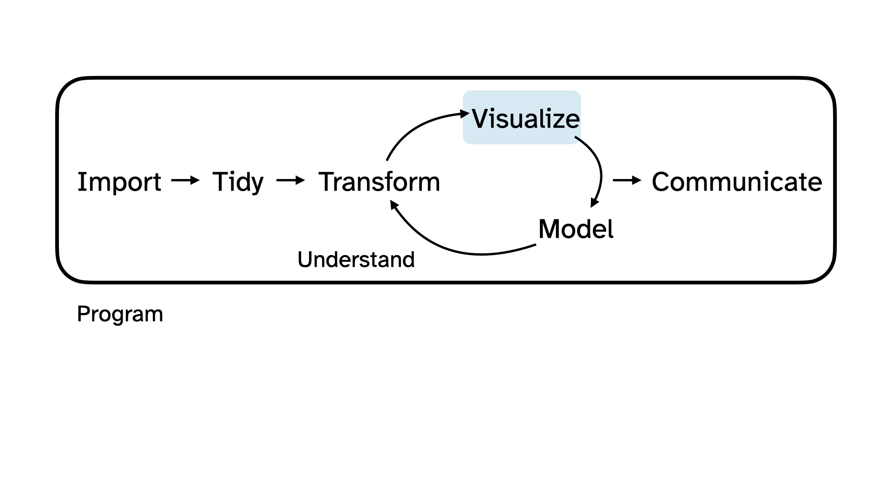
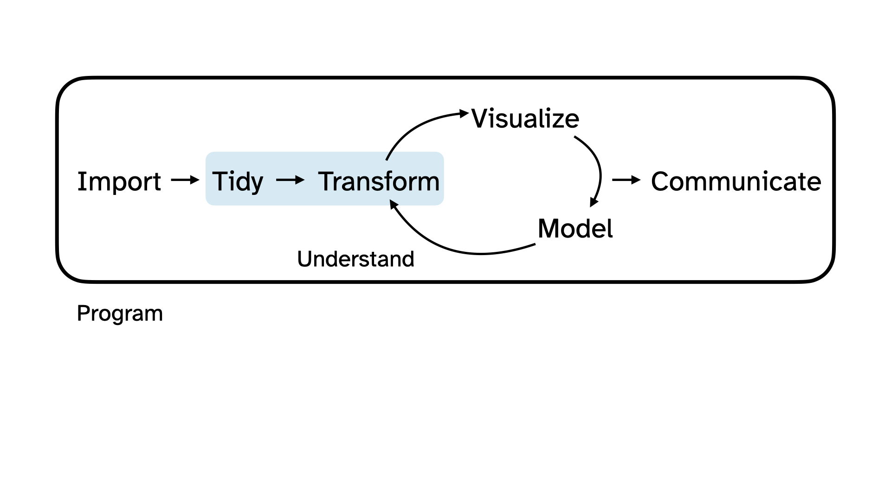

```{r}
#| label: setup
#| include: false
ggplot2::theme_set(ggplot2::theme_gray(base_size = 16))
```

# Hello world!

## Meet the prof {.smaller}

::: {.columns}
::: {.column width="50%"}
**Dr. Mine Çetinkaya-Rundel**

Professor of the Practice

Director of First-Year Experience in Trinity College of Arts & Sciences

Associate Director of Undergraduate Studies, Statistical Science

**Office:** Old Chem 211C
:::
::: {.column width="50%"}
**Office hours:**

- 3:30-5 pm on Wednesdays at my office
- Always available after class
- Also available by appointment
:::
::: 

## Meet the course team {.smaller}

::::: columns
::: {.column width="50%"}
- **Mary Knox (Course coordinator)**
- Josh Lim (PhD) (Head TA)
- Helen Chen (PhD)
- Cael Elmore	(PhD)
- **Robbie Hao (MS)**
- Carl Emerson (MS)
- Juan Pablo Lopez Escamilla (MS)
- Kenna Roberts (MS)
- Yasmine Abdel-Rahman (UG)
:::

::: {.column width="50%"}
- Tally Coulter (UG)
- Oliver Gao (UG)
- Hellen Han (UG)
- **Hyunjin Lee	(UG)**
- Anric Ngan (UG)
- Chelsea Nguyen (UG)
- **Max	Niu (UG)**
- Sophie Schwartz (UG)
- Allison Yang (UG)
:::
:::::

## Meet each other!

::: question
Please share with at least two classmates...

-   Your name
-   Your year
-   Where you're from
-   What you did this past summer
-   What you hope to get out of this course
:::

::: {.content-visible when-format="revealjs"}

:::

## Meet data science

::: incremental
-   **Data science** is an exciting discipline that allows you to turn raw data into understanding, insight, and knowledge.

-   We're going to learn to do this in a modern and `tidy` way -- more on that later!

-   This is a course on introduction to data science, with an emphasis on **statistical thinking**.
:::

# Hello, country music! 🎸

## Let's do some data science! {.smaller}

::: {.columns}
::: {.column}
-   Today we're going to explore some data together, following the data science cycle.

-   Our question: **Are the stereotypes about country music actually true?**
:::
::: {.column}
{fig-alt="Data science cycle: Import, tidy, transform, visualize, model, communicate." fig-align="center"}
:::
:::

## Participate 💻📱



## Are the stereotypes about country music actually true?

::: demo
"Is it REALLY all about beer and trucks and girls and blue jeans? Are all the lyrics REALLY the same?"

--- [Grady Smith](https://www.youtube.com/watch?v=48ZxNFGJTo8), country music critic
:::

## Data {.smaller}

::: {.columns}

::: {.column .fragment}
 

Grady Smith kept a spreadsheet of every country song that reached the Top 30 of Billboard's Country Airplay chart.


:::

::: {.column .fragment}
 

Someone tidied it up and put it in a CSV (comma-separated values) file and released it as part of the [TidyTuesday](https://github.com/rfordatascience/tidytuesday) project.

:::

:::

## Import

{fig-alt="Data science cycle: Import, tidy, transform, visualize, model, communicate. Import is highlighted." fig-align="center"}

## Load some packages

More on what packages are on Thursday, but in a nutshell "get your tools out of the toolbox":

```{r}
#| label: cl-packages
#| message: false
library(tidyverse) # for data wrangling and visualization
library(scales) # for better axis labels
library(tidytext) # for handling text data
library(taylor) # for a surprise!
```

## Import the data

Import the data called `country-lyrics.csv` in the folder called `data` using the `read_csv()` function:

```{r}
#| label: cl-read-real
#| include: false
country <- read_csv(here::here("slides", "data/country-lyrics.csv"))
```

```{r}
#| label: cl-read-show
#| eval: false
country <- read_csv("data/country-lyrics.csv")
```

```{r}
#| label: cl-brand
#| include: false
# Plot colors are read from _brand.yml so the figures and the slide theme stay
# in sync. Hyphens become underscores so they can be used as brand$all_aboard.
brand <- yaml::read_yaml(here::here("_brand.yml"))$color$palette
names(brand) <- gsub("-", "_", names(brand))
```

## Take a peek at the data {.smaller}

```{r}
#| label: cl-peek
country
```

## When did these songs chart?

Every song in this dataset broke into the Top 30 in some year. One way to make sense of a variable like this is to visualize it.

{fig-alt="Data science cycle: Import, tidy, transform, visualize, model, communicate. Visualize is highlighted." fig-align="center"}

## Visualize

```{r}
#| label: cl-year
#| code-fold: true
#| fig-width: 10
#| fig-asp: 0.4
country |>
  count(entered_top_30_in) |>
  mutate(prop = n / sum(n)) |>
  ggplot(aes(x = entered_top_30_in, y = prop, group = 1)) +
  geom_point() +
  geom_line() +
  scale_y_continuous(labels = percent_format(accuracy = 1)) +
  scale_x_continuous(breaks = seq(2013, 2019, by = 1)) +
  labs(
    title = "When did these songs break into the Top 30?",
    x = NULL,
    y = NULL,
    caption = "Country songs reaching the Top 30 of Billboard's Country Airplay chart."
  ) +
  theme_minimal(base_size = 16)
```

## Who is on country radio? {.smaller}

There are `r nrow(country)` songs in the data, but only 121 different artists. Let's look at the 15 with the most Top 30 hits.

```{r}
#| label: cl-artist
#| code-fold: true
#| fig-width: 10
#| fig-asp: 0.55
country |>
  count(artist, sort = TRUE) |>
  slice_head(n = 15) |>
  ggplot(aes(y = fct_reorder(artist, n), x = n, fill = n)) +
  geom_col(show.legend = FALSE) +
  labs(
    title = "Who had the most Top 30 country hits?",
    y = NULL,
    x = "Number of songs",
    caption = "Country songs reaching the Top 30 of Billboard's Country Airplay chart."
  ) +
  theme_minimal(base_size = 16)
```

## Who *writes* country songs? {.smaller}

Songs are usually written by more than one person, so the `writers` variable holds a whole list in a single cell:

```{r}
#| label: cl-writers-peek
#| code-fold: true
country |>
  select(song, writers)
```

## Tidy + Transform

Before we can visualize this variable, we need to tidy and transform it.

{fig-alt="Data science cycle: Import, tidy, transform, visualize, model, communicate. Tidy and transform are highlighted." fig-align="center"}

## Tidy + Transform {.smaller}

```{r}
#| label: cl-writers-tidy
#| code-fold: true
country |>
  # separate into multiple rows for each writer, using comma as delimiter
  separate_longer_delim(writers, delim = ", ") |>
  count(writers, sort = TRUE)
```

## Visualize {.smaller}

```{r}
#| label: cl-writers-plot
#| code-fold: true
#| fig-width: 10
#| fig-asp: 0.55
country |>
  separate_longer_delim(writers, delim = ", ") |>
  count(writers, sort = TRUE) |>
  slice_head(n = 15) |>
  ggplot(aes(y = fct_reorder(writers, n), x = n, fill = n)) +
  geom_col(show.legend = FALSE) +
  scale_fill_taylor_c(album = "Speak Now") +
  labs(
    title = "Is country radio run by a small circle of hitmakers?",
    y = NULL,
    x = "Number of songs written",
    caption = "Country songs reaching the Top 30 of Billboard's Country Airplay chart."
  ) +
  theme_minimal(base_size = 16)
```

## What do country songs sing about?

The `lyrics` variable contains the entire text of each song:

::: demo
"My friends call me up 'cause they know I'm down / Take me out to paint the town and help me get over it..."
:::

We can use text mining techniques, like *tokenizing* to words, to explore it.

## Tidy + Transform + Summarize {.smaller}

```{r}
#| label: cl-words
#| code-fold: true
country |>
  select(lyrics) |>
  unnest_tokens(word, lyrics) |>
  anti_join(stop_words, by = "word") |>
  count(word, sort = TRUE) |>
  slice_head(n = 15) |>
  print(n = Inf)
```

## Tokenize to bigrams {.smaller}

We can also tokenize to *bigrams* (pairs of words):

```{r}
#| label: cl-bigrams-raw
#| code-fold: true
country |>
  select(lyrics) |>
  unnest_tokens(bigram, lyrics, token = "ngrams", n = 2) |>
  count(bigram, sort = TRUE) |>
  slice_head(n = 8) |>
  print(n = Inf)
```

. . .

Hmm. Not very informative -- these are all common words!

## Drop the stop words {.smaller}

Let's split each bigram in two and throw away the pairs built from common words:

```{r}
#| label: cl-bigrams-clean
#| code-fold: true
country |>
  select(lyrics) |>
  unnest_tokens(bigram, lyrics, token = "ngrams", n = 2) |>
  separate_wider_delim(bigram, delim = " ", names = c("word1", "word2")) |>
  anti_join(stop_words, by = join_by(word1 == word)) |>
  anti_join(stop_words, by = join_by(word2 == word)) |>
  count(word1, word2, sort = TRUE) |>
  slice_head(n = 20) |>
  print(n = Inf)
```

## Can AI help? {.smaller .scrollable}

We could also ask a large language model to read every song and tell us what it's about?

> "What are common themes in these country song lyrics?" [Attached data file `country-lyrics.csv`.] 24 August 2026. ChatGPT 5.6 Sol Light. [chatgpt.com/share/e/6a8c7343-62e4-83ea-b114-715f9b847cea](https://chatgpt.com/share/e/6a8c7343-62e4-83ea-b114-715f9b847cea)

::: xsmall

Across the 484 songs in [country-lyrics.csv](sandbox:/workspace/scratch/fea9b77f1ff8/upload/country-lyrics.csv), several recurring themes stand out:

1. **Romantic love and attraction**
   The dominant theme: falling in love, physical attraction, kissing, longing, and wanting to be together. Love-related language appears in roughly 94% of the songs.

2. **Heartbreak and separation**
   Many songs focus on breakups, regret, loneliness, missing someone, or being unable to move on. This appears in approximately 73% of the songs, often alongside love rather than separately from it.

3. **Drinking and nightlife**
   Beer, whiskey, bars, neon lights, and getting drunk frequently serve as settings or coping mechanisms—especially for heartbreak. Related language appears in about 60% of the songs.

4. **Music and dancing**
   Radios, songs, dancing, guitars, and jukeboxes are prominent. Music often brings couples together, evokes a memory, or provides the soundtrack for driving and partying. About 56% contain this imagery.

5. **Roads, trucks, and escape**
   Driving can represent romance, independence, returning home, or leaving a painful situation behind. Roads, trucks, and related imagery occur in approximately 55%.

6. **Partying and carefree pleasure**
   Friday nights, weekends, bonfires, dancing, and “good times” create an idealized space temporarily free from responsibility. This theme appears in about half the songs.

7. **Faith, hope, and resilience**
   References to God, prayer, heaven, belief, strength, and survival often accompany songs about hardship or gratitude. Related language occurs in approximately 43%.

8. **Home, family, and belonging**
   Home is both a physical place and an emotional anchor. Parents, family roots, and returning home appear in around 40% of the songs.

9. **Rural and small-town identity**
   Country roads, fields, porches, boots, farms, and small towns establish a distinct cultural setting and sense of authenticity. About 32% explicitly use this imagery.

10. **Youth, memory, and nostalgia**
    Songs frequently look back on summer, adolescence, first love, or an earlier and supposedly simpler time. Explicit nostalgic language appears in roughly 27%.

The broadest overarching theme is **emotion tied to place**: love, heartbreak, and personal identity are repeatedly expressed through small towns, roads, vehicles, bars, music, and home. The lyrics also contain a recurring tension between **leaving and belonging**—wanting to escape one’s circumstances while remaining emotionally attached to a person, hometown, or former life.

These percentages are approximate keyword-based measures, and the categories overlap: one song can simultaneously be about heartbreak, whiskey, driving, and home.

:::

## Checks and balances {.smaller}

Ask anyone what country songs are about and you'll likely hear: beer, trucks, dirt roads, blue jeans, tractors.

. . .

But we have the lyrics, so we can just *check*:

```{r}
#| label: cl-stereotypes
#| code-fold: true
country |>
  mutate(lyrics_lower = str_to_lower(lyrics)) |>
  summarize(
    truck = mean(str_detect(lyrics_lower, "truck")),
    whiskey = mean(str_detect(lyrics_lower, "whiskey")),
    beer = mean(str_detect(lyrics_lower, "beer")),
    `dirt road` = mean(str_detect(lyrics_lower, "dirt road")),
    `blue jeans` = mean(str_detect(lyrics_lower, "blue jeans")),
    tractor = mean(str_detect(lyrics_lower, "tractor"))
  ) |>
  pivot_longer(
    everything(),
    names_to = "stereotype",
    values_to = "prop"
  ) |>
  arrange(desc(prop))
```

## Communicate {.smaller}

::: incremental
-   Only about **12%** of these songs mention a truck, and **1%** mention a tractor.

-   The words that actually dominate are `girl`, `baby`, `love`, and `night`.

-   The stereotype is **memorable**, not **frequent** -- and that difference is only visible once you look at the data.
:::

. . .

::: callout-tip
This is what we mean by **statistical thinking**: a claim that "feels true" is not a finding, but you can explore and verify the claim with data and the skills you'll learn in this course.
:::

# Course overview

## Homepage

[https://sta199-f26.github.io](https://sta199-f26.github.io/){.uri}

-   All course materials
-   Links to Canvas, GitHub, Positron containers, etc.

## Course toolkit

All linked from the course website:

-   GitHub organization: [github.com/sta199-f26](https://github.com/sta199-f26)
-   Positron containers: [cmgr.oit.duke.edu/containers](https://cmgr.oit.duke.edu/containers)
-   Communication: Ed Discussion
-   Assignment submission and feedback: Gradescope

## Course materials {.smaller}

Both textbooks are **free online** and linked from the course website:

-   [R for Data Science, 2e](https://r4ds.hadley.nz/) -- Wickham, Çetinkaya-Rundel, Grolemund
-   [Introduction to Modern Statistics](https://openintrostat.github.io/ims/) -- Çetinkaya-Rundel, Hardin

Computing:

-   R and Positron run in containers provided by Duke OIT -- **nothing to install**

-   **Bring a laptop (or Chromebook) to every class, fully charged** -- there aren't enough outlets in the classroom for everyone

## Activities {.smaller}

-   Introduce new content and prepare for lectures by watching the videos and completing the readings
-   Attend and actively participate in lectures (and answer questions for participation credit) and labs, office hours, team meetings
-   Practice applying statistical concepts and computing with application exercises during lecture
-   Put together what you've learned to analyze real-world data
    -   Lab assignments
    -   Homework assignments
    -   Exams
    -   Term project completed in teams

## Attendance and participation {.smaller}

-   Daily in lecture, via Wooclap on your laptop or phone

-   Tracked for credit, but not based on correctness, only participation (and often they will be questions designed to make you think that might not have a single right answer!)

-   There are 25 lectures this semester: **participate in at least 17 for full credit**

-   Below that, the score is prorated, e.g. participating in 15/25 lectures gives (15/25) × 5% = 3%

## Application exercises {.smaller}

-   Daily-ish in lecture

-   Not graded, but tracked for feedback on workflow

## Labs {.smaller}

-   Hands-on practice with data analysis

-   A single exercise per lab, graded on turning in something reasonable + correctness

-   Completed in-person, in lab, in teams

-   Teams randomized each week until project teams assigned

-   Developed collaboratively, but turned in individually by the end of the lab session

-   Two lowest scores dropped

-   No late work accepted

## Homework {.smaller}

-   Hands-on practice with data analysis

-   Some questions for practice with instant feedback by AI

-   1-2 randomly sampled questions to be graded by humans for correctness

-   Can consult with course team and peers, but completed and turned in individually by **11:59 pm on Wednesdays**

-   Lowest score dropped

-   Up to 3 days late (-5% per day), no late work accepted after that

-   One-time late penalty waiver: Can be used on any homework assignment, no questions asked, must be requested from Dr. Knox before the deadline

## Turning in labs and HWs {.smaller}

Every assignment, same two steps:

1.  **Push** your work to the assignment's GitHub repository
2.  **Submit** the PDF output on **Gradescope**

. . .

-   Labs are due at the **end of your lab session**
-   Homework is due by **11:59 pm on Wednesdays**

. . .

Submit what you have even if you haven't finished -- you'll get partial credit for your work.

## Exams - structure {.smaller}

-   Two exams + final, all in class:

    -   **Exam 1: Wednesday, October 7**
    -   **Exam 2: Wednesday, November 18**
    -   **Final: Thursday, December 10**

-   All exams comprised of two parts:

    -   Multiple choice questions

    -   Short answer questions, on homework specifics (read: difficult/impossible to answer correctly without having done the homework)

-   Cover material from videos, readings, lectures, application exercises, homework, and labs

-   One sheet of notes for each exam, no larger than 8 1/2 x 11, both sides, **must be prepared by you**

## Exams - policies {.smaller}

-   No extensions and no make-up exams.

-   With documentation (Dean's excuse or similar):

    -   Miss Exam 1 or 2 → your final exam score replaces the missed score
    -   Miss the Final → you receive an Incomplete and take the final later

-   **Improvement bonus:** If you take all three exams, your final exam score replaces the *lower* of your two mid-semester exam scores -- if the final score is higher.

::: callout-caution
Exam dates cannot be changed and no make-up exams will be given. If you can't take the exams on Oct 7, Nov 18, and Dec 10, you should drop this class.
:::

## Project {.smaller}

-   Dataset of your choice, method of your choice

-   Teamwork

-   Seven milestones, interim deadlines throughout semester

-   Final milestone: Presentation in lab and write-up, **Thursday, November 5**

-   Must be in lab, in-person to present

-   Peer feedback between teams on presentation content; peer evaluation *within* teams for contribution, alongside commit history

-   Some lab sessions allocated to project progress

::: callout-caution
The project presentation date (Nov 5) cannot be changed, and no late work is accepted for the project. You must complete the project to pass this class.
:::

## Teams {.smaller}

-   Randomized at first for weekly labs

-   Then selected by you or assigned by me if you don't express a preference for project and remaining labs

-   Expectations and roles
    -   Everyone is expected to contribute equal *effort*
    -   Everyone is expected to understand *all* code turned in
    -   Individual contribution evaluated by peer evaluation, commits, etc.

-   For the project: Peer evaluation during teamwork and after completion

## Grading {.smaller}

| Category              | Percentage |
|-----------------------|------------|
| Lectures (attendance + participation) | 5%         |
| HW                    | 5%         |
| Labs                  | 10%        |
| Project               | 15%        |
| Exam 1                | 20%        |
| Exam 2                | 20%        |
| Final                 | 25%        |

See course syllabus for how the final letter grade will be determined.

# Policies and support

## Tips for success

-   Prepare: Watch videos and read before class
-   Engage: Attend all lectures and labs actively
-   Ask questions: Use office hours and Ed Discussion forum
-   Start early: Don’t procrastinate on assignments
-   Stay current: Content builds progressively

## Support {.smaller}

-   Help from humans:
    -   Attend office hours
    -   Ask and answer questions on the discussion forum
-   Reserve email for questions on personal matters and/or grades, and **include "STA 199" in the subject line**
    -   Extensions, accommodations, missed work, registration → course coordinator **Dr. Mary Knox**, [mary.knox\@duke.edu](mailto:mary.knox@duke.edu)
    -   Anything else not suited to the forum → **Dr. Çetinkaya-Rundel**, [mc301\@duke.edu](mailto:mc301@duke.edu)
    -   Expect a reply within 48 hours, Monday through Friday; slower over the weekend
-   Read the course support page

## Announcements

-   Posted on Canvas (Announcements tool) and sent via email, be sure to check both regularly
-   I'll assume that you've read an announcement by the next "business" day
-   I'll (try my best to) send a weekly update announcement each Friday, outlining the plan for the following week and reminding you what you need to do to prepare, practice, and perform

## Diversity, inclusion, and belonging {.smaller}

It is my intent that students from all diverse backgrounds and perspectives be well-served by this course, that students' learning needs be addressed both in and out of class, and that the diversity that the students bring to this class be viewed as a resource, strength and benefit.

::: incremental

-   Fill out the Getting to know you survey.
-   If you feel like your performance in the class is being impacted by your experiences outside of class, please don't hesitate to come and talk with me. I want to be a resource for you. If you prefer to speak with someone outside of the course, your advisors, and deans are excellent resources.
-   I (like many people) am still in the process of learning about diverse perspectives and identities. If something was said in class (by anyone) that made you feel uncomfortable, please talk to me about it.

:::

## Access and accommodations {.smaller}

-   For disability accommodations, register with the [Student Disability Access Office (SDAO)](https://access.duke.edu/students) and provide documentation related to your needs; SDAO will work with you to determine what accommodations are appropriate.

-   Accommodations are **not retroactive**, and cannot be provided until I have received your Faculty Accommodation Letter -- so start the process early.

-   Accommodations for exams must be arranged through SDAO, and exams with accommodations must be taken in the testing center.

-   Athletic travel conflicts and religious holidays: Submit requests for accommodations **at the beginning of the semester** so we can make suitable arrangements well in advance.

-   I am committed to making all course materials accessible and I'm always learning how to do this better.
    If any course component is not accessible to you in any way, please don't hesitate to let me know.

## Late work, waivers, lecture recordings, regrades... {.smaller}

-   We have policies!

-   Read about them on the [course syllabus](https://sta199-f26.github.io/course-syllabus.html) and refer back to them when you need it

. . .

Two that are easy to miss:

-   **Lecture recordings:** available for excused absences only -- submit the request form **within 24 hours** of the missed lecture, with documentation
-   **Regrade requests:** on Gradescope, **within one week** of an assignment being returned; note that the entire assignment may be regraded

## Participate 💻📱 {.smaller}



## Use of AI tools

- AI tools are not a replacement for understanding the material, but they can help you learn it.

- Reading code and writing code are skills that take time and practice to develop - both are essential.

- The nature of these tools is changing rapidly - autocomplete vs. chatbots vs. agentic tools.

::: aside
A piece on AI and education that I read recently that resonated with me is ["School is a gym, not a job"](https://erichudson.substack.com/p/school-is-a-gym-not-a-job) by Eric Hudson.
:::

## Centaurs vs. reverse centaurs

.](images/01/centaurs.png){fig-alt="A centaur (horse body, human head) and a reverse centaur (horse head, human body)." fig-align="center"}

## Use of AI tools: the rules {.smaller}

You may use AI as a resource as you complete assignments, but not to answer the exercises for you.

::: incremental
-   **Disclose** your use in the AI disclosure statement accompanying the assignment
-   **Cite** what you use: the tool, the model, the date you ran the prompt, and a link to the full transcript
-   **Don't** paste assignment prompts into AI tools -- write your own prompt that reflects your understanding
-   **Don't** paste AI output into your assignment -- edit it so it carries your voice and matches course syntax, terminology, and style
:::

. . .

::: callout-important
Any content identified as AI-generated but not cited as such will be treated as plagiarism, resulting in an automatic 0 for the relevant portion of the assignment.
:::

## Academic integrity

> To uphold the Duke Community Standard:
>
> -   I will not lie, cheat, or steal in my academic endeavors;
>
> -   I will conduct myself honorably in all my endeavors; and
>
> -   I will act if the Standard is compromised.

## A note on showing up and participating {.smaller}

-   This is a large "lecture" but with lots of opportunities and expectations for active learning, participation, and collaboration.

-   You are expected to show up and participate in all lectures and labs, though there are a good number of each you can miss without penalty.

-   It's possible to read the books and watch the videos and get an exposure to the material we cover in the course without showing up, but the experience will be much less rich and you will likely miss out on a lot of learning.
    That's why the assessments and workflows are designed to reward and reinforce active participation.

# Wrap up

## Tasks due Wednesday

-   Complete the getting to know you survey, then accept your GitHub organization invitation
-   Read the syllabus
-   Complete readings and videos for Wednesday

All linked from the course website at 

[sta199-fa26.github.io](https://sta199-f26.github.io/)
