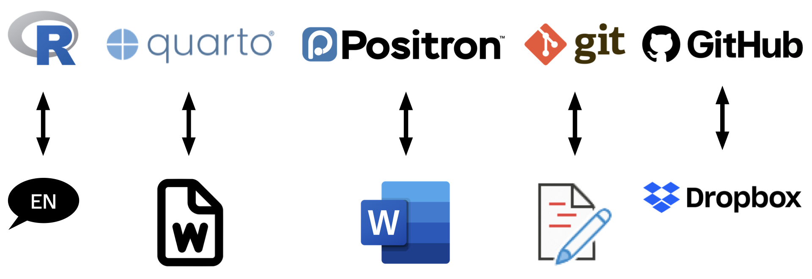
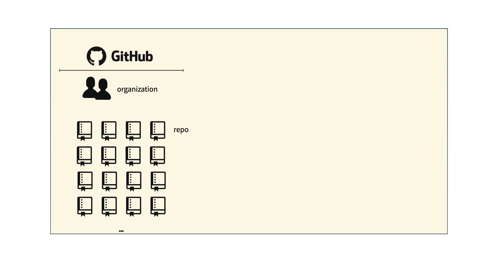
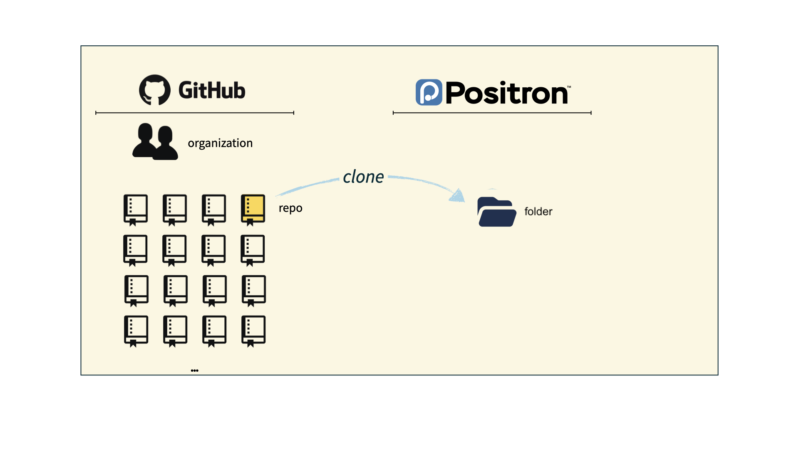
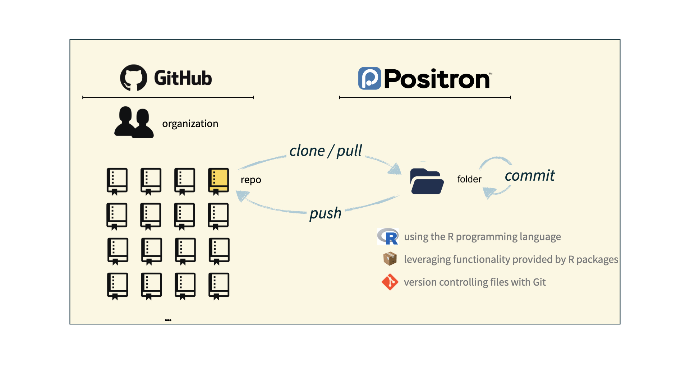

```{r}
#| label: setup
#| include: false
ggplot2::theme_set(ggplot2::theme_gray(base_size = 16))
```

# Warm up

## While you wait...

Fill out the Getting to know you survey if you haven't yet done so.

## Meet (some of the) course team {.smaller}

- **Mary Knox (Course coordinator)**
- **Robbie Hao (MS)**
- **Hyunjin Lee	(UG)**
- **Max	Niu (UG)**

# From last time: Policies and support

## Diversity, inclusion, and belonging {.smaller}

It is my intent that students from all diverse backgrounds and perspectives be well-served by this course, that students' learning needs be addressed both in and out of class, and that the diversity that the students bring to this class be viewed as a resource, strength and benefit.

::: incremental

-   Fill out the Getting to know you survey.
-   If you feel like your performance in the class is being impacted by your experiences outside of class, please don't hesitate to come and talk with me. I want to be a resource for you. If you prefer to speak with someone outside of the course, your advisors, and deans are excellent resources.
-   I (like many people) am still in the process of learning about diverse perspectives and identities. If something was said in class (by anyone) that made you feel uncomfortable, please talk to me about it.

:::

## Access and accommodations {.smaller}

-   For disability accommodations, register with the [Student Disability Access Office (SDAO)](https://access.duke.edu/students) and provide documentation related to your needs; SDAO will work with you to determine what accommodations are appropriate.

-   Accommodations are **not retroactive**, and cannot be provided until I have received your Faculty Accommodation Letter -- so start the process early.

-   Accommodations for exams must be arranged through SDAO, and exams with accommodations must be taken in the testing center.

-   Athletic travel conflicts and religious holidays: Submit requests for accommodations **at the beginning of the semester** so we can make suitable arrangements well in advance.

-   I am committed to making all course materials accessible and I'm always learning how to do this better.
    If any course component is not accessible to you in any way, please don't hesitate to let me know.

## Late work, waivers, lecture recordings, regrades... {.smaller}

-   We have policies!

-   Read about them on the [course syllabus](https://sta199-f26.github.io/course-syllabus.html) and refer back to them when you need it

. . .

Two that are easy to miss:

-   **Lecture recordings:** available for excused absences only -- submit the request form **within 24 hours** of the missed lecture, with documentation
-   **Regrade requests:** on Gradescope, **within one week** of an assignment being returned; note that the entire assignment may be regraded

## Participate 💻📱 {.smaller}



## Use of AI tools

- AI tools are not a replacement for understanding the material, but they can help you learn it.

- Reading code and writing code are skills that take time and practice to develop - both are essential.

- The nature of these tools is changing rapidly - autocomplete vs. chatbots vs. agentic tools.

::: aside
A piece on AI and education that I read recently that resonated with me is ["School is a gym, not a job"](https://erichudson.substack.com/p/school-is-a-gym-not-a-job) by Eric Hudson.
:::

## Centaurs vs. reverse centaurs

.](images/01/centaurs.png){fig-alt="A centaur (horse body, human head) and a reverse centaur (horse head, human body)." fig-align="center"}

## Use of AI tools: the rules {.smaller}

You may use AI as a resource as you complete assignments, but not to answer the exercises for you.

::: incremental
-   **Disclose** your use in the AI disclosure statement accompanying the assignment
-   **Cite** what you use: the tool, the model, the date you ran the prompt, and a link to the full transcript
-   **Don't** paste assignment prompts into AI tools -- write your own prompt that reflects your understanding
-   **Don't** paste AI output into your assignment -- edit it so it carries your voice and matches course syntax, terminology, and style
:::

. . .

::: callout-important
Any content identified as AI-generated but not cited as such will be treated as plagiarism, resulting in an automatic 0 for the relevant portion of the assignment.
:::

## Academic integrity

> To uphold the Duke Community Standard:
>
> -   I will not lie, cheat, or steal in my academic endeavors;
>
> -   I will conduct myself honorably in all my endeavors; and
>
> -   I will act if the Standard is compromised.

## A note on showing up and participating {.smaller}

-   This is a large "lecture" but with lots of opportunities and expectations for active learning, participation, and collaboration.

-   You are expected to show up and participate in all lectures and labs, though there are a good number of each you can miss without penalty.

-   It's possible to read the books and watch the videos and get an exposure to the material we cover in the course without showing up, but the experience will be much less rich and you will likely miss out on a lot of learning.
    That's why the assessments and workflows are designed to reward and reinforce active participation.

# Toolkit

## Learning goals {.smaller}

By the end of the course, you will be able to gain insight from data, reproducibly (with literate programming and version control) and collaboratively, using modern programming tools and techniques.

## Computational toolkit {.smaller}

-   Computing:
    -   Language: R
    -   IDE: RStudio
    -   Packages: tidyverse (primarily), plus others
    -   Authoring: Quarto
-   Version control:
    -   Tracking: Git
    -   Hosting and collaboration: GitHub

# Reproducible data analysis

## Reproducibility checklist {.smaller}

::: question

What does it mean for a data analysis to be "reproducible"?

:::

. . .

**Short-term goals:**

-   Are the tables and figures reproducible from the code and data?
-   Does the code actually do what you think it does?
-   In addition to what was done, is it clear *why* it was done?

. . .

**Long-term goals:**

-   Can the code be used for other data?
-   Can you extend the code to do other things?

## Toolkit for reproducibility

::: incremental

-   Scriptability -- Coding as opposed to using a point-and-click tool $\rightarrow$ R
-   Literate programming -- Code, narrative, output in one place, as opposed to copying and pasting code output into a document (e.g., Word or Google Doc) that contains the narrative $\rightarrow$ Quarto
-   Version control -- Track changes with brief messages that describe those changes $\rightarrow$ Git / GitHub

:::

## An analogy to English {.smaller}

Suppose you wanted to write an essay for a literature class.

- You would need to pick a language (e.g., English) 
- and choose an interface to write your document with (such as Microsoft Word with a .docx word document)
- You also might want to use track changes to see edits you make 
- and use a platform such as Google Drive to collaborate

{fig-align="center"}

# R and Positron

## R and Positron {.smaller}

::::: columns

::: {.column width="50%"}

{fig-alt="R logo" fig-align="center"}

-   R is an open-source statistical **programming language**
-   R is also an environment for statistical computing and graphics
-   It's easily extensible with *packages*

:::

::: {.column .fragment width="50%"}

{fig-alt="RStudio logo"}

-   RStudio is a convenient interface for R called an **IDE** (integrated development environment), e.g. *"I write R code in the RStudio IDE"*
-   RStudio is not a requirement for programming with R, but it's very commonly used by R programmers and data scientists

:::

:::::

## R vs. RStudio

[{fig-alt="On the left: a car engine. On the right: a car dashboard. The engine is labelled R. The dashboard is labelled RStudio." fig-align="center" width="1001"}](https://moderndive.com/1-getting-started.html)

::: aside

Source: [Modern Dive](https://moderndive.com/1-getting-started.html).

:::

## R packages {.smaller}

::: incremental

-   **Packages**: Fundamental units of reproducible R code, including reusable R functions, the documentation that describes how to use them, and sample data<sup>1</sup>

-   As of 27 August 2025, there are 22,578 R packages available on **CRAN** (the Comprehensive R Archive Network)<sup>2</sup>

-   We're going to work with a small (but important) subset of these!

:::

::: aside

<sup>1</sup> Wickham and Bryan, [R Packages](https://r-pkgs.org/).

<sup>2</sup> [CRAN contributed packages](https://cran.r-project.org/web/packages/).

:::

## Tour: R + RStudio {.smaller}

::::::: columns

:::: {.column width="50%"}

::: demo

**Option 1:**

Sit back and enjoy the show!

:::

::::

:::: {.column width="50%"}

::: appex

**Option 2:**

Go to [your container](https://cmgr.oit.duke.edu/containers) and launch RStudio.

{width="310" fig-align="center"}

:::

::::

:::::::

## Tour recap: R + RStudio


# A short list<br>(for now)<br>of R essentials

## Packages {.smaller}

-   Installed with `install.packages()`, once per system:

```{r}
#| eval: false
install.packages("palmerpenguins")
```

::: callout-note

We already pre-installed many of the package you'll need for this course, so you might go the whole semester without needing to run `install.packages()`!

:::

. . .

-   Loaded with `library()`, once per session:

```{r}
#| label: load-palmerpenguins
library(palmerpenguins)
```

## Packages, an analogy

If data analysis was cooking...

::: incremental

-   Installing a package would be like buying ingredients from the store

-   Loading a package would be like getting the ingredients out of your pantry and setting them on your counter top to be used

:::

## tidyverse

::: hand

aka the package you'll hear about the most...

:::

::: columns

::: {.column width="40%"}

[{fig-alt="Hex logos for dplyr, ggplot2, forcats, tibble, readr, stringr, tidyr, and purrr"}](https://tidyverse.org)

:::

::: {.column .fragment width="60%"}

[tidyverse.org](https://www.tidyverse.org/)

-   The **tidyverse** is an opinionated collection of R packages designed for data science
-   All packages share an underlying philosophy and a common grammar

:::

:::

## Data frames and variables

-   Each row of a data frame is an **observation**

. . .

-   Each column of a data frame is a **variable**

. . .

-   Columns (variables) in data frames can be accessed with `$`:

```{r}
#| eval: false
dataframe$variable_name
```

## `penguins` data frame {.smaller}

```{r}
penguins
```

## `bill_length_mm`  {.smaller}

```{r}
penguins$bill_length_mm
```

## Participate 💻📱 {.smaller}

::: {.columns}

::: {.column width="70%"}

::: task

Why did the error occur?

:::

```{r}
#| label: flipper-length-mm
#| error: true
flipper_length_mm
```

:::

::: {.column width="30%"}



:::

:::

## `flipper_length_mm` {.smaller}

This can be fixed by using `penguins$flipper_length_mm`.

```{r}
penguins$flipper_length_mm
```

## `function(argument)`

Functions are (most often) verbs, followed by what they will be applied to in parentheses:

```{r}
#| eval: false
do_this(to_this)
do_that(to_this, to_that, with_those)
```

## `trim`med `mean()`

```{r}
x <- c(1, 2, 3, 4, 5, 6, 7, 8, 9, 100)
x
```

```{r}
mean(x)
```

```{r}
mean(x, trim = 0.05)
```

## Help

Object documentation can be accessed with `?`

::: columns

::: {.column width="50%"}

```{r}
#| eval: false
?mean
```

:::

::: {.column width="50%"}

{fig-alt="Documentation for mean function in R."}

:::

:::

# Toolkit: Version control and collaboration

## Git and GitHub {.smaller}

::: columns

::: {.column .fragment width="50%"}

{fig-alt="Git logo" fig-align="center" width="150"}

-   Git is a version control system -- like "Track Changes" features from Microsoft Word, on steroids
-   It's not the only version control system, but it's a very popular one

:::

::: {.column .fragment width="50%"}

{fig-alt="GitHub logo" fig-align="center" width="150"}

-   GitHub is the home for your Git-based projects on the internet -- like DropBox but much, much better

-   We will use GitHub as a platform for web hosting and collaboration (and as our course management system!)

:::

:::

## Versioning - done badly

{fig-align="center"}

## Versioning - done better

{fig-align="center"}

## Versioning - done even better

::: hand

with human readable messages

:::

{fig-align="center"}

## How will we use Git and GitHub?

{fig-align="center"}

## How will we use Git and GitHub?

{fig-align="center"}

## How will we use Git and GitHub?

{fig-align="center"}

## How will we use Git and GitHub?

{fig-align="center"}

## Git and GitHub tips {.smaller}

::: incremental

-   There are millions of git commands -- ok, that's an exaggeration, but there are a lot of them -- and very few people know them all. 99% of the time you will use git to add, commit, push, and pull.
-   We will be doing Git things and interfacing with GitHub through RStudio, but if you google for help you might come across methods for doing these things in the command line -- skip that and move on to the next resource unless you feel comfortable trying it out.
-   There is a great resource for working with git and R: [happygitwithr.com](http://happygitwithr.com/). Some of the content in there is beyond the scope of this course, but it's a good place to look for help.

:::

## Tour: Git + GitHub {.smaller .scrollable}

::: columns

::: {.column width="50%"}

::: demo

**Option 1:**

Sit back and enjoy the show!

:::

::: callout-note

You'll need to stick to this option if you haven't yet accepted your GitHub invite and don't have a repo created for you.

:::

:::

::: {.column width="50%"}

::: appex

**Option 2:**

Go to the [course GitHub organization](https://github.com/sta199-f25) and clone `ae-YOUR-GITHUB-NAME` repo to [your container](https://cmgr.oit.duke.edu/containers).

:::

:::

:::

<br>

<details>
<summary>Tour recap: Git + GitHub</summary>

-   Find your application repo, that will always be named using the naming convention `assignment_title-YOUR-GITHUB-NAME`, e.g., `ae-mine-cetinkaya-rundel` or `lab-1-mine-cetinkaya-rundel`.

-   Click on the green "Code" button, make sure SSH is selected, copy the repo URL

{fig-align="center" width="600"}

-   In RStudio, File \> New Project \> From Version Control \> Git

-   Paste repo URL copied in previous step, then click tab to auto-fill the project name, then click Create Project

-   **If you haven't done Lab 0**, **for one time only**, type `yes` in the pop-up dialogue

</details>

## What could have gone wrong?

- Never received GitHub invite $\rightarrow$ Fill out "Getting to know you survey

- Never accepted GitHub invite $\rightarrow$ Look for it in your email and accept it

- Cloning repo fails $\rightarrow$ Review/redo Lab 0 steps for setting up SSH key

- Still no luck? Stay after class today or come by my office hours tomorrow or post on Ed for help

# Quarto

## Quarto

::: incremental

-   Fully reproducible reports -- each time you render the analysis is ran from the beginning
-   Code goes in cells narrative goes outside of cells
-   Optional: A visual editor for a familiar / Google docs-like editing experience

:::

# Wrap up

## Tasks

::: {.columns}

::: {.column}

**Due tonight:** Complete the Getting to know you survey if you haven't yet done so.

**Tomorrow:** Show up to lab on time with a charged laptop and find your team and sit with them.

:::

::: {.column}

**Before Monday:**

- Complete the readings and watch the videos
- ???

:::

:::


