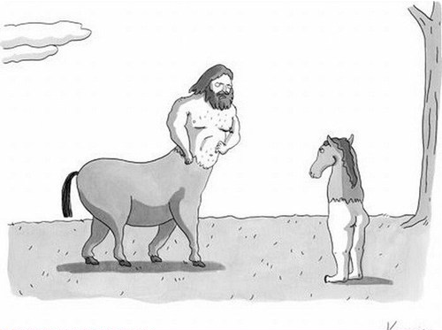

```{r}
#| label: setup
#| include: false
ggplot2::theme_set(ggplot2::theme_gray(base_size = 16))
```

# Warm up

## While you wait...

If you haven't yet done so:

- Fill out the Getting to know you survey

- Accept the GitHub organization invite

## Meet (some of the) course team {.smaller}

- **Mary Knox (Course coordinator)**
- **Robbie Hao (MS)**
- **Max	Niu (UG)**

## Century Course {.smaller}

> “If students could take just one foundational course in your discipline, which course would best introduce them to its core questions and essential approaches?”

Launched in Fall 2026, Century Courses 

- provide students with a broad yet rigorous introduction to the fundamental knowledge, methodologies and ways of thinking that define an academic field,

- introduce students to a discipline's foundational and core ideas, and

- invite students to engage with a field’s central questions and intellectual practices while equipping them with the conceptual tools needed for deeper exploration or further study.

Read more at [trinity.duke.edu/century-courses](https://trinity.duke.edu/century-courses).


# From last time: Policies and support

## Diversity, inclusion, and belonging {.smaller}

It is my intent that students from all diverse backgrounds and perspectives be well-served by this course, that students' learning needs be addressed both in and out of class, and that the diversity that the students bring to this class be viewed as a resource, strength, and benefit.

::: incremental

-   Complete the *Getting to Know You* survey if you have not already.
-   If you feel like your performance in the class is being impacted by your experiences outside of class, I’m here to help, and advisors and deans are also excellent resources.
-   I am always learning. If something in class makes you uncomfortable, please let me know.

:::

## Access and accommodations {.smaller}

-   For disability accommodations, register with the [Student Disability Access Office (SDAO)](https://access.duke.edu/students) and provide documentation related to your needs; SDAO will work with you to determine what accommodations are appropriate.

-   Accommodations are **not retroactive**, and cannot be provided until I have received your Faculty Accommodation Letter -- so start the process early.

-   Accommodations for exams must be arranged through SDAO, and exams with accommodations must be taken in the testing center.

-   Athletic travel conflicts and religious holidays: Submit requests for accommodations **at the beginning of the semester** so we can make suitable arrangements well in advance.

-   I am committed to making all course materials accessible and I'm always learning how to do this better.
    If any course component is not accessible to you in any way, please don't hesitate to let me know.

## Late work, waivers, lecture recordings, regrades... {.smaller}

-   We have policies!

-   Read about them on the [course syllabus](https://sta199-f26.github.io/course-syllabus.html) and refer back to them when you need it

. . .

Two that students often miss:

-   **Lecture recordings:** available for excused absences only -- submit the request form **within 24 hours** of the missed lecture, with documentation
-   **Regrade requests:** on Gradescope, **within one week** of an assignment being returned; note that the entire assignment may be regraded

## Participate 💻📱 {.smaller}


::: {.columns}

::: {.column}

::: wooclap
Who should you email if you want to use your one-time late penalty waiver on a homework assignment?
:::

:::

::: {.column}



:::

:::

# AI

## The big picture {.smaller}

::: incremental
- Yes, there is still value in learning what we teach in this course -- for humanity and for your growth as a human

- No, the emergence of AI has not made reasoning with data and making decisions in the face of uncertainty irrelevant

- Yes, AI tools can do a really decent job of writing code and narrative, but... ["school is a gym, not a job"](https://erichudson.substack.com/p/school-is-a-gym-not-a-job)
:::

::: aside
Recommended reading: ["School is a gym, not a job"](https://erichudson.substack.com/p/school-is-a-gym-not-a-job) by Eric Hudson.
:::

## Use of AI tools for STA 199 {.smaller}

::: incremental
- AI tools are not a replacement for understanding the material, but they can help you as you learn it, as long as you don't fall into the trap of cognitive outsourcing disguised as productivity boosting

- Reading code and writing code are skills that take time and practice to develop - both are essential and rushing them does not benefit you in the long run

- The nature of these tools and how real data scientists use them is changing rapidly -- autocomplete vs. chatbots vs. agentic tools -- and we will demo some of this usage and ~~best~~ good practices later in the semester
:::

## Who is the driver?

{fig-alt="A centaur (horse body, human head) and a reverse centaur (horse head, human body)." fig-align="center"}

::: aside
Recommended reading: [Reverse Centaurs](https://locusmag.com/feature/commentary-cory-doctorow-reverse-centaurs/) by Cory Doctorow in in Locus Magazine.
:::

## Use of AI tools: the rules {.smaller}

You may use AI as a resource as you complete assignments, but not to answer the exercises for you.

::: incremental
-   **Disclose** your use in the AI disclosure statement accompanying the assignment
-   **Cite** what you use: the tool, the model, the date you ran the prompt, and a link to the full transcript
-   **Don't** paste assignment prompts into AI tools -- write your own prompt that reflects your understanding
-   **Don't** paste AI output into your assignment -- edit it so it carries your voice and matches course syntax, terminology, and style
:::

. . .

::: callout-important
Any content identified as AI-generated but not cited as such will be treated as plagiarism, resulting in an automatic 0 for the relevant portion of the assignment.
:::

## Academic integrity

> To uphold the Duke Community Standard:
>
> -   I will not lie, cheat, or steal in my academic endeavors;
>
> -   I will conduct myself honorably in all my endeavors; and
>
> -   I will act if the Standard is compromised.

## A note on showing up and participating {.smaller}

-   This is a large "lecture" but with lots of opportunities and expectations for active learning, participation, and collaboration.

-   You are expected to show up and participate in all lectures and labs, though there are a good number of each you can miss without penalty.

-   It's possible to read the books and watch the videos and get an exposure to the material we cover in the course without showing up, but the experience will be much less rich and you will likely miss out on a lot of learning.
    That's why the assessments and workflows are designed to reward and reinforce active participation.

# Meet the toolkit

## Computational toolkit {.smaller}

> By the end of the course, you will be able to gain insight from data, reproducibly (with literate programming and version control) and collaboratively, using modern programming tools and techniques.

-   Computing:
    -   Language: R
    -   IDE: Positron
    -   Packages: tidyverse (primarily), plus others
    -   Authoring: Quarto
-   Version control:
    -   Tracking: Git
    -   Hosting and collaboration: GitHub

## What does it mean for a data analysis to be "reproducible"?

::: question

What does it mean for a data analysis to be "reproducible"?

:::

. . .

**Short-term goals:**

-   Are the tables and figures reproducible from the code and data?
-   Does the code actually do what you think it does?
-   In addition to what was done, is it clear *why* it was done?

. . .

**Long-term goals:**

-   Can the code be used for other data?
-   Can you extend the code to do other things?

## Toolkit for reproducibile data analyses

::: incremental

-   Scriptability -- Coding as opposed to using a point-and-click tool $\rightarrow$ R

-   Literate programming -- Code, narrative, output in one place, as opposed to copying and pasting code output into a document (e.g., Word or Google Doc) that contains the narrative $\rightarrow$ Quarto

-   Version control -- Track changes with brief messages that describe those changes $\rightarrow$ Git / GitHub

:::

## An analogy to English {.smaller}

Suppose you wanted to write an essay for a literature class.

- You would need to pick a language (e.g., English) 
- and choose an interface to write your document with (such as Microsoft Word with a .docx word document)
- You also might want to use track changes to see edits you make 
- and use a platform such as Google Drive to collaborate

{fig-align="center"}

# Writing code: R and Positron

## R and Positron {.smaller}

::::: columns

::: {.column width="50%"}

{fig-alt="R logo" height="200" fig-align="center"}

-   R is an open-source statistical **programming language**
-   R is also an environment for statistical computing and graphics
-   It's easily extensible with *packages*

:::

::: {.column .fragment width="50%"}

{height="200" fig-alt="Positron logo" fig-align="center"}

-   Positron is a convenient interface for R called an **IDE** (integrated development environment), e.g. *"I write R code in the Positron IDE"*
-   Positron is not a requirement for programming with R, but it's very commonly used by R programmers and data scientists

:::

:::::

## R packages {.smaller}

::: incremental

-   **Packages**: Fundamental units of reproducible R code, including reusable R functions, the documentation that describes how to use them, and sample data<sup>1</sup>

-   As of 25 August 2026, there are 24,780 R packages available on **CRAN** (the Comprehensive R Archive Network)<sup>2</sup>

-   We're going to work with a small (but important) subset of these!

:::

::: aside

<sup>1</sup> Wickham and Bryan, [R Packages](https://r-pkgs.org/).

<sup>2</sup> [CRAN contributed packages](https://cran.r-project.org/web/packages/).

:::

## Tour: R + Positron {.smaller}

Sit back and enjoy the show!

Or, join me in Positron and get a feel for following along -- with 0 expectation that you actually follow along with everything for today 😀

## Writing code -> writing reports: Quarto

-   Fully reproducible reports -- each time you render the analysis is ran from the beginning

-   Code goes in cells narrative goes outside of cells

More on this in a bit!

# Version control and collaboration: Git and GitHub

## Git and GitHub {.smaller}

::: columns

::: {.column .fragment width="50%"}

{fig-alt="Git logo" fig-align="center" width="150"}

-   Git is a version control system -- like "Track Changes" features from Microsoft Word, on steroids
-   It's not the only version control system, but it's a very popular one

:::

::: {.column .fragment width="50%"}

{fig-alt="GitHub logo" fig-align="center" width="150"}

-   GitHub is the home for your Git-based projects on the internet -- like DropBox but much, much better

-   We will use GitHub as a platform for web hosting and collaboration (and as our course management system!)

:::

:::

## Versioning - done badly

{fig-align="center"}

## Versioning - done better

{fig-align="center"}

## Versioning - done even better

::: hand

with human readable messages

:::

{fig-align="center"}

## How will we use Git and GitHub?

{fig-align="center"}

## How will we use Git and GitHub?

{fig-align="center"}

## How will we use Git and GitHub?

{fig-align="center"}

## How will we use Git and GitHub?

{fig-align="center"}

## Git and GitHub tips {.smaller}

-   There are millions of git commands -- ok, that's an exaggeration, but there are a lot of them -- and very few people know them all. 99% of the time you will use git to add, commit, push, and pull.

-   We will be doing Git things and interfacing with GitHub through Positron, but if you google for help you might come across methods for doing these things in the command line -- skip that and move on to the next resource unless you feel comfortable trying it out.

## Tour: Git + GitHub + Quarto {.smaller .scrollable}

Sit back and enjoy the show!

# Wrap up

## *Getting to know you* feedback: Questions {.smaller}

::: incremental
- Is the course designed for students with no prior coding or statistics background?
- What is the balance between learning statistical concepts and programming in R? How often will students code?
- How should students use readings, videos, and other materials—and which are essential?
- What should students expect from discussion projects, collaboration, and required uploads?
- What will exams look like, and what practice or study materials will be available?
- Where can students get help, and what kinds of collaboration are appropriate?
- How does the course compare to COMPSCI 216 (Everything Data) and STA 323 (Statistical Computing)?
:::

## *Getting to know you* feedback: Concerns {.smaller}

::: incremental
- Dominant concern: lack of prior coding experience—especially learning R, syntax, troubleshooting, and technical tools such as Git and GitHub
- Keeping pace: falling behind or being less prepared than classmates
- Workload: time management for labs, HW, projects, and other commitments
- Assessment: format of exams, details of grading, and effective study strategies
- Smaller themes: Group-project dynamics, large-lecture setting, and confidence with math/statistical terminology
:::

## Seeing double 👀

<br><br>

We have (at least) [**EIGHT**]{.fragment} twins in the course this semester!

## Tasks

::: {.columns}

::: {.column}

**Due tonight:** Complete the Getting to know you survey if you haven't yet done so.

**Tomorrow:** Show up to lab on time with a charged laptop and find your team and sit with them.

:::

::: {.column}

**Before Monday:**
 
- Catch up with anything you fell behind on this week

- Complete the readings and watch the videos for Monday's lecture

:::

:::


