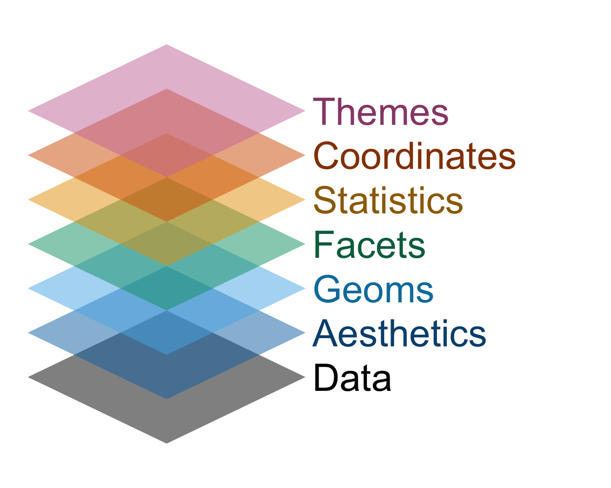

```{r}
#| label: setup
#| include: false
ggplot2::theme_set(ggplot2::theme_gray(base_size = 16))
```

# Warm up

## While you wait... {.smaller}

::: {.columns}

::: {.column width="15%"}

If you haven't yet done so:

- Fill out the Getting to know you survey

- Accept the GitHub organization invite

:::

::: {.column width="5%"}
&nbsp;
:::

::: {.column width="65%"}

**Participate** 📱💻 

::: wooclap
What does point represent in this visualization?
:::


:::

::: {.column width="15%"}



:::

:::


## Outline {.smaller}

-   Last week:

    -   We introduced you to the course toolkit.

    -   You **cloned** your `lab` repository and started making some updates in your Quarto documents.

    -   You **committed and pushed** your changes back -- at least most of you did!

. . .

-   Today:

    -   You will **clone** your `ae` (application exercise) repository.

    -   We will introduce data visualization.

    -   You will work on the application exercise on data visualization, **commit** your changes, and **push** them.

# Data visualization

## Load packages

```{r}
#| label: load-packages
#| message: false
library(tidyverse)
```

<br>

::: callout-note
## Reminder

**tidyverse** is the collection of R packages designed for data science. 
:::

## Load the data

```{r}
#| label: load-gss-data
#| message: false
gss <- read_csv("data/gss-2024.csv")
```

<br>

::: callout-note
## Reminder

We can read this as "read the CSV file called `gss-2024.csv` in the data folder" and save the result as `gss`.
:::

## 2024 General Social Survey (GSS) {.smaller}

GSS is a widely respected, nationally representative sociological survey that tracks how American opinions, attitudes, and behaviors change over time.

We're working with GSS data from the most recent wave:

- Each row represents one survey respondent.
- The variables describe demographics, education, family, happiness, employment, and political identification.

::: callout-note
The GSS is a cross-sectional survey. We can describe associations, but these data do not establish causation.
:::

::: aside
Source: [gss.norc.org/about-the-gss.html](https://gss.norc.org/about-the-gss.html).
:::

## View the data {.smaller}

```{r}
#| label: gss-view
gss
```

## Variables in our extract {.smaller}

| Variable | Description | Type |
|---|---|---|
| `marital_status` | Current marital status | Categorical |
| `age` | Age in years | Numerical |
| `education_years` | Completed years of education | Numerical |
| `children` | Number of children; 8 means 8 or more | Numerical |
| `happiness` | Self-reported happiness | Categorical |
| `employment_status` | Current employment status | Categorical |
| `party_id` | Party identification | Categorical |

## Start with a question

::: {.question .hand .large}
How does age vary across marital-status groups?
:::

Before writing code:

- Which variables do we need?
- What type is each variable?
- What kind of plot might answer the question?

## Age by marital status {.smaller}

```{r}
#| label: age-marital-boxplot
#| fig-width: 9
#| fig-height: 4.5
ggplot(gss, aes(x = marital_status, y = age, fill = marital_status)) +
  geom_boxplot(show.legend = FALSE) +
  labs(
    title = "Age varies substantially across marital-status groups",
    x = "Marital status",
    y = "Age (years)",
    caption = "Source: 2024 General Social Survey (GSS), NORC"
  ) +
  scale_fill_viridis_d()
```

## Interpret the plot {.smaller}

::: question
With a partner:

- Which group has the highest median age? The lowest?
- Which groups have the greatest variability?
- What does one box summarize?
- Can this plot tell us whether marital status causes differences in age?
:::

```{r}

```

## Plot autopsy {.smaller}

```{r}
#| label: plot-autopsy
#| eval: false
#| code-annotations: below
ggplot(
  data = gss, # <1>
  mapping = aes(x = marital_status, y = age, fill = marital_status) # <2>
) +
  geom_boxplot() + # <3>
  labs(...) + # <4>
  scale_fill_viridis_d() #<5>
```

1. The **data** to visualize
2. The variables **mapped** to visual properties
3. The **geometric object** used to represent the observations
4. The plot **labels**
5. The **scale** used to map values to colors

. . .

::: question
Which component would you change to plot different variables? Which component controls the variable represented by color?
:::

## Mapping and aesthetics {.smaller}

**Aesthetics** are visual properties such as position, color, fill, shape, size, and transparency.

. . .

::: {.columns}

::: {.column width="42%"}

For the GSS boxplot:

```r
aes(
  x = marital_status,
  y = age,
  fill = marital_status
)
```

| Variable | Aesthetic |
|---|---|
| `marital_status` | x position |
| `age` | y position |
| `marital_status` | fill color |

:::

::: {.column width="58%"}

```{r}
#| ref-label: age-marital-boxplot
#| echo: false
#| warning: false
#| fig-width: 7
#| fig-height: 4
```

:::

:::

## Map a variable; set a value {.smaller}

::: {.columns}

::: {.column}

**Map:** fill varies with a variable, so ggplot2 creates a legend

```{r}
#| label: mapping
#| eval: false
geom_boxplot(aes(fill = marital_status))
```

```{r}
#| label: age-marital-boxplot-mapping
#| echo: false
#| warning: false
#| fig-width: 7
#| fig-height: 3.5
ggplot(gss, aes(x = marital_status, y = age, fill = marital_status)) +
  geom_boxplot(show.legend = FALSE) +
  labs(
    title = NULL,
    x = NULL,
    y = NULL,
    caption = NULL
  ) +
  scale_fill_viridis_d()
```

:::

::: {.column .fragment}

**Set:** every box has the same fill, so no legend is needed

```{r}
#| label: setting
#| eval: false
geom_boxplot(fill = "steelblue")
```

```{r}
#| label: age-marital-boxplot-setting
#| echo: false
#| warning: false
#| fig-width: 7
#| fig-height: 3.5
ggplot(gss, aes(x = marital_status, y = age)) +
  geom_boxplot(fill = "pink") +
  labs(
    title = NULL,
    x = NULL,
    y = NULL,
    caption = NULL
  )
```

:::

:::

::: {.callout-tip .fragment}
Variables belong inside `aes()`; fixed visual choices belong outside it.
:::

## Grammar of graphics {.smaller}

::: {.columns}

::: {.column}

- When building or reading a plot, work through the layers as if they're a checklist.

- Not every plot needs every component, but each component is a separate decision.

:::

::: {.column}



:::

:::


# Choosing a plot

## Start with the question {.smaller}

| Question | Variables | A useful first plot |
|---|---|---|
| What values are common? | One categorical | [Bar chart]{.fragment} |
| What is the distribution? | One numerical | [Histogram or boxplot]{.fragment} |
| Do groups differ? | Numerical + categorical | [Boxplot or histogram by group]{.fragment} |
| Are two categorical variables associated? | Two categorical | [Filled or dodged bar chart]{.fragment} |
| Are two numerical variables associated? | Two numerical | [Scatterplot]{.fragment} |

## One categorical variable {.smaller}

```{r}
#| label: one-categorical
#| fig-width: 9
#| fig-height: 4
gss |>
  ggplot(aes(x = marital_status)) +
  geom_bar(fill = "pink") +
  labs(
    title = "Marital status among GSS respondents in 2024",
    x = "Marital status",
    y = "Number of respondents",
    caption = "Source: 2024 General Social Survey (GSS), NORC"
  ) +
  theme_minimal() +
  theme(axis.text.x = element_text(angle = 20, hjust = 1))
```

The bar height is a **count**. `geom_bar()` counts rows for us.

## Counts and survey weights {.smaller}

These two mappings answer slightly different questions:

```{r}
#| eval: false
# How many respondents are in each category?
aes(x = marital_status)

# What is the survey-weighted size of each category?
aes(x = marital_status, weight = weight)
```

For learning the grammar, we will focus on the plot structure. For population descriptions, we should use the GSS survey weights.

## Two categorical variables: What is the denominator? {.smaller}

Now compare marital status and self-reported happiness in the 2024 GSS.

- A **stacked** bar chart shows counts, split into groups.
- A **dodged** bar chart makes counts in each combination easier to compare.
- A **filled** bar chart makes every bar height 100%, so it compares *within-marital-status proportions*.

## Compare the choices {.smaller}

::: {.columns}

::: {.column width="33%"}

**Stacked: counts**

```{r}
#| label: stacked-bars
#| fig-width: 4
#| fig-height: 4
gss |>
  filter(!is.na(happiness)) |>
  ggplot(aes(x = marital_status, fill = happiness, weight = weight)) +
  geom_bar() +
  labs(x = "Marital status", y = "Weighted count", fill = "Happiness") +
  theme_minimal(base_size = 11)
```

:::

::: {.column width="33%"}

**Dodged: counts**

```{r}
#| label: dodged-bars
#| fig-width: 4
#| fig-height: 4
gss |>
  filter(!is.na(happiness)) |>
  ggplot(aes(x = marital_status, fill = happiness, weight = weight)) +
  geom_bar(position = "dodge") +
  labs(x = "Marital status", y = "Weighted count", fill = "Happiness") +
  theme_minimal(base_size = 11)
```

:::

::: {.column width="33%"}

**Filled: proportions**

```{r}
#| label: filled-bars
#| fig-width: 4
#| fig-height: 4
gss |>
  filter(!is.na(happiness)) |>
  ggplot(aes(x = marital_status, fill = happiness, weight = weight)) +
  geom_bar(position = "fill") +
  scale_y_continuous(labels = scales::label_percent()) +
  labs(x = "Marital status", y = "Proportion", fill = "Happiness") +
  theme_minimal(base_size = 11)
```

:::

:::

## Participate 📱💻 {.smaller}

::: {.columns}

::: {.column width="70%"}

::: wooclap
You want to compare the proportion in each happiness category *within marital-status group*. Which bar-chart position should you use, and why?
:::

:::

::: {.column width="30%"}



:::

:::

## A chart is an argument {.smaller}

- Give the reader a meaningful title, axis labels, and a legend.
- Use color deliberately; do not rely on color alone when another channel can help.
- Choose the denominator and chart form to answer the question.
- Describe what the data show, and distinguish that description from a causal claim unless the data come from a randomized experiment or the visualization is part of a causal inference analysis.

## On your own {.smaller}

::: task
Use `gss` to answer one question below with an appropriate plot:

- Is self-reported **happiness** distributed differently across marital-status groups?
- How does **employment status** vary across marital-status groups?
- What is the relationship between **education years** and **age**? Does it differ by marital status?

State the question, identify the variable type(s), and explain why your plot answers it. Then, describe patterns, making sure to avoid causal language.
:::
