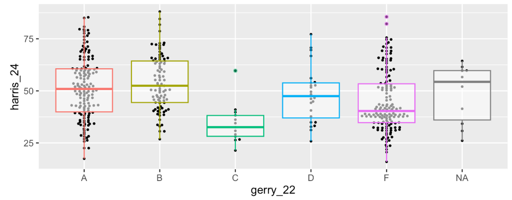
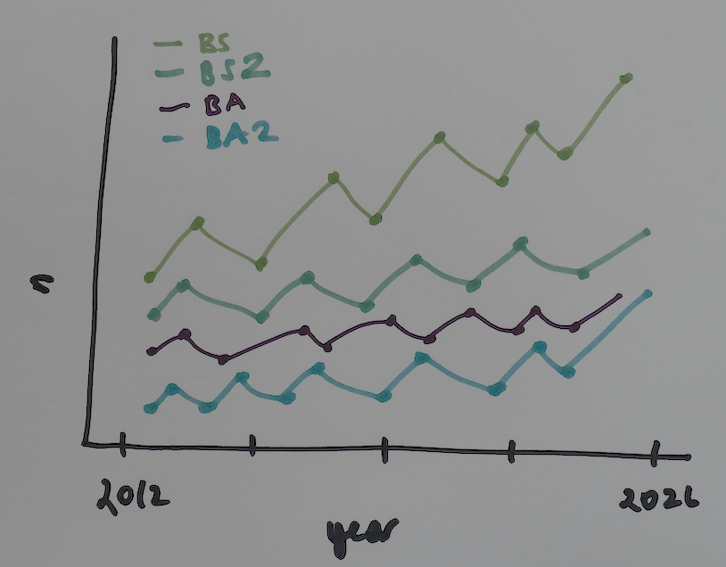

```{r}
#| label: setup
#| include: false
ggplot2::theme_set(ggplot2::theme_gray(base_size = 16))
```

```{r}
#| include: false
library(tidyverse)
library(usdata)
library(ggbeeswarm)
```

# Warm-up

## While you wait: Participate 📱💻 {.xsmall}

::: columns

::: {.column width="85%"}

::: wooclap
Which of the following plots does this code produce?

```{r}
#| include: false
gerrymander <- read_csv("data/gerrymander.csv")
gerrymander_24 <- gerrymander |>
  filter(!is.na(house_party_24))
```

```{r}
#| fig-show: hide
ggplot(gerrymander_24, aes(x = gerry_22, y = trump_24)) +
  geom_boxplot(aes(color = gerry_22)) +
  geom_beeswarm()
```

```{r}
#| fig-asp: 0.4
#| fig-width: 6
#| echo: false
#| layout-ncol: 2
ggplot(gerrymander_24, aes(x = gerry_22, y = trump_24)) +
  geom_boxplot(aes(color = gerry_22)) +
  geom_beeswarm(size = 0.8) +
  labs(title = "o Plot A")

ggplot(gerrymander_24, aes(x = gerry_22, y = trump_24)) +
  geom_boxplot() +
  geom_beeswarm(size = 0.8) +
  labs(title = "o Plot B")

ggplot(gerrymander_24, aes(x = gerry_22, y = trump_24)) +
  geom_beeswarm(size = 0.8) +
  geom_boxplot(aes(fill = gerry_22)) +
  labs(title = "o Plot C")

ggplot(gerrymander_24, aes(x = gerry_22, y = trump_24, color = gerry_22)) +
  geom_boxplot() +
  geom_beeswarm(size = 0.8) +
  labs(title = "o Plot D")
```
:::

:::

::: {.column width="15%"}

{width="200" fig-align="center" fig-alt="QR code for Wooclap"}

Go to [wooclap.com](https://app.wooclap.com/ICNGKSL) and use the code ICNGKSL.

:::

:::

## Pause {.smaller}

::: question
Any questions before we get started?
:::

## Recap: layering geoms {.scrollable .smaller}

::: columns

::: {.column width="60%"}

::: question
Update the following code to create the visualization on the right.
:::

:::

::: {.column width="40%"}

:::

:::

```{r}
#| message: false
#| fig-asp: 0.3
ggplot(gerrymander_24, aes(x = gerry_22, y = harris_24)) +
  geom_boxplot(aes(color = gerry_22)) +
  geom_beeswarm()
```

## Recap: layering geoms {.smaller}

0.  Original Code:

```{r}
#| message: false
#| fig-asp: 0.4
ggplot(gerrymander_24, aes(x = gerry_22, y = harris_24)) +
  geom_boxplot(aes(color = gerry_22)) +
  geom_beeswarm()
```

<!-- small Venn diagram in the bottom-right -->

<div style="
  position: absolute;
  bottom: 500px;
  right: -15px;
  width: 413px;           /* adjust to taste */
  pointer-events: none;  /* so it never steals clicks */
">
  
</div>


## Recap: layering geoms {.smaller}

1.  Swap the order of the two geoms.

```{r}
#| message: false
#| fig-asp: 0.4
ggplot(gerrymander_24, aes(x = gerry_22, y = harris_24)) +
  geom_beeswarm(size = 0.8) +
  geom_boxplot(aes(color = gerry_22))
```
<!-- small Venn diagram in the bottom-right -->
<div style="
  position: absolute;
  bottom: 500px;
  right: -15px;
  width: 413px;           /* adjust to taste */
  pointer-events: none;  /* so it never steals clicks */
">
  
</div>


## Recap: layering geoms {.smaller}

2.  Make the boxplots semi-transparent.

```{r}
#| message: false
#| fig-asp: 0.4
ggplot(gerrymander_24, aes(x = gerry_22, y = harris_24)) +
  geom_beeswarm(size = 0.8) +
  geom_boxplot(aes(color = gerry_22), alpha = 0.5)
```
<!-- small Venn diagram in the bottom-right -->
<div style="
  position: absolute;
  bottom: 500px;
  right: -15px;
  width: 413px;           /* adjust to taste */
  pointer-events: none;  /* so it never steals clicks */
">
  
</div>


## Recap: layering geoms {.smaller}

3.  Remove the legend.

```{r}
#| message: false
#| fig-asp: 0.4
ggplot(gerrymander_24, aes(x = gerry_22, y = harris_24)) +
  geom_beeswarm(size = 0.8) +
  geom_boxplot(aes(color = gerry_22), alpha = 0.5, show.legend = FALSE)
```

<!-- small Venn diagram in the bottom-right -->
<div style="
  position: absolute;
  bottom: 500px;
  right: -15px;
  width: 413px;           /* adjust to taste */
  pointer-events: none;  /* so it never steals clicks */
">
  
</div>


## Recap: logical operators {.smaller}

Generally useful in a `filter()` but will come up in various other places as well...

| operator | definition                    |
|:---------|:------------------------------|
| `<`      | [is less than?]{.fragment}    |
| `>`      | [is greater than?]{.fragment} |

: {tbl-colwidths="\[25,75\]"}

## Recap: Participate 📱💻 {.xsmall}

::: columns

::: {.column width="70%"}

::: wooclap
Match the following logical operators to their definitions.

::: wooclap-choices
-   `<=`
-   `>=`
-   `==`
-   `!=`
:::

:::

:::

::: {.column width="30%"}

{width="200" fig-align="center" fig-alt="QR code for Wooclap"}

Go to [wooclap.com](https://app.wooclap.com/ICNGKSL) and use the code ICNGKSL.

:::

:::

## Recap: Participate 📱💻 {.xsmall}

::: columns
::: {.column width="70%"}
::: wooclap
Match the following definitions to their logical operators.

::: wooclap-choices
-   is x AND y?
-   is x OR y?
-   is x NA?
-   is x not NA?
:::
:::
:::

::: {.column width="30%"}
{width="200" fig-align="center" fig-alt="QR code for Wooclap"}

Go to [wooclap.com](https://app.wooclap.com/ICNGKSL) and use the code ICNGKSL.
:::
:::

## Recap: logical operators (cont.) {.smaller}

Other useful logical operators:

| operator      | definition                                                            |
|:-----------------|:-----------------------------------------------------|
| `x %in% y`    | [is x in y?]{.fragment}                                               |
| `!(x %in% y)` | [is x not in y?]{.fragment}                                           |
| `!x`          | [is not x? (only makes sense if `x` is `TRUE` or `FALSE`)]{.fragment} |

: {tbl-colwidths="\[25,75\]"}

## Recap: logical operators (cont.) {.smaller}

::: task
For which rows are the following true?
:::

::: columns

::: {.column width = "30%"}
| Col1 | Col2 | Col3 |
|------|------|------|
| 1    | A    |50    |
| 2    | B    |40    |    
| 3    | A    |30    |
| 4    | B    |NA    |
| 5    | C    |10    |

:::

::: {.column width = "10%"}

:::

::: {.column width = "60%"}

::: incremental

- `Col1 < 3 | Col3 < 20 `

- `Col2 == "C"`

- `Col2 %in% c("C", "A")`

- `is.na(Col3)`

- `!is.na(Col3)`


:::
:::

:::

# Data tidying

## Tidy data

> "Tidy datasets are easy to manipulate, model and visualise, and have a specific structure: each variable is a column, each observation is a row, and each type of observational unit is a table."
>
> Tidy Data, <https://vita.had.co.nz/papers/tidy-data.pdf>

. . .

**Note:** "easy to manipulate" = "straightforward to manipulate"

## Goal

Visualize Statistical Science majors over the years!



## Read data {.smaller}

```{r}
majors <- read_csv("data/majors.csv")
```

```{r}
#| include: false
majors <- read_csv(here::here("slides/data/majors.csv"))
```

::: question
What does the message that prints when we read a CSV file in with `read_csv()` say? How carefully do you need to review this message before moving on?
:::

## View data {.smaller}

```{r}
#| label: majors-display
majors
```

## Data dictionary {.smaller}

| Variable | Description |
|:--|:--|
| `department` | Academic department offering the major or minor. |
| `academic_plan` | BS: Bachelor of Science; BS2: Bachelor of Science, second major; BA: Bachelor of Arts; BA2: Bachelor of Arts, second major; Minor: a minor in the department. |
| `2026`:`2012` | Each column gives the number of graduates completing that academic plan in the corresponding academic year. `NA` indicates no count recorded. |

: {tbl-colwidths="\[20,80\]"}

:::{.task .fragment}
What does each row in `majors` represent?
:::

[Each row represents a department and academic plan combination.]{.fragment}

## Let's plan! {.smaller}

::: question
Review the goal plot and sketch the data frame needed to create it. What would go inside `aes` when we call `ggplot`?
:::


## First: `filter()`

```{r}
statsci_majors <- majors |>
  filter(
    department == "Statistical Science",
    academic_plan != "Minor"
  )
```

<br>

::: {.fragment .small}

```{r}
statsci_majors
```

:::

## The Goal {.smaller .nostretch}

We want to write code that starts something like this:

```{r}
#| eval: false

ggplot(statsci_majors, aes(x = year, y = n, color = academic_plan)) +
  ...
```

. . .

<br>

But the data are not organized in the appropriate columns :(

```{r}
statsci_majors
```

## The challenge {.smaller}

::: {.small}

***How do we go from this ....***

```{r}
#| echo: false
statsci_majors
```

:::

::: {.small .fragment}

***.... to this??***

```{r}
#| echo: false
statsci_majors |>
  pivot_longer(
    cols = !c(department, academic_plan),
    values_to = "n",
    names_to = "year",
    names_transform = as.numeric
  )
```

:::

# Pivot

## `pivot_longer()` {.smaller .scrollable}

::: {.small}

```{r}
#| echo: false
statsci_majors
```

:::

::: {.task}

::: {.columns}

::: {.column width="5%"}

<br>

⬇️

:::

::: {.column width="95%" .fragment}

Pivot the `statsci_majors` data frame *longer* such that each row represents a degree type / year combination. The new columns should be called `year` and `n` (for number of graduates for that year).

:::

:::


:::

::: {.small}

```{r}
#| echo: false
statsci_majors |>
  pivot_longer(
    cols = !c(department, academic_plan),
    values_to = "n",
    names_to = "year",
    names_transform = as.numeric
  )
```

:::

## `pivot_longer()` {.smaller .scrollable}

::: {.small}

```{r}
#| echo: false
statsci_majors
```

:::

::: {.task}

::: {.columns}

::: {.column width="5%"}

<br><br>

⬇️

:::

::: {.column width="95%" .fragment}

```{r}
#| eval: false
statsci_majors |>
  pivot_longer(
    cols = ___________________,

    names_to = _______________,

    values_to = ______________
  )
```

:::

:::


:::

::: {.small}

```{r}
#| echo: false
statsci_majors |>
  pivot_longer(
    cols = !c(department, academic_plan),
    values_to = "n",
    names_to = "year",
    names_transform = as.numeric
  )
```

:::

## `pivot_longer()` {.smaller}

::: question

What goes in each of the blanks?

:::

```{r}
#| eval: false
# fmt: skip
statsci_majors |>
  pivot_longer(
    cols = ___________________, # columns to pivot

    names_to = _______________, # what the new variable name should be

    values_to = ______________  # where the new variable name should come from
  )
```

## How did it go? {.smaller}

We started with:

::: {.small}

```{r}
#| echo: false
statsci_majors
```

:::

[⬇️ Then we pivoted]{.fragment}

::: {.columns}

::: {.column .fragment width="41%"}

We wanted:

::: {.small}

```{r}
#| echo: false
statsci_majors |>
  pivot_longer(
    cols = !c(department, academic_plan),
    values_to = "n",
    names_to = "year",
    names_transform = as.numeric
  )
```

:::

:::

::: {.column .fragment width="41%"}

But we got:

::: {.small}

```{r}
#| echo: false
statsci_majors |>
  pivot_longer(
    cols = !c(department, academic_plan),
    values_to = "n",
    names_to = "year"
  )
```

:::

:::

::: {.column .fragment width="18%"}

::: question
Can you spot the difference?
:::

:::

:::

## `year` {.smaller}

::: question
What is the type of the `year` variable? Why? What should it be?
:::

::: columns

::: {.column .small}
```{r}
statsci_majors |>
  pivot_longer(
    cols = !c(department, academic_plan),
    values_to = "n",
    names_to = "year"
  )
```

:::

::: {.column}

::: fragment

::: incremental
-   It's a character (`chr`) variable since the information came from the column names of the original data frame.

-   R cannot know that these character strings represent years.

-   We need to tell R that the variable type of `year` should be numeric.
:::

:::

:::

:::

## `pivot_longer()` again {.smaller .scrollable}

Let's pivot again, this time making sure also that `year` is a numerical variable in the resulting data frame.

```{r}
#| code-line-numbers: "|6"
statsci_majors |>
  pivot_longer(
    cols = !c(department, academic_plan),
    values_to = "n",
    names_to = "year",
    names_transform = as.numeric
  )
```

# Application exercise

## Goal: Make this plot {.smaller}


## `ae-03: StatSci majors` {.smaller}

::: appex
-   Go to your ae project in Positron.

-   If you haven't yet done so, make sure all of your changes up to this point are committed and pushed, i.e., there's nothing left in your source control pane.

-   Pull to get today's application exercise file: `ae-03-statsci-majors.qmd`.

-   Work through the application exercise in class, and render, commit, and push your edits by the end of class.
:::

# Pivot wider

## We pivotted longer... what about wider? {.smaller}

::: {.small}

```{r}
#| echo: false
statsci_majors
```

:::

::: {.task}

::: {.columns}

::: {.column width="5%"}

⬆️

:::

::: {.column width="95%" .fragment}

Can we go the other direction?

:::

:::

:::

::: {.small}

```{r}
#| echo: false
statsci_majors |>
  pivot_longer(
    cols = !c(department, academic_plan),
    values_to = "n",
    names_to = "year",
    names_transform = as.numeric
  )
```

:::

## We pivotted longer... what about wider? {.smaller}

::: {.small}

```{r}
#| echo: false
statsci_majors
```

:::

::: {.task}

::: {.columns}

::: {.column width="5%"}

<br>

⬆️

:::

::: {.column width="95%" .fragment}

```{r}
#| eval: false
statsci_majors_longer |>
  pivot_wider(
    names_from = _______,

    values_from = ______________
  )
```

:::

:::


:::

::: {.small}

```{r}
#| echo: false
statsci_majors |>
  pivot_longer(
    cols = !c(department, academic_plan),
    values_to = "n",
    names_to = "year",
    names_transform = as.numeric
  )
```

:::

## `pivot_wider()` {.smaller}

```{r}
#| include: false
statsci_majors_longer <- statsci_majors |>
  pivot_longer(
    cols = !c(department, academic_plan),
    values_to = "n",
    names_to = "year",
    names_transform = as.numeric
  )
```

```{r}
#| output-location: fragment
statsci_majors_longer |>
  pivot_wider(
    names_from = year,
    values_from = n
  )
```

## Recap: Pivoting {.smaller}

::: incremental
-   ***When should you pivot?*** If all of the data you need is in your data frame, but the data are not organized in the columns you need, there is a good chance you need to pivot!

-   ***Wide and long:*** Data sets can't be labeled as *wide* or *long* but they can be made *wider* or *longer* for a certain analysis that requires a certain shape.

-   ***Pivot longer - data type:*** When pivoting longer, variable names that turn into values are characters by default. If you need them to be in another format, you need to explicitly make that transformation, which you can do so within the `pivot_longer()` function.
:::

## Recap: Plotting

::: incremental
-   You can tweak a plot forever, but at some point the tweaks are likely not very productive.

-   However, you should always be critical of defaultsand see if you can improve the plot to better portray your data / results / what you want to communicate.
:::
