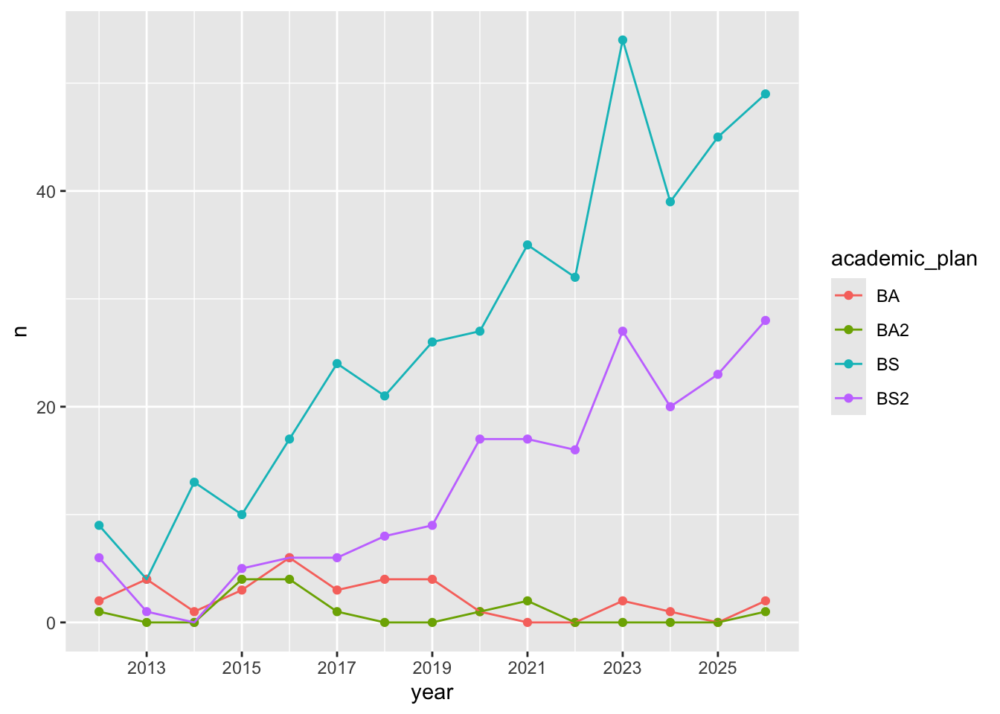
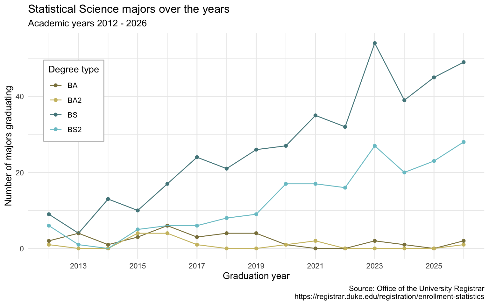

```{r}
#| label: setup
#| include: false
ggplot2::theme_set(ggplot2::theme_gray(base_size = 16))
```

```{r}
#| include: false
library(tidyverse)
library(usdata)
library(ggbeeswarm)
```

# Warm-up

## While you wait: Participate 📱💻 {.smaller}

::: columns

::: {.column width="80%"}

::: question
Can you guess the variable plotted here?
:::

```{r}
#| label: tax-choropleth
#| echo: false
#| message: false
library(usmap)
library(scales)
library(scico)

states <- us_map(regions = "states")

sales_taxes <- read_csv(here::here("slides", "data/sales-taxes-26.csv"))

states_sales_taxes <- states |>
  left_join(sales_taxes, join_by(full == state))

ggplot(states_sales_taxes) +
  geom_sf(aes(fill = state_tax_rate)) +
  scale_fill_scico(
    palette = "oslo",
    labels = label_percent(scale = 1)
  ) +
  theme_void() +
  coord_sf() +
  labs(fill = NULL)
```

:::

::: {.column width="20%"}

{width="200" fig-align="center" fig-alt="QR code for Wooclap"}

Go to [wooclap.com](https://app.wooclap.com/PYDPUEI) and use the code PYDPUEI.

:::

:::

## Announcements {.smaller}

- If you have received an email from Dr. Knox about missing labs, HWs, commits, files on GitHub or Gradescope:
  - Step 1: Don't panic -- these emails are just to make sure you don't repeatedly make the same errors throughout assignments
  - Step 2: 
    - If you're not sure how to address the issues, please write back ASAP so we can help you!
    - If you know how to address it, make sure to do so in your following assignment!

::: fragment

- If you've enjoyed working with classmates in your randomly assigned labs so far and/or if you have identified common interests, reach out to them to see if you might form a project team together. You'll get a chance to share these preferences in lab on Thursday.

:::

## Recap: from last AE {.scrollable .smaller}

::: question
Any questions about how we left off last time to where AE-03 goes by the end? Or where to find the AE answers?
:::

::: {.columns}

::: {.column width="40%"}

**Where we left off:**

{width="100%"}

:::

::: {.column width="60%"}

**Where the AE-03 ends:**

{width="100%"}

:::

:::


# Recoding data

## Let's look at the results... {.smaller}

```{r}
#| ref-label: tax-choropleth
#| echo: false
#| message: false
```

## Sales taxes in US states {.smaller}

```{r}
sales_taxes
```

## Participate 📱💻 {.xsmall}

::: columns

::: {.column width="80%"}

::: wooclap
Put the following steps in order to compare the average state sales tax rates of swing states (Arizona, Georgia, Michigan, Nevada, North Carolina, Pennsylvania, and Wisconsin) vs. non-swing states:

::: wooclap-choices
-   Group by `swing_state`
-   Summarize to find the mean sales tax in each type of state
-   Create a new variable called `swing_state` with levels `"Swing"` and `"Non-swing"`
:::

:::

:::

::: {.column width="20%"}

{width="200" fig-align="center" fig-alt="QR code for Wooclap"}

Go to [wooclap.com](https://app.wooclap.com/PYDPUEI) and use the code PYDPUEI.

:::

:::

## Participate 📱💻 {.xsmall}

::: columns

::: {.column width="80%"}

::: wooclap

First, create a vector called `list_of_swing_states` that contains the names of the swing states.

```{r}
# fmt: skip
list_of_swing_states <- c(
  "Arizona", "Georgia", "Michigan", "Nevada", "North Carolina",
  "Pennsylvania", "Wisconsin"
)
```

Then, fill in the blanks to create a new variable called `swing_state` with levels `"Swing"` and `"Non-swing"`:

```{r}
#| eval: false
sales_taxes <- sales_taxes |>
  __BLANK_1__(
    swing_state = __BLANK_2__(
      state __BLANK_3__ list_of_swing_states, "Swing", "Non-swing"
    )
  )
```

:::

:::

::: {.column width="20%"}

{width="200" fig-align="center" fig-alt="QR code for Wooclap"}

Go to [wooclap.com](https://app.wooclap.com/PYDPUEI) and use the code PYDPUEI.

:::

:::

```{r}
#| echo: false
sales_taxes <- sales_taxes |>
  mutate(
    swing_state = if_else(
      state %in% list_of_swing_states,
      "Swing",
      "Non-swing"
    )
  )
```

## Recap: `if_else()`

```{r}
#| eval: false
if_else(
  x == y, #<1>
  "x is equal to y", #<2>
  "x is not equal to y" #<3>
)
```

1.  Condition
2.  Value if condition is `TRUE`
3.  Value if condition is `FALSE`

## Participate 📱💻 {.smaller}

::: columns

::: {.column width="80%"}

::: wooclap

Fill in the blank to compare the average state sales tax rates of swing states vs. non-swing states.

```{r}
#| eval: false
sales_taxes |>
  __BLANK__ |>
  summarize(mean_state_tax = mean(state_tax_rate))
```

::: wooclap-choices
- `arrange(swing_state)`
- `filter(swing_state == "Swing")`
- `group_by(swing_state)`
- `group_by(list_of_swing_states)`
:::

:::

:::

::: {.column width="20%"}

{width="200" fig-align="center" fig-alt="QR code for Wooclap"}

Go to [wooclap.com](https://app.wooclap.com/PYDPUEI) and use the code PYDPUEI.

:::

:::

## Sales tax in swing states

```{r}
sales_taxes |>
  group_by(swing_state) |>
  summarize(mean_state_tax = mean(state_tax_rate))
```

## Sales tax in coastal states {.smaller}

::: question
Suppose you're tasked with the following:

> Compare the average state sales tax rates of states on the Pacific Coast, states on the Atlantic Coast, and the rest of the states.

How would you approach this task?
:::

::: fragment

-   Create a new variable called `coast` with levels `"Pacific"`, `"Atlantic"`, and `"Neither"`
-   Group by `coast`
-   Summarize to find the mean sales tax in each type of state

:::

## Participate 📱💻 {.xsmall}

::: columns

::: {.column width="80%"}

::: wooclap

First, create two vectors called `pacific_coast` and `atlantic_coast` that contain the respective states.

```{r}
pacific_coast <- c("Alaska", "Washington", "Oregon", "California", "Hawaii")

# fmt: skip
atlantic_coast <- c(
  "Connecticut", "Delaware", "Georgia", "Florida", "Maine", "Maryland", 
  "Massachusetts", "New Hampshire", "New Jersey", "New York", 
  "North Carolina", "Rhode Island", "South Carolina", "Virginia"
)
```

Then, fill in the blank to create a new variable called `coast`:

```{r}
#| eval: false
sales_taxes <- sales_taxes |>
  mutate(
    coast = __BLANK__(
      state %in% atlantic_coast ~ "Atlantic",
      state %in% pacific_coast ~ "Pacific",
      .default = "Neither"
    )
  )
```

:::

:::

::: {.column width="20%"}

{width="200" fig-align="center" fig-alt="QR code for Wooclap"}

Go to [wooclap.com](https://app.wooclap.com/PYDPUEI) and use the code PYDPUEI.

:::

:::

```{r}
#| echo: false
sales_taxes <- sales_taxes |>
  mutate(
    coast = case_when(
      state %in% atlantic_coast ~ "Atlantic",
      state %in% pacific_coast ~ "Pacific",
      .default = "Neither"
    )
  )
```

## Recap: `case_when()`

```{r}
#| eval: false
case_when(
  x > y ~ "x is greater than y", #<1>
  x < y ~ "x is less than y", #<2>
  .default = "x is equal to y" #<3>
)
```

1.  Value if first condition is `TRUE`
2.  Value if second condition is `TRUE`
3.  Value if neither condition is `TRUE`, i.e., default value

## Sales tax in coastal states {.smaller .scrollable}

::: question
Compare the average state sales tax rates of states on the Pacific Coast, states on the Atlantic Coast, and the rest of the states.
:::

```{r}
sales_taxes |>
  group_by(coast) |>
  summarize(mean_state_tax = mean(state_tax_rate))
```

## Sales tax in US regions {.smaller}

::: question
Suppose you're tasked with the following:

> Compare the average state sales tax rates of states in various regions (Midwest - 12 states, Northeast - 9 states, South - 16 states, West - 13 states).

How would you approach this task?
:::

. . .

-   Create a new variable called `region` with levels `"Midwest"`, `"Northeast"`, `"South"`, and `"West"`.
-   Group by `region`
-   Summarize to find the mean sales tax in each type of state

## `mutate()` with `case_when()` {.smaller}

::: question
Who feels like filling in the blanks lists of states in each region?
Who feels like it's simply too tedious to write out names of all states?
:::

```{r}
#| eval: false
list_of_midwest_states <- c(___)
list_of_northeast_states <- c(___)
list_of_south_states <- c(___)
list_of_west_states <- c(___)

sales_taxes <- sales_taxes |>
  mutate(
    region = case_when(
      state %in% list_of_midwest_states ~ "Midwest",
      state %in% list_of_northeast_states ~ "Northeast",
      state %in% list_of_south_states ~ "South",
      state %in% list_of_west_states ~ "West"
    )
  )
```

# Joining data

## Why join? {.smaller}

Suppose we want to answer questions like:

> Is there a relationship between\
> - number of QS courses taken\
> - having scored a 4 or 5 on the AP stats exam\
> - motivation for taking course\
> - ...\
> and performance in this course?

. . .

Each of these would require *join*ing class performance data with an outside data source so we can have all relevant information (columns) in a single data frame.

## Why join? {.smaller}

Suppose we want to answer questions like:

> Compare the average state sales tax rates of states in various regions (Midwest - 12 states, Northeast - 9 states, South - 16 states, West - 13 states).

. . .

This can also be solved with *join*ing region information with the state-level sales tax data.

## Setup

For the next few slides...

::: columns

::: {.column}

```{r}
x <- tibble(
  id = c(1, 2, 3),
  value_x = c("x1", "x2", "x3")
)

x
```

:::

::: {.column}

```{r}
y <- tibble(
  id = c(1, 2, 4),
  value_y = c("y1", "y2", "y4")
)

y
```

:::

:::

## `left_join()`

::: columns

::: {.column}


:::

::: {.column}

```{r}
left_join(x, y)
```

:::

:::

## `right_join()`

::: columns

::: {.column}


:::

::: {.column}

```{r}
right_join(x, y)
```

:::

:::

## `full_join()`

::: columns

::: {.column}

:::

::: {.column}

```{r}
full_join(x, y)
```

:::

:::

## `inner_join()`

::: columns

::: {.column}

:::

::: {.column}

```{r}
inner_join(x, y)
```

:::

:::

## `anti_join()`

::: columns

::: {.column}


:::

::: {.column}

```{r}
anti_join(x, y)
```

:::

:::

## Summary of joins

{fig-align="center"}

# Application exercise

## Goal

Compare the average state sales tax rates of states in various regions (Midwest, Northeast, South, West), where the input data are:

1.  States and sales taxes: `sales-taxes-26.csv`
2.  States and regions: `us-regions.csv`

## `ae-04-taxes-join` {.smaller}

::: appex
-   Go to your ae project in Positron.

-   If you haven't yet done so, make sure all of your changes up to this point are committed and pushed, i.e., there's nothing left in your source control pane.

-   If you haven't yet done so, pull to get today's application exercise file: `ae-04-taxes-join.qmd`.

-   Work through the application exercise in class, and render, commit, and push your edits by the end of class.
:::
