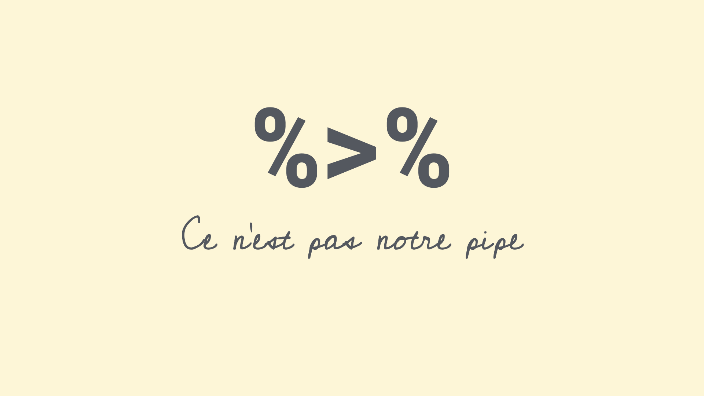
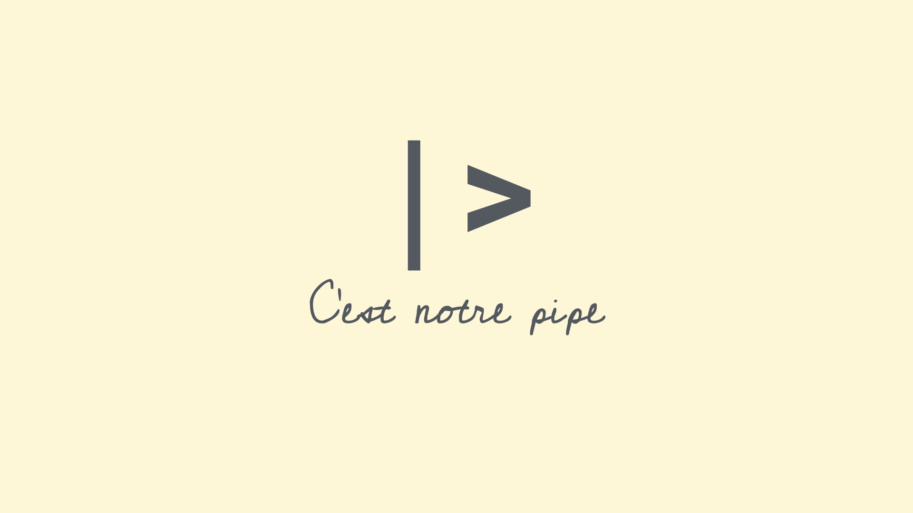

```{r}
#| label: setup
#| include: false
ggplot2::theme_set(ggplot2::theme_gray(base_size = 16))
```

```{r}
#| include: false
library(tidyverse)
```

# Warm-up

## While you wait: Participate 📱💻 

::: columns

::: {.column width="70%"}

::: wooclap

Fill in the blank:

On Wednesdays, I have `_____` class(es), including STA 199.

:::

:::

::: {.column width="30%"}

{width="200" fig-align="center" fig-alt="QR code for Wooclap"}

Go to [wooclap.com](https://app.wooclap.com/TJEJAXK) and use the code TJEJAXK.

:::

:::

## Participate 📱💻

::: columns

::: {.column width="70%"}

::: wooclap

Which of the following best describes you?

::: wooclap-choices
- First-year
- Sophomore
- Junior
- Senior
:::

:::

:::

::: {.column width="30%"}

{width="200" fig-align="center" fig-alt="QR code for Wooclap"}

Go to [wooclap.com](https://app.wooclap.com/TJEJAXK) and use the code TJEJAXK.

:::

:::

## Announcements

- Team *preferences*:
  - Exactly 4 students per team
  - Let me know in my office hours today or at the end of lab to your TA tomorrow
  - All 4 members must be in attendance when submitting the preference

- No AI use in lab -- work with your teammates and ask your TAs for help

## Recap: The tidyverse package {.smaller}

- When you load the **tidyverse** package, you get access to a suite of packages that work well together for data manipulation and visualization:

  ```{r}
  library(tidyverse)
  ```

- You never need to load one of these packages individually after you load the tidyverse, e.g., `library(dplyr)`.

::: {.columns}

::: {.column .fragment}

❌ **What not to do:**

```` markdown
```{{r}}
#| label: load-packages
#| message: false
library(tidyverse)
library(dplyr)
library(tidyr)
```
````

:::

::: {.column .fragment}

✅ **What to do:**

```` markdown
```{{r}}
#| label: load-packages
#| message: false
library(tidyverse)
```
````

:::

:::


## Recap: Loading packages {.small}

- Only need to load a package once per R session or Quarto document.

- Good practice: Load all packages you need at the start of your document, that's why the templates I give you usually have a `load-packages` code cell at the top.

- Don't load these packages again in the same document.

- If you discover that you need a new package, go back and add it to the `load-packages`  cell.

## Recap: Loading packages {.smaller}

::: {.columns}

::: {.column}

❌ **What not to do:**

```` markdown
```{{r}}
#| label: long-running-near-peak
library(dplyr)
spotify |>
    filter(weeks_on_chart > 275, positions_below_peak < 30) |>
    # and more code...
```

some content...

```{{r}}
#| label: most-streamed-song
library(dplyr)
spotify |>
    group_by(genre) |>
    filter(n() >= 10) |>
    # and more code...
```

````

:::

::: {.column .fragment}

✅ **What to do:**

```` markdown
```{{r}}
#| label: long-running-near-peak
library(tidyverse)
spotify |>
    filter(weeks_on_chart > 275, positions_below_peak < 30) |>
    # and more code...
```

some content...

```{{r}}
#| label: most-streamed-song
spotify |>
    group_by(genre) |>
    filter(n() >= 10) |>
    # and more code...
```

````

:::

:::

## Recap: Pipes

::: center-align

{width=700px}

This is not a pipe.

:::

## Recap: Pipes

::: center-align

{width=900px}

This is not our pipe [operator].

:::

## Recap: Pipes

::: center-align

{width=900px}

**This is our a pipe [operator].**

:::

## Recap: Pipes {.smaller}

::: {.columns}

::: {.column}

**❌ What not to do:**

```` markdown
```{{r}}
#| label: family-sustaining-wage
nc_county %>%
    filter(p_family_sustaining_wage < 0.5) %>%
    count(county_type, name = "n_counties") %>%
    arrange(desc(n_counties))
```

some content...

```{{r}}
#| label: edu-he-create
nc_county <- nc_county |>
    mutate(
        p_edu_he = p_edu_assoc + p_edu_ba + p_edu_mapl
    )
```
````

:::

::: {.column .fragment}

✅ **What to do:**

```` markdown
```{{r}}
#| label: family-sustaining-wage
nc_county |>
    filter(p_family_sustaining_wage < 0.5) |>
    count(county_type, name = "n_counties") |>
    arrange(desc(n_counties))
```

some content...

```{{r}}
#| label: edu-he-create
nc_county <- nc_county |>
    mutate(
        p_edu_he = p_edu_assoc + p_edu_ba + p_edu_mapl
    )
```
````

:::

:::

## Aside: The Itsy Bitsy Spider 

::: task
[🕷️]{.large} Any volunteers to sing (or just recite) a bit of the **Itsy Bitsy Spider** for us? 
:::

## Recap: Data pipelines {.smaller}

Now that we all remember how **The Itsy Bitsy Spider** goes...

::: {.fragment}

**Piped:** Read from top to bottom.

```r
spider |>
  climb_spout() |>
  wash_down_in_rain() |>
  dry_in_sun() |>
  climb_again()
```

:::

::: {.fragment}

**Nested:** Read from the inside out.

```r
climb_again(dry_in_sun(wash_down_in_rain(climb_spout(spider))))
```

:::

::: fragment

The pipe `|>` passes the result of each step to the next function as its first argument.

:::

## Recap: Data pipelines

::: {.columns}

::: {.column width="53%"}

❌ **What not to do:**

```` markdown
```{{r}}
#| label: q2-a
distinct(df_2, member, shift)
```
````

:::

::: {.column width="47%" .fragment}

✅ **What to do:**

```` markdown
```{{r}}
#| label: q2-a
df_2 |>
  distinct(member, shift)
```
````

:::

:::

# Data types

## Data types in R

-   **character**[: `"First-year"` -- Character strings]{.fragment}
-   **double**[: `2.5` -- Floating point numerical values (default numerical type)]{.fragment}
-   **integer**[: `3L` -- Integer numerical values (indicated with an `L`)]{.fragment}
-   **logical**[: `TRUE` or `FALSE` -- Boolean values]{.fragment}
-   and some more, but we won't be focusing on those

## Vectors {.smaller}

Vectors can be constructed using the `c()` function.

-   Numeric vector:

```{r}
c(1, 2, 3)
```

. . .

-   Character vector:

```{r}
c("Hello", "World!")
```

. . .

-   Vector made of vectors:

```{r}
c(c("hi", "hello"), c("bye", "jello"))
```

## Vectors and their types

::: question
Why do we care about vectors and their types, especially when all we've worked with so far are data frames and their columns... 
:::

::: fragment
Each column of a data frame is (generally) a vector, and the type of that vector determines what operations can be performed on it or how it will behave when certain functions are applied to it. For example, you can't take the mean of a character vector, but you can take the mean of a numeric vector.
:::

## Making vectors from vectors {.smaller}

::: columns

::: {.column width="70%"}

::: wooclap

We have a vector, `x`, of type character: \
`x <- c("a", "b", "c")`

And another vector, `y`, of type double: \
`y <- c(1, 2, 3)`

What happens if we combine them into a new vector, `z <- c(x, y)`? What type will `z` be?

::: wooclap-choices
- character
- double
- integer
- logical
:::

:::

:::

::: {.column width="30%"}

{width="200" fig-align="center" fig-alt="QR code for Wooclap"}

Go to [wooclap.com](https://app.wooclap.com/TJEJAXK) and use the code TJEJAXK.

:::

:::

## Making vectors from vectors

::: columns

::: column

```{r}
x <- c("a", "b", "c")
typeof(x)
```

:::


::: column

```{r}
y <- c(1, 2, 3)
typeof(y)
```

:::

:::

::: fragment

```{r}
z <- c(x, y)
z
```

:::

::: fragment

```{r}
#| output-location: fragment
typeof(z)
```

:::

## Converting between types

::: hand
with intention...
:::

::::: columns
::: column

```{r}
x <- 1:3
x
typeof(x)
```

:::

::: {.column .fragment}

```{r}
y <- as.character(x)
y
typeof(y)
```

:::
:::::

## Converting between types

::: hand
with intention...
:::

::::: columns
::: column

```{r}
x <- c(TRUE, FALSE)
x
typeof(x)
```

:::

::: {.column .fragment}

```{r}
y <- as.numeric(x)
y
typeof(y)
```

:::
:::::

## Converting between types

::: hand
without intention...
:::


```{r}
c(2, "Just this one!")
```

. . .

R will happily convert between various types without complaint when different types of data are concatenated in a vector, and that's not always a great thing!

## Converting between types

::: hand
without intention...
:::

```{r}
c(FALSE, 3L)
```

. . .

```{r}
c(FALSE, 1.2)
```

. . .

```{r}
c(2L, "two")
```

. . .

```{r}
c(TRUE, "two")
```

## Participate 📱💻

::: columns

::: {.column width="70%"}

::: wooclap

What is the output of `typeof(c(1.2, 3L))`?

::: wooclap-choices
- `"character"`
- `"double"`
- `"integer"`
- `"logical"`
:::

:::

:::

::: {.column width="30%"}

{width="200" fig-align="center" fig-alt="QR code for Wooclap"}

Go to [wooclap.com](https://app.wooclap.com/TJEJAXK) and use the code TJEJAXK.

:::

:::

## Explicit vs. implicit coercion

::::: columns
::: column
**Explicit coercion:**

When you call a function like `as.logical()`, `as.numeric()`, `as.integer()`, `as.double()`, or `as.character()`.
:::

::: {.column .fragment}
**Implicit coercion:**

Happens when you use a vector in a specific context that expects a certain type of vector.
:::
:::::

# Data classes

## Data classes {.smaller}

::: incremental
-   Vectors are like Lego building blocks
-   We stick them together to build more complicated constructs, e.g. *representations of data*
-   The **class** attribute relates to the S3 class of an object which determines its behaviour
    -   You don't need to worry about what S3 classes really mean, but you can read more about it [here](https://adv-r.hadley.nz/s3.html#s3-classes) if you're curious
-   Examples: factors, dates, and data frames
:::

## Factors {.smaller}

R uses factors to handle categorical variables, variables that have a fixed and known set of possible values

```{r}
class_years <- factor(
  c(
    "First-year",
    "Sophomore",
    "Sophomore",
    "Senior",
    "Junior"
  )
)
class_years
```

::::: columns
::: {.column .fragment}

```{r}
typeof(class_years)
```

:::

::: {.column .fragment}

```{r}
class(class_years)
```

:::
:::::

## More on factors

We can think of factors like character (level labels) and an integer (level numbers) glued together

```{r}
glimpse(class_years)
```

```{r}
as.integer(class_years)
```

## Dates

```{r}
today <- as.Date("2026-09-23")
today
```

```{r}
typeof(today)
```

```{r}
class(today)
```

## More on dates

We can think of dates like an integer (the number of days since the origin, 1 Jan 1970) and an integer (the origin) glued together

```{r}
as.integer(today)
```

```{r}
as.integer(today) / 365 # roughly 56.8 yrs
```

## Data frames

We can think of data frames like like vectors of equal length glued together

```{r}
df <- data.frame(x = 1:2, y = 3:4)
df
```

::::: columns
::: column
```{r}
typeof(df)
```

:::

::: column

```{r}
class(df)
```

:::
:::::

## Lists {.smaller}

Lists are a generic vector container; vectors of any type can go in them

```{r}
#| code-line-numbers: "|2|3|4"
l <- list(
  x = 1:4,
  y = c("hi", "hello", "jello"),
  z = c(TRUE, FALSE)
)
l
```

## Lists and data frames {.smaller}

-   A data frame is a special list containing vectors of equal length

```{r}
df
```

-   When we use the `pull()` function, we extract a vector from the data frame

```{r}
df |>
  pull(y)
```

# Working with factors

## Read data in as character strings

```{r}
#| include: false
set.seed(123)
n_wed_classes_raw <- sample(0:5, size = 100, replace = TRUE)
n_wed_classes_raw <- if_else(n_wed_classes_raw == 0, 1, n_wed_classes_raw)
n_wed_classes_raw <- if_else(n_wed_classes_raw == 5, 4, n_wed_classes_raw)
fake_survey <- tibble(
  class_year = sample(
    c("First-year", "Sophomore", "Junior", "Senior"),
    size = 100,
    replace = TRUE
  ),
  n_wed_classes = n_wed_classes_raw
)
```

```{r}
#| message: false
fake_survey
```

## But coerce when plotting

```{r}
#| out-width: 100%
#| fig-width: 7
#| fig-asp: 0.5
ggplot(fake_survey, mapping = aes(x = class_year)) +
  geom_bar()
```

## Use forcats to reorder levels {.smaller}

```{r}
#| out-width: 100%
#| fig-width: 5
#| fig-asp: 0.618
#| output-location: column
fake_survey |>
  mutate(
    class_year = fct_relevel(
      class_year,
      "First-year",
      "Sophomore",
      "Junior",
      "Senior"
    )
  ) |>
  ggplot(mapping = aes(x = class_year)) +
  geom_bar()
```

## A peek into forcats {.smaller}

::: columns

::: {.column .fragment}

Reordering levels by:

-   `fct_relevel()`: hand

-   `fct_infreq()`: frequency

-   `fct_reorder()`: sorting along another variable

-   `fct_rev()`: reversing

...

:::

::: {.column  .fragment}

Changing level values by:

-   `fct_lump()`: lumping uncommon levels together into "other"

-   `fct_other()`: manually replacing some levels with "other"

...

:::

:::

::: aside
More functions from the **forcats** package can be found [here](https://forcats.tidyverse.org/reference/index.html).
:::

# Application exercise

## `ae-05-survey-types` {.smaller}

::: appex
-   Go to your ae project in Positron.

-   If you haven't yet done so, make sure all of your changes up to this point are committed and pushed, i.e., there's nothing left in your source control pane.

-   If you haven't yet done so, pull to get today's application exercise file: `ae-05-survey-types.qmd`.

-   Work through the application exercise in class, and render, commit, and push your edits by the end of class.
:::
